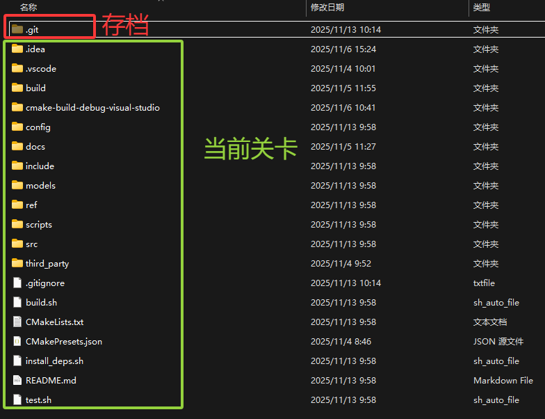
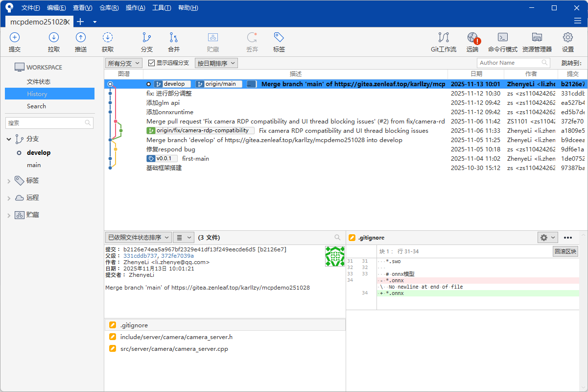

# 基于Git的代码版本管理与多人协作

> 欢迎来到代码版本管理的游戏世界！在这里，你将学会如何像玩游戏一样管理你的代码。

---

## 第一部分：Git版本管理基础

### 1.1 引言：代码版本管理的游戏世界

想象一下，你正在玩一款充满挑战的游戏。在游戏中，你需要：

- 不断闯关、打怪、解谜
- 在关键节点保存进度
- 需要时读取之前的存档重新尝试
- 查看自己的游戏历程

代码开发其实和玩游戏非常相似！让我们用游戏的概念来理解Git：

| 游戏概念       | Git概念          | 说明                             |
| -------------- | ---------------- | -------------------------------- |
| 🎮 存档库      | `.git` 文件夹  | 保存所有历史版本的地方           |
| 📜 存档记录    | `git log`      | 查看所有的保存点和历史           |
| 🗺️ 当前关卡  | 工作目录         | 你正在进行游戏的地方             |
| ⚔️ 打怪/闯关 | 修改文件         | 编写代码、修改文档               |
| 💾 通关存档    | `git commit`   | 完成一个阶段后保存进度           |
| 🏆 里程碑      | `git tag`      | 标记重要的游戏节点（如版本发布） |
| ⏮️ 读档      | `git checkout` | 回到之前的某个存档点             |



写代码的过程可以看作是修改当前关卡内的文件，完成指定功能（通关），然后存档的过程。

#### 为什么需要版本管理？

在没有版本管理的世界里，你可能遇到过这些问题：

1. **找不回之前的代码**：改了一通后发现之前的版本更好，但已经覆盖了
2. **文件命名混乱**：`代码_最终版.py`、`代码_最终版_真的最终版.py`、`代码_这次真的是最终版.py`
3. **多人协作困难**：你和同事同时修改同一个文件，不知道该保留谁的修改
4. **无法追溯历史**：不知道某段代码是谁写的、为什么写、什么时候写的

Git就是为了解决这些问题而生的！它就像是一个**智能的游戏存档系统**，让你可以：

- ✅ 随时保存代码的任意版本
- ✅ 轻松回到历史的任何时刻
- ✅ 清楚地看到每次修改的内容
- ✅ 多人同时工作互不干扰
- ✅ 安全地合并不同人的修改

### 1.2 准备工作：新手村设置

在开始冒险之前，我们需要完成一些准备工作。

#### 安装Git

**Windows系统：**

1. 访问Git官网：https://git-scm.com/download/win
2. 下载安装包并运行
3. 安装过程中保持默认设置即可（建议勾选"Git Bash Here"）
4. 安装完成后，右键点击任意文件夹，应该能看到"Git Bash Here"选项

**macOS系统：**

方法1：使用Homebrew（推荐）

```bash
brew install git
```

方法2：下载安装包

- 访问：https://git-scm.com/download/mac
- 下载并安装

**Linux系统：**

Ubuntu/Debian:

```bash
sudo apt update
sudo apt install git
```

CentOS/Fedora:

```bash
sudo yum install git
```

#### 验证安装

打开终端（Windows用户打开Git Bash），输入：

```bash
git --version
```

如果看到类似 `git version 2.40.0` 的输出，说明安装成功！

#### 全局配置：设置你的游戏ID

在Git的世界里，每次存档（commit）都需要记录是谁保存的。所以我们需要先设置你的身份信息：

```bash
# 设置你的用户名
git config --global user.name "你的名字"

# 设置你的邮箱
git config --global user.email "your.email@example.com"
```

**示例：**

```bash
git config --global user.name "张三"
git config --global user.email "zhangsan@example.com"
```

> 💡 **提示**：这里的邮箱建议使用你在Gitea上注册的邮箱，这样提交记录会和你的账号关联起来。

查看你的配置：

```bash
git config --global --list
```

#### 其他有用的配置

**设置默认分支名称为main：**

```bash
git config --global init.defaultBranch main
```

**设置默认编辑器（可选）：**

使用VS Code:

```bash
git config --global core.editor "code --wait"
```

使用Vim:

```bash
git config --global core.editor "vim"
```

使用Nano:

```bash
git config --global core.editor "nano"
```

**配置命令行显示颜色：**

```bash
git config --global color.ui auto
```

#### 图形化工具推荐（可选）

虽然我们主要讲解命令行操作，但图形化工具在某些场景下更直观：

- **SourceTree**：功能强大，适合新手（免费，但只适用于windows和mac，下图就是）
- **GitKraken**：界面美观，操作流畅（免费版可以打开公开仓库，付费才能支持私有仓库打开）
- **VS Code**：内置Git支持，如果你用VS Code写代码，无需额外安装
- **GitHub Desktop**：简单易用，虽然名字有GitHub但也支持Gitea



### 1.3 单人冒险：基础版本管理

现在，让我们开始第一次冒险！

#### 创建你的游戏世界：初始化仓库

假设你要开发一个计算器程序，首先创建项目文件夹：

```bash
# 创建项目文件夹
mkdir my-calculator
cd my-calculator

# 初始化Git仓库（创建存档系统）
git init
```

执行 `git init` 后，你会看到：

```
Initialized empty Git repository in /path/to/my-calculator/.git/
```

这时，一个隐藏的 `.git` 文件夹就被创建了。这就是你的**存档库**！

> ⚠️ **注意**：`.git` 文件夹非常重要，千万不要手动删除或修改它！这里保存着所有的历史记录。

查看 `.git` 文件夹（可选）：

```bash
# Windows Git Bash / Linux / macOS
ls -la
```

#### Git的三大区域：游戏的三个世界

在Git中，你的文件会处于三个不同的区域，理解这三个区域非常重要：

```
┌─────────────────────────────────────────────────────────────┐
│                    远程仓库（Remote）                          │
│                  （云端存档，第三部分讲解）                      │
└─────────────────────────────────────────────────────────────┘
                            ↕ git push/pull
┌─────────────────────────────────────────────────────────────┐
│                   版本库（Repository）                         │
│                      .git 文件夹                               │
│                   【已保存的存档】                              │
│                                                               │
│  存储：所有历史提交记录                                         │
└─────────────────────────────────────────────────────────────┘
                            ↑ git commit
┌─────────────────────────────────────────────────────────────┐
│                   暂存区（Staging Area）                       │
│                      Index / Stage                            │
│                 【准备存档的内容】                              │
│                                                               │
│  存储：准备提交的文件快照                                       │
└─────────────────────────────────────────────────────────────┘
                            ↑ git add
┌─────────────────────────────────────────────────────────────┐
│                   工作区（Working Directory）                  │
│                     项目文件夹                                 │
│                  【当前游戏关卡】                               │
│                                                               │
│  存储：你正在编辑的文件                                         │
└─────────────────────────────────────────────────────────────┘
```

**游戏化理解：**

1. **工作区（Working Directory）**：就像游戏中的**当前关卡**

   - 你看到的项目文件夹中的所有文件
   - 这是你"打怪"（编写代码）的地方
2. **暂存区（Staging Area）**：就像游戏的**保存菜单**

   - 你选择了要保存的内容，但还没有确认保存
   - 可以多次添加、修改暂存内容
3. **版本库（Repository）**：就像**已保存的存档**

   - 一旦提交（commit），就永久保存在这里
   - 可以随时读取这些存档

#### 基本操作流程：开始游戏

让我们通过一个完整的例子来体验Git的基本操作。

**第1步：创建文件（进入关卡）**

创建一个简单的计算器文件：

```bash
# 创建README文件
echo "# 我的计算器项目" > README.md

# 创建Python计算器文件
echo "def add(a, b):" > calculator.py
echo "    return a + b" >> calculator.py
```

或者用你喜欢的编辑器创建文件：

`README.md`:

```markdown
# 我的计算器项目

这是一个简单的计算器程序。
```

`calculator.py`:

```python
def add(a, b):
    return a + b

def subtract(a, b):
    return a - b
```

**第2步：查看状态（查看当前游戏状态）**

```bash
git status
```

输出类似：

```
On branch main

No commits yet

Untracked files:
  (use "git add <file>..." to include in what will be committed)
        README.md
        calculator.py

nothing added to commit but untracked files present (use "git add" to track)
```

解读：

- `Untracked files`：未跟踪的文件，Git还不知道这些文件
- 红色显示的文件：还没有被添加到暂存区

**第3步：添加到暂存区（选择要存档的内容）**

```bash
# 添加单个文件
git add README.md

# 或者添加所有文件
git add .
```

> 💡 **提示**：
>
> - `git add 文件名`：添加指定文件
> - `git add .`：添加当前目录所有文件
> - `git add *.py`：添加所有.py文件

再次查看状态：

```bash
git status
```

输出：

```
On branch main

No commits yet

Changes to be committed:
  (use "git rm --cached <file>..." to unstage)
        new file:   README.md
        new file:   calculator.py
```

解读：

- `Changes to be committed`：准备提交的更改
- 绿色显示：文件已在暂存区

**第4步：提交到版本库（正式存档）**

```bash
git commit -m "初始提交：创建项目和基本加减法功能"
```

输出：

```
[main (root-commit) a1b2c3d] 初始提交：创建项目和基本加减法功能
 2 files changed, 8 insertions(+)
 create mode 100644 README.md
 create mode 100644 calculator.py
```

> 💡 **提示**：`-m` 参数后面的内容是提交信息（commit message），应该简洁明了地描述这次修改做了什么。

**第5步：查看历史（查看存档记录）**

```bash
git log
```

输出：

```
commit a1b2c3d4e5f6g7h8i9j0k1l2m3n4o5p6q7r8s9t0 (HEAD -> main)
Author: 张三 <zhangsan@example.com>
Date:   Mon Nov 17 10:30:00 2025 +0800

    初始提交：创建项目和基本加减法功能
```

**更友好的查看方式：**

```bash
# 单行显示，更简洁
git log --oneline

# 图形化显示分支（后面会用到）
git log --oneline --graph --all

# 查看最近3条记录
git log -3
```

#### 实战示例：继续游戏，完成更多关卡

现在让我们继续开发，添加乘除法功能。

**关卡2：添加乘法和除法**

修改 `calculator.py`：

```python
def add(a, b):
    return a + b

def subtract(a, b):
    return a - b

def multiply(a, b):
    return a * b

def divide(a, b):
    if b == 0:
        return "错误：除数不能为0"
    return a / b
```

查看修改：

```bash
git status
```

输出：

```
On branch main
Changes not staged for commit:
  (use "git add <file>..." to update what will be committed)
  (use "git restore <file>..." to discard changes in working directory)
        modified:   calculator.py

no changes added to commit (use "git add" and/or "git commit -a")
```

查看具体修改了什么：

```bash
git diff
```

输出会显示文件的变化，`+` 表示新增的行，`-` 表示删除的行。

提交修改：

```bash
git add calculator.py
git commit -m "新增功能：添加乘法和除法"
```

**关卡3：添加测试用例**

创建 `test_calculator.py`：

```python
from calculator import add, subtract, multiply, divide

# 测试加法
assert add(2, 3) == 5
assert add(-1, 1) == 0

# 测试减法
assert subtract(5, 3) == 2
assert subtract(0, 5) == -5

# 测试乘法
assert multiply(3, 4) == 12
assert multiply(-2, 5) == -10

# 测试除法
assert divide(10, 2) == 5
assert divide(7, 2) == 3.5
assert divide(5, 0) == "错误：除数不能为0"

print("所有测试通过！")
```

提交：

```bash
git add test_calculator.py
git commit -m "新增测试：添加计算器功能的测试用例"
```

查看游戏历程：

```bash
git log --oneline
```

输出：

```
c3d4e5f (HEAD -> main) 新增测试：添加计算器功能的测试用例
b2c3d4e 新增功能：添加乘法和除法
a1b2c3d 初始提交：创建项目和基本加减法功能
```

🎉 恭喜！你已经完成了三个关卡，并保存了三个存档点！

#### 时光倒流：版本回退

有时候，你可能会发现最近的修改有问题，想要回到之前的某个版本。Git提供了多种"读档"的方式。

**查看历史版本：**

```bash
git log --oneline
```

假设输出：

```
c3d4e5f (HEAD -> main) 新增测试：添加计算器功能的测试用例
b2c3d4e 新增功能：添加乘法和除法
a1b2c3d 初始提交：创建项目和基本加减法功能
```

**方式1：git checkout（临时查看，不修改历史）**

就像在游戏中"读档查看"但不真正恢复：

```bash
# 回到指定版本查看（使用commit ID）
git checkout a1b2c3d

# 回到最新版本
git checkout main
```

> ⚠️ **注意**：这会让你进入"detached HEAD"状态，只是查看，不要在这个状态下修改文件。

**方式2：git reset（修改历史，慎用）**

这是真正的"读档"，会改变历史：

```bash
# 回退到上一个版本，保留工作区的修改
git reset --soft HEAD~1

# 回退到上一个版本，保留工作区和暂存区
git reset --mixed HEAD~1  # 默认模式

# 回退到上一个版本，丢弃所有修改（危险！）
git reset --hard HEAD~1
```

**特殊符号说明：**

- `HEAD`：当前版本
- `HEAD~1`：上一个版本
- `HEAD~2`：上上个版本
- 也可以直接使用commit ID：`git reset --hard a1b2c3d`

**三种模式对比：**

| 模式        | 版本库 | 暂存区 | 工作区 | 使用场景           |
| ----------- | ------ | ------ | ------ | ------------------ |
| `--soft`  | 回退   | 保留   | 保留   | 重新组织提交       |
| `--mixed` | 回退   | 清空   | 保留   | 取消暂存，保留修改 |
| `--hard`  | 回退   | 清空   | 清空   | 完全放弃最近的修改 |

**方式3：git revert（创建新提交来撤销，推荐）**

这是最安全的方式，不修改历史，而是创建一个新的提交来撤销之前的修改：

```bash
# 撤销指定的提交
git revert c3d4e5f

# 撤销最近的提交
git revert HEAD
```

Git会打开编辑器让你输入撤销说明，保存后就完成了。

**选择建议：**

- 🟢 **多人协作**：使用 `git revert`（不改变历史）
- 🟡 **本地调整**：使用 `git reset`（还没推送到远程）
- 🔴 **临时查看**：使用 `git checkout`（只是看看）

#### 实战练习：撤销操作

**场景1：撤销工作区的修改**

你修改了文件，但还没有 `git add`：

```bash
# 查看修改
git status

# 撤销对某个文件的修改
git restore calculator.py

# 或撤销所有修改
git restore .
```

**场景2：撤销暂存区的文件**

你已经 `git add` 了，但还没有 `git commit`：

```bash
# 取消暂存某个文件（文件修改仍保留在工作区）
git restore --staged calculator.py

# 取消所有暂存
git restore --staged .
```

**场景3：修改最后一次提交**

你刚刚提交，但发现漏了一个文件或提交信息写错了：

```bash
# 修改文件或添加遗漏的文件
echo "print('计算器v1.0')" >> calculator.py
git add calculator.py

# 追加到上一次提交，并修改提交信息
git commit --amend -m "新增功能：添加乘法和除法（含版本号）"
```

> 💡 **提示**：`--amend` 会替换最后一次提交，所以commit ID会改变。

#### .gitignore：不需要存档的文件

在游戏中，并不是所有东西都需要保存。比如：

- 游戏的临时缓存
- 系统自动生成的文件
- 个人的配置文件

在代码项目中也是一样，有些文件不需要版本控制：

- 编译生成的文件（如 `.pyc`、`.class`）
- 依赖包文件夹（如 `node_modules/`、`venv/`）
- 系统文件（如 `.DS_Store`、`Thumbs.db`）
- 配置文件（如包含密码的 `.env`）
- IDE配置（如 `.vscode/`、`.idea/`）

创建 `.gitignore` 文件来忽略这些文件：

```bash
# 创建 .gitignore
touch .gitignore
```

编辑 `.gitignore`：

```gitignore
# Python相关
__pycache__/
*.py[cod]
*$py.class
*.so
.Python
venv/
env/
.env

# 系统文件
.DS_Store
Thumbs.db
Desktop.ini

# IDE配置
.vscode/
.idea/
*.swp
*.swo

# 测试覆盖率报告
htmlcov/
.coverage
.pytest_cache/

# 日志文件
*.log

# 数据库文件
*.db
*.sqlite3
```

提交 `.gitignore`：

```bash
git add .gitignore
git commit -m "配置：添加.gitignore文件"
```

**通配符说明：**

- `*.log`：忽略所有 `.log` 文件
- `temp/`：忽略 `temp` 文件夹
- `!important.log`：例外，不忽略 `important.log`
- `doc/*.txt`：忽略 `doc` 目录下的 `.txt` 文件，但不包括子目录
- `doc/**/*.txt`：忽略 `doc` 目录及其所有子目录下的 `.txt` 文件

**查看忽略规则：**

```bash
# 查看某个文件是否被忽略
git check-ignore -v filename.log
```

#### 小结：单人冒险的核心技能

恭喜你完成了单人冒险模式！现在你已经掌握了：

✅ **基础操作**

- `git init`：创建仓库
- `git status`：查看状态
- `git add`：添加到暂存区
- `git commit`：提交到版本库
- `git log`：查看历史

✅ **版本回退**

- `git checkout`：临时查看历史版本
- `git reset`：回退版本（修改历史）
- `git revert`：撤销提交（创建新提交）

✅ **撤销操作**

- `git restore`：撤销工作区修改
- `git restore --staged`：取消暂存
- `git commit --amend`：修改最后一次提交

✅ **忽略文件**

- `.gitignore`：指定不需要版本控制的文件

**常用命令速查：**

```bash
# 初始化和配置
git init                          # 初始化仓库
git config --global user.name     # 设置用户名
git config --global user.email    # 设置邮箱

# 日常操作
git status                        # 查看状态
git add .                         # 添加所有文件
git commit -m "说明"              # 提交
git log --oneline                 # 查看历史

# 查看差异
git diff                          # 工作区 vs 暂存区
git diff --staged                 # 暂存区 vs 版本库
git diff HEAD                     # 工作区 vs 版本库

# 撤销操作
git restore 文件名                # 撤销工作区修改
git restore --staged 文件名       # 取消暂存
git reset --soft HEAD~1           # 撤销提交，保留修改
```

现在，你已经可以独立管理自己的项目了！这样的开发我们解决的问题主要是版本管理，于是就会得到下边这样的“我独自升级”版本提交图：


但是，真正的冒险才刚刚开始。在下一部分，我们将进入**联机模式**，学习如何将你的存档同步到云端，以及如何与其他玩家协作！

---

## 第二部分：联机模式 - 远程仓库与Gitea

### 2.1 远程仓库概念：云端存档系统

在单人游戏模式中，你的所有存档都保存在本地电脑的 `.git` 文件夹里。但是，这样会有一些问题：

❌ **单点故障**：如果电脑坏了、硬盘损坏，你的所有代码和历史就都没了
❌ **无法协作**：其他人无法访问你的代码
❌ **不便切换**：在家里和公司无法同步进度
❌ **难以分享**：想展示项目给别人看很麻烦

这就像你的游戏存档只保存在一台游戏机里，既不安全也不方便。

#### 远程仓库的作用

**远程仓库**就像是**云端存档系统**，提供：

✅ **云端备份**：代码保存在服务器上，永不丢失
✅ **多端同步**：在任何设备上都能访问和继续开发
✅ **团队协作**：多人可以同时参与项目
✅ **开源分享**：可以让全世界的开发者看到你的项目
✅ **版本控制**：服务器保存完整历史，随时可以回溯

#### 本地仓库 vs 远程仓库

```
┌─────────────────────┐         ┌─────────────────────┐
│    你的电脑（A）      │         │    你的电脑（B）      │
│                     │         │                     │
│  ┌───────────────┐  │         │  ┌───────────────┐  │
│  │ 本地仓库(Local)│  │         │  │ 本地仓库(Local)│  │
│  │   .git/       │  │         │  │   .git/       │  │
│  └───────────────┘  │         │  └───────────────┘  │
│         │           │         │         │           │
└─────────┼───────────┘         └─────────┼───────────┘
          │                               │
          │ git push       git pull/clone │
          │                               │
          └───────────┬───────────────────┘
                      │
          ┌───────────▼───────────┐
          │   远程仓库(Remote)     │
          │   在Gitea服务器上      │
          │                       │
          │  ┌─────────────────┐  │
          │  │   云端存档       │  │
          │  │   完整历史记录   │  │
          │  └─────────────────┘  │
          └───────────────────────┘
```

**常见的Git托管平台：**

- **Gitea**：开源、轻量、可自建（本教程重点）
- **GitHub**：全球最大的代码托管平台
- **GitLab**：功能强大，支持CI/CD
- **Gitee**：国内访问速度快
- **Bitbucket**：Atlassian产品，与Jira集成好

### 2.2 Gitea平台操作指南

Gitea是一个轻量级的代码托管解决方案，类似于GitHub，但可以部署在自己的服务器上。

#### 注册Gitea账号

假设你的组织已经搭建了Gitea服务器，访问地址如：`https://git.yourcompany.com`

**注册步骤：**

1. 打开Gitea服务器地址
2. 点击右上角"注册"按钮
3. 填写注册信息：
   - 用户名：建议使用英文，如 `zhangsan`
   - 邮箱：用于接收通知
   - 密码：设置强密码
4. 点击"注册账号"
5. 验证邮箱（如果需要）

> 💡 **提示**：有些Gitea服务器可能关闭了公开注册，需要管理员创建账号。

#### 创建远程仓库

登录后，创建你的第一个远程仓库：

**步骤详解：**

1. **点击右上角的 `+` 号** → 选择"新建仓库"
2. **填写仓库信息：**

   - **仓库名称**：`my-calculator`（建议与本地项目名一致）
   - **描述**：简单的计算器项目（可选但建议填写）
   - **可见性**：

     - ✅ 公开：任何人都可以看到
     - 🔒 私有：只有你和授权的人可以访问
   - **初始化选项**（重要！）：

     - ❌ **不要**勾选"使用README初始化仓库"
     - ❌ **不要**勾选".gitignore"
     - ❌ **不要**勾选"许可证"

     > ⚠️ **注意**：因为我们本地已经有项目了，如果勾选这些，稍后推送时会产生冲突。
     >
3. **点击"创建仓库"**
4. **记下仓库地址：**
   创建后，你会看到两个地址：

   - **HTTPS地址**：`https://git.yourcompany.com/zhangsan/my-calculator.git`
   - **SSH地址**：`git@git.yourcompany.com:zhangsan/my-calculator.git`

#### SSH密钥配置详解

SSH密钥就像是你的"通行证"，配置后可以免密码推送代码。当然了如果觉得这一章节的配置显得繁琐可以直接不配置，使用用户名和密码呀也是一样的。

**为什么使用SSH？**

| 方式  | 优点             | 缺点             |
| ----- | ---------------- | ---------------- |
| HTTPS | 简单，防火墙友好 | 每次都要输入密码 |
| SSH   | 免密码，更安全   | 需要配置密钥     |

我们推荐使用SSH方式。

**第1步：检查是否已有SSH密钥**

```bash
# 查看是否已有密钥
ls -la ~/.ssh
```

如果看到 `id_rsa` 和 `id_rsa.pub`（或 `id_ed25519` 和 `id_ed25519.pub`），说明已有密钥，可以跳过生成步骤。

**第2步：生成SSH密钥**

如果没有密钥，生成一个：

```bash
# 使用ed25519算法（推荐，更安全更短）
ssh-keygen -t ed25519 -C "your.email@example.com"

# 如果系统不支持ed25519，使用RSA
ssh-keygen -t rsa -b 4096 -C "your.email@example.com"
```

执行过程：

```
Generating public/private ed25519 key pair.
Enter file in which to save the key (/Users/你/.ssh/id_ed25519): 
```

直接按回车（使用默认路径）

```
Enter passphrase (empty for no passphrase):
```

可以设置密码（更安全）或直接回车（更方便）

```
Enter same passphrase again:
```

再次确认密码

生成成功后会显示：

```
Your identification has been saved in /Users/你/.ssh/id_ed25519
Your public key has been saved in /Users/你/.ssh/id_ed25519.pub
The key fingerprint is:
SHA256:xxxxxxxxxxxxxxxxxxx your.email@example.com
```

**第3步：复制公钥**

```bash
# macOS
cat ~/.ssh/id_ed25519.pub | pbcopy

# Linux（需要安装xclip）
cat ~/.ssh/id_ed25519.pub | xclip -selection clipboard

# Windows Git Bash
cat ~/.ssh/id_ed25519.pub | clip

# 或者直接查看然后手动复制
cat ~/.ssh/id_ed25519.pub
```

输出类似：

```
ssh-ed25519 AAAAC3NzaC1lZDI1NTE5AAAAILxxxxxxxxxxxxxxxxxxxxxxxxxxxxxxxxx your.email@example.com
```

**第4步：添加公钥到Gitea**

1. 登录Gitea，点击右上角头像 → "设置"
2. 左侧菜单选择"SSH / GPG密钥"
3. 点击"添加密钥"
4. 填写信息：
   - **密钥名称**：给这个密钥起个名字，如"我的笔记本"
   - **密钥内容**：粘贴刚才复制的公钥（整个内容）
5. 点击"添加密钥"

**第5步：测试SSH连接**

```bash
# 测试连接（替换为你的Gitea域名）
ssh -T git@git.yourcompany.com
```

首次连接会提示：

```
The authenticity of host 'git.yourcompany.com (xxx.xxx.xxx.xxx)' can't be established.
ED25519 key fingerprint is SHA256:xxxxxxxxxxxxxxxxxxxxxx.
Are you sure you want to continue connecting (yes/no/[fingerprint])?
```

输入 `yes` 并回车。

成功后会显示：

```
Hi there, 你的用户名! You've successfully authenticated, but Gitea does not provide shell access.
```

🎉 配置成功！

**常见问题：**

❌ **Permission denied (publickey)**

- 检查公钥是否正确添加到Gitea
- 检查私钥文件权限：`chmod 600 ~/.ssh/id_ed25519`
- 使用 `ssh -vT git@git.yourcompany.com` 查看详细信息

❌ **Could not resolve hostname**

- 检查Gitea服务器地址是否正确
- 检查网络连接

### 2.3 本地与远程的连接

现在，让我们把本地的"单机存档"同步到"云端存档"。

#### 场景1：本地已有项目，推送到远程

这是我们当前的情况，已经在本地开发了一段时间，现在要推送到Gitea。

**第1步：关联远程仓库**

在本地项目目录中执行：

```bash
# 添加远程仓库（origin是远程仓库的默认名称）
git remote add origin git@git.yourcompany.com:zhangsan/my-calculator.git

# 验证远程仓库
git remote -v
```

输出：

```
origin  git@git.yourcompany.com:zhangsan/my-calculator.git (fetch)
origin  git@git.yourcompany.com:zhangsan/my-calculator.git (push)
```

> 💡 **提示**：
>
> - `origin` 是远程仓库的别名（可以自定义，但习惯用origin）
> - `fetch` 是拉取地址
> - `push` 是推送地址

**第2步：推送到远程仓库**

```bash
# 首次推送（-u参数会关联本地分支和远程分支）
git push -u origin main
```

> 💡 **注意**：如果你的默认分支叫 `master`，使用 `git push -u origin master`但是由于黑命贵运动，很多仓库都改成了main。

输出：

```
Enumerating objects: 9, done.
Counting objects: 100% (9/9), done.
Delta compression using up to 8 threads
Compressing objects: 100% (6/6), done.
Writing objects: 100% (9/9), 1.23 KiB | 1.23 MiB/s, done.
Total 9 (delta 1), reused 0 (delta 0)
To git.yourcompany.com:zhangsan/my-calculator.git
 * [new branch]      main -> main
Branch 'main' set up to track remote branch 'main' from 'origin'.
```

🎉 推送成功！现在去Gitea网页刷新，就能看到你的代码了！

**参数说明：**

- `-u` 或 `--set-upstream`：建立跟踪关系，以后只需 `git push` 即可
- `origin`：远程仓库名称
- `main`：要推送的本地分支名

**第3步：后续的推送**

以后修改代码后，推送就很简单了：

```bash
# 修改代码
echo "# 版本 1.0" >> README.md

# 提交到本地
git add README.md
git commit -m "docs: 更新README版本信息"

# 推送到远程（因为已经建立跟踪关系，可以简化命令）
git push
```

#### 场景2：克隆远程仓库到本地

如果远程已经有项目，你想在本地开发：

```bash
# 克隆仓库
git clone git@git.yourcompany.com:zhangsan/my-calculator.git

# 进入项目目录
cd my-calculator

# 查看远程仓库（自动配置好了）
git remote -v
```

克隆会：

1. 下载完整的项目代码和历史
2. 自动创建项目文件夹
3. 自动配置远程仓库为 `origin`
4. 自动切换到默认分支

**克隆指定分支：**

```bash
git clone -b develop git@git.yourcompany.com:zhangsan/my-calculator.git
```

#### 远程操作核心命令

**1. git fetch - 下载远程更新（不合并）**

```bash
# 获取远程所有分支的更新
git fetch origin

# 获取指定分支的更新
git fetch origin main
```

`git fetch` 只是下载数据到本地仓库，不会自动合并到工作区。

**2. git pull - 下载并合并远程更新**

```bash
# 拉取当前分支的远程更新
git pull

# 等价于
git fetch origin
git merge origin/main
```

**pull的两种策略：**

```bash
# 使用merge策略（默认）
git pull

# 使用rebase策略（推荐，保持线性历史）
git pull --rebase
```

**3. git push - 推送本地更新到远程**

```bash
# 推送当前分支
git push

# 推送指定分支
git push origin feature-login

# 强制推送（危险！会覆盖远程历史）
git push -f origin main

# 推送所有本地分支
git push --all

# 推送标签
git push --tags
```

> ⚠️ **警告**：永远不要对公共分支（如main）使用 `git push -f`！

**4. 查看远程信息**

```bash
# 查看远程仓库列表
git remote

# 查看详细信息
git remote -v

# 查看某个远程仓库的详细信息
git remote show origin

# 查看远程分支
git branch -r

# 查看所有分支（本地+远程）
git branch -a
```

**5. 管理远程仓库**

```bash
# 添加远程仓库
git remote add <name> <url>

# 删除远程仓库
git remote remove origin

# 重命名远程仓库
git remote rename origin upstream

# 修改远程仓库URL
git remote set-url origin git@newserver.com:user/repo.git
```

#### 远程分支管理

**查看远程分支：**

```bash
# 查看远程分支列表
git branch -r

# 查看所有分支（本地+远程）
git branch -a
```

**创建本地分支跟踪远程分支：**

```bash
# 方式1：自动创建同名分支
git checkout develop

# 方式2：指定本地分支名
git checkout -b local-dev origin/develop

# 方式3：使用git switch（新命令，更清晰）
git switch -c local-dev origin/develop
```

**推送新分支到远程：**

```bash
# 创建并切换到新分支
git checkout -b feature-new

# 推送新分支到远程
git push -u origin feature-new
```

**删除远程分支：**

```bash
# 删除远程分支
git push origin --delete feature-old

# 或者使用简写
git push origin :feature-old
```

**清理本地的过时远程分支引用：**

```bash
# 删除远程已经不存在的分支引用
git remote prune origin

# 或者在fetch时自动清理
git fetch --prune
```

#### 实战场景：多人协作基础

**场景：同事修改了远程代码，你需要获取最新代码**

```bash
# 1. 查看本地状态
git status

# 2. 如果有未提交的修改，先提交或暂存
git add .
git commit -m "保存当前工作"

# 3. 拉取远程更新
git pull

# 4. 如果有冲突，解决冲突（后面会详细讲）
```

**场景：你在两台电脑上工作**

在公司电脑上：

```bash
# 提交并推送
git add .
git commit -m "完成登录功能"
git push
```

回家后在家里电脑上：

```bash
# 拉取最新代码
git pull

# 继续开发...
```

**场景：查看远程仓库的提交历史**

```bash
# 查看远程分支的提交历史（不用下载）
git log origin/main

# 对比本地和远程的差异
git log main..origin/main

# 图形化查看
git log --oneline --graph --all
```

#### 协作流程图

```
开发者A的操作                    远程仓库                    开发者B的操作

修改代码                                                    
     ↓                                                      
git add & commit                                            
     ↓                                                      
git push ─────────→  更新远程main  ─────────→  git pull
                                                     ↓
                                                  获取A的修改
                                                     ↓
                                                  继续开发
                                                     ↓
                                              git add & commit
                                                     ↓
git pull  ←─────────  更新远程main  ←───────── git push
     ↓                                                      
获取B的修改                                                  
     ↓                                                      
继续开发...                                                 
```

#### 最佳实践

✅ **推送前先拉取**

```bash
git pull --rebase  # 拉取最新代码
git push           # 推送自己的修改
```

✅ **频繁提交，谨慎推送**

- 本地可以频繁commit
- 推送前确保代码可以运行
- 不要推送半成品到主分支

✅ **使用有意义的提交信息**

```bash
# 好的例子
git commit -m "fix: 修复计算器除零错误"
git commit -m "feat: 添加开方运算功能"

# 不好的例子
git commit -m "修改"
git commit -m "update"
```

✅ **定期同步远程仓库**

```bash
# 每天开始工作前
git pull

# 完成一个功能后
git push
```

#### 常见问题解决

**问题1：推送被拒绝**

```
! [rejected]        main -> main (fetch first)
error: failed to push some refs to 'xxx'
hint: Updates were rejected because the remote contains work that you do not have locally.
```

**原因**：远程有新的提交，你的本地版本落后了。

**解决**：

```bash
# 先拉取远程更新
git pull --rebase

# 再推送
git push
```

**问题2：HTTPS每次都要输入密码**

**解决方案1**：切换到SSH

```bash
# 查看当前远程地址
git remote -v

# 修改为SSH地址
git remote set-url origin git@git.yourcompany.com:zhangsan/my-calculator.git
```

**解决方案2**：使用凭据存储

```bash
# 永久保存密码（Windows）
git config --global credential.helper wincred

# 永久保存密码（macOS）
git config --global credential.helper osxkeychain

# 永久保存密码（Linux）
git config --global credential.helper store
```

**问题3：Cannot pull with rebase: You have unstaged changes**

**原因**：有未提交的修改。

**解决**：

```bash
# 方案1：提交修改
git add .
git commit -m "保存当前工作"

# 方案2：暂存修改（临时保存，稍后恢复）
git stash
git pull --rebase
git stash pop
```

#### 小结：联机模式核心技能

恭喜你掌握了联机协作的基础！现在你已经学会了：

✅ **远程仓库概念**

- 理解本地仓库和远程仓库的关系
- 知道为什么需要远程仓库

✅ **Gitea平台操作**

- 注册账号和创建仓库
- 配置SSH密钥实现免密操作
- 在Gitea网页上查看代码

✅ **本地与远程连接**

- `git remote add`：关联远程仓库
- `git push`：推送本地更新
- `git pull`：拉取远程更新
- `git clone`：克隆远程仓库
- `git fetch`：获取远程信息

✅ **远程分支管理**

- 查看远程分支
- 推送和删除远程分支
- 跟踪远程分支

**常用命令速查：**

```bash
# 远程仓库管理
git remote add origin <url>       # 添加远程仓库
git remote -v                      # 查看远程仓库
git remote show origin             # 查看远程仓库详情

# 克隆和推送
git clone <url>                    # 克隆远程仓库
git push                           # 推送到远程
git push -u origin main            # 首次推送并建立跟踪

# 拉取更新
git fetch origin                   # 获取远程更新
git pull                           # 拉取并合并
git pull --rebase                  # 拉取并变基（推荐）

# 分支操作
git branch -r                      # 查看远程分支
git branch -a                      # 查看所有分支
git push origin --delete branch    # 删除远程分支
```

现在，你已经可以将本地的"存档"同步到云端，并在多台设备间同步了！但是，真正的团队协作还需要更高级的技巧。在下一部分，我们将进入**团队副本模式**，学习Git Flow工作流，掌握如何与团队成员高效协作！

---

## 第三部分：团队副本 - Git Flow多人协作

### 3.1 Git Flow模型介绍：多人副本的战斗策略

在单人游戏中，你只需要一条主线往前推进就行。但在多人在线游戏（MMO）中，情况就复杂得多：

- 🏆 **主线剧情**（main分支）：已经通关的稳定版本，所有玩家都能体验
- 🎯 **测试服**（develop分支）：新内容的集结地，正在测试中
- ⚔️ **支线任务**（feature分支）：不同玩家在做不同的任务
- 🛡️ **紧急修复**（hotfix分支）：主线出现严重bug，需要立即修复

这就是**Git Flow模型**的核心思想。

#### 为什么需要分支管理策略？

想象一个场景：

- 开发者A正在开发登录功能（70%完成）
- 开发者B正在开发支付功能（50%完成）
- 突然，线上版本发现严重bug需要立即修复
- 同时，测试团队需要一个稳定的版本进行测试

如果所有人都在同一个分支上工作：
❌ 半成品功能会相互干扰
❌ 无法快速修复线上bug
❌ 测试版本不稳定
❌ 发布版本混乱

**Git Flow通过分支管理解决这些问题：**
✅ 各个功能独立开发，互不干扰
✅ 主分支永远保持稳定
✅ 可以随时紧急修复线上问题
✅ 发布流程规范化

#### Git Flow完整模型图解


### 3.2 五大分支类型详解

#### (1) main分支 - 主线剧情（永久分支）

**角色定位：**

- 🏆 生产环境的代码
- 📦 每个commit都是一个发布版本
- ✅ 永远保持稳定，可以随时部署

**特点：**

- **永久存在**，不会被删除
- **只接受合并**，不直接在上面开发
- 每次合并都应该打上版本标签（如v1.0.0）

**游戏类比：**
就像游戏的正式服务器，只有经过充分测试的内容才能上线，玩家玩的都是这个版本。

**操作命令：**

```bash
# 查看main分支的历史
git log main --oneline

# 查看main分支的标签
git tag -l

# 切换到main分支
git checkout main
```

**保护规则（在Gitea中设置）：**

- 🔒 禁止直接push
- 🔒 必须通过Pull Request合并
- 🔒 需要代码审查通过
- 🔒 必须通过CI/CD测试

#### (2) develop分支 - 开发服务器（永久分支）

**角色定位：**

- 🎯 开发环境的代码
- 🔄 集成所有开发完成的功能
- 📊 反映最新的开发进度

**特点：**

- **永久存在**，不会被删除
- **接受feature分支合并**
- 可能不稳定，但应该是可运行的

**游戏类比：**
就像游戏的测试服，新功能会先在这里集成，有问题可以继续修改，稳定后才会推到正式服。


**创建develop分支：**

```bash
# 从main创建develop分支
git checkout main
git checkout -b develop

# 推送到远程
git push -u origin develop
```

**日常操作：**

```bash
# 切换到develop
git checkout develop

# 拉取最新代码
git pull

# 查看develop的提交历史
git log develop --oneline
```

#### (3) feature分支 - 支线任务（临时分支）

**角色定位：**

- ⚔️ 开发具体功能
- 👤 通常一个人负责一个feature
- 🎯 完成后合并到develop，然后删除

**命名规范：**

```
feature/功能名称
feature/issue编号-功能名称
```

**示例：**

- `feature/user-login`
- `feature/payment-integration`
- `feature/issue-123-add-search`

游戏类比：

开很多个支线任务，然后再把支线任务里的奖励拿到之后再回到主线。（对应原神中的，先完成每日任务抽卡抽角色，再去做主线的魔神任务。）


**完整流程：**

**第1步：创建feature分支**

```bash
# 确保develop是最新的
git checkout develop
git pull

# 从develop创建新的feature分支
git checkout -b feature/user-login

# 推送到远程
git push -u origin feature/user-login
```

**第2步：在feature分支上开发**

```bash
# 开发功能...
# 编辑文件

# 提交代码
git add .
git commit -m "feat: 实现用户登录表单"

# 继续开发...
git add .
git commit -m "feat: 添加登录验证逻辑"

# 推送到远程
git push
```

**第3步：定期同步develop的更新**

如果develop分支有新的更新，需要定期合并，避免分支差异太大：

```bash
# 方法1：merge（保留完整历史）
git checkout feature/user-login
git merge develop

# 方法2：rebase（保持线性历史，推荐）
git checkout feature/user-login
git rebase develop
```

**第4步：功能完成，准备合并**

在Gitea上创建Pull Request（后面详细讲），或者直接合并：

```bash
# 切换到develop
git checkout develop
git pull

# 合并feature分支
git merge --no-ff feature/user-login

# 推送到远程
git push

# 删除本地feature分支
git branch -d feature/user-login

# 删除远程feature分支
git push origin --delete feature/user-login
```

> 💡 **提示**：`--no-ff` 参数表示"不使用快进合并"，会创建一个合并commit，保留分支历史。

**实战示例：开发一个搜索功能**

```bash
# 1. 创建分支
git checkout develop
git pull
git checkout -b feature/search-function

# 2. 第一次提交：创建搜索组件
# 编辑 search.py
git add search.py
git commit -m "feat: 创建搜索功能基础框架"

# 3. 第二次提交：实现搜索逻辑
# 编辑 search.py
git add search.py
git commit -m "feat: 实现基于关键词的搜索逻辑"

# 4. 第三次提交：添加测试
# 创建 test_search.py
git add test_search.py
git commit -m "test: 添加搜索功能的单元测试"

# 5. 推送到远程
git push -u origin feature/search-function

# 6. 在Gitea上创建PR（Pull Request）
# 请求合并到develop分支

# 7. PR合并后，删除分支
git checkout develop
git pull
git branch -d feature/search-function
git push origin --delete feature/search-function
```

#### (4) release分支 - 测试服（临时分支）

**角色定位：**

- 🎮 准备发布新版本
- 🔍 最后的测试和bug修复
- 📝 更新版本号和文档

**命名规范：**

```
release/版本号
```

**示例：**

- `release/1.0.0`
- `release/2.1.0`
- `release/v1.5.0-beta`

**什么时候创建release分支？**

当develop分支积累了足够的功能，准备发布新版本时：

- ✅ 所有计划的feature都已合并到develop
- ✅ develop分支相对稳定
- ✅ 准备好发布给用户

**完整流程：**

**第1步：从develop创建release分支**

```bash
# 切换到develop，确保最新
git checkout develop
git pull

# 创建release分支
git checkout -b release/1.0.0

# 推送到远程
git push -u origin release/1.0.0
```

**第2步：在release分支上进行最后的修改**

只做**版本相关的修改**，不添加新功能：

```bash
# 更新版本号
echo "VERSION = '1.0.0'" > version.py
git add version.py
git commit -m "chore: 更新版本号为1.0.0"

# 修复测试中发现的小bug
# 编辑文件...
git add .
git commit -m "fix: 修复登录页面的显示问题"

# 更新CHANGELOG
echo "## v1.0.0 (2025-11-17)" > CHANGELOG.md
echo "- 新增用户登录功能" >> CHANGELOG.md
echo "- 新增搜索功能" >> CHANGELOG.md
git add CHANGELOG.md
git commit -m "docs: 更新CHANGELOG for v1.0.0"
```

**第3步：完成测试，准备发布**

测试团队在release分支上进行完整测试，发现的bug在这个分支上修复。

**第4步：合并到main和develop**

```bash
# 合并到main（生产环境）
git checkout main
git pull
git merge --no-ff release/1.0.0
git tag -a v1.0.0 -m "Release version 1.0.0"
git push
git push --tags

# 合并到develop（同步bug修复）
git checkout develop
git pull
git merge --no-ff release/1.0.0
git push

# 删除release分支
git branch -d release/1.0.0
git push origin --delete release/1.0.0
```

**流程图：**


#### (5) hotfix分支 - 紧急修复（临时分支）

**角色定位：**

- 🚨 修复生产环境的紧急bug
- ⚡ 不等待develop的开发周期
- 🎯 修复后立即发布

**命名规范：**

```
hotfix/问题描述
hotfix/bug编号-问题描述
```

**示例：**

- `hotfix/login-crash`
- `hotfix/payment-error`
- `hotfix/issue-456-fix-security`

**什么时候使用hotfix？**

- 🔥 生产环境出现严重bug
- 🚨 安全漏洞需要立即修复
- ⏰ 不能等待正常的发布周期

**完整流程：**

**第1步：从main创建hotfix分支**

```bash
# 切换到main
git checkout main
git pull

# 创建hotfix分支
git checkout -b hotfix/login-crash

# 推送到远程
git push -u origin hotfix/login-crash
```

**第2步：修复bug**

```bash
# 修复bug
# 编辑相关文件...

git add .
git commit -m "fix: 修复登录时的崩溃问题"

# 测试修复
# 运行测试...

git push
```

**第3步：合并到main和develop**

```bash
# 合并到main
git checkout main
git pull
git merge --no-ff hotfix/login-crash

# 更新版本号（补丁版本）
git tag -a v1.0.1 -m "Hotfix: 修复登录崩溃"
git push
git push --tags

# 合并到develop
git checkout develop
git pull
git merge --no-ff hotfix/login-crash
git push

# 删除hotfix分支
git branch -d hotfix/login-crash
git push origin --delete hotfix/login-crash
```

**流程图：**


#### 分支类型对比表

| 分支类型          | 生命周期 | 从哪里分支 | 合并到哪里     | 命名规范          | 用途               |
| ----------------- | -------- | ---------- | -------------- | ----------------- | ------------------ |
| **main**    | 永久     | -          | -              | `main`          | 生产环境，正式发布 |
| **develop** | 永久     | main       | -              | `develop`       | 开发环境，功能集成 |
| **feature** | 临时     | develop    | develop        | `feature/xxx`   | 开发新功能         |
| **release** | 临时     | develop    | main & develop | `release/x.x.x` | 准备发布版本       |
| **hotfix**  | 临时     | main       | main & develop | `hotfix/xxx`    | 紧急修复bug        |

### 3.3 Issue驱动开发流程：任务系统

在游戏中，所有任务都从任务板开始。在代码协作中，所有工作都应该从Issue开始。

#### 什么是Issue？

**Issue**（议题）是Gitea的任务管理系统，可以用来：

- 📝 报告bug
- 💡 提出新功能建议
- 📋 记录待办事项
- 💬 讨论技术方案

**游戏类比：**
Issue就像任务板，每个Issue都是一个任务，你接受任务（分配给自己），完成任务（关闭Issue）。

#### 在Gitea创建工单(Issue)


**步骤详解：**

1. **进入项目仓库**

   - 打开项目页面
2. **点击"Issues"标签**

   - 在顶部导航栏找到"Issues"
3. **点击"新建Issue"按钮**
4. **填写Issue信息：**

   **标题**（必填）：简洁明了地描述问题

   ```
   好的例子：
   - 登录页面在移动端显示异常
   - 添加支付宝支付方式
   - 优化搜索性能

   不好的例子：
   - 有bug
   - 修改一下
   - 问题
   ```

   **描述**（详细信息）：

   ```markdown
   ## 问题描述
   用户在移动端访问登录页面时，表单显示不完整。

   ## 复现步骤
   1. 打开手机浏览器
   2. 访问登录页面
   3. 观察表单显示

   ## 预期行为
   表单应该完整显示并自适应屏幕宽度

   ## 实际行为
   表单右侧被截断

   ## 环境信息
   - 设备：iPhone 13
   - 浏览器：Safari 16
   - 系统版本：iOS 16

   ## 截图
   （可以拖拽图片到这里）
   ```

   **标签**（Labels）：分类Issue

   - `bug`：程序错误
   - `feature`：新功能
   - `enhancement`：功能改进
   - `documentation`：文档相关
   - `question`：疑问
   - `help wanted`：需要帮助
   - `priority:high`：高优先级

   **里程碑**（Milestone）：版本规划

   - `v1.0.0`：第一个正式版本
   - `v1.1.0`：下一个小版本
   - `Q1-2025`：第一季度目标

   **指派**（Assignees）：分配给谁

   - 指定负责人

   **到期日期**：设置截止时间
5. **点击"创建Issue"**

#### Issue组成要素示例

**Issue #123：添加用户注册功能**

```
标题：添加用户注册功能

标签：feature, priority:high
里程碑：v1.0.0
指派给：@zhangsan
到期时间：2025-11-30

描述：
## 需求背景
目前系统只有登录功能，需要添加用户注册功能。

## 功能要求
1. 注册表单包含：
   - 用户名（必填，3-20字符）
   - 邮箱（必填，需验证格式）
   - 密码（必填，至少8位）
   - 确认密码（必填，需匹配）

2. 验证逻辑：
   - 用户名不能重复
   - 邮箱不能重复
   - 密码强度检查

3. 成功后自动登录并跳转到首页

## 技术方案
- 前端：使用Vue.js实现表单
- 后端：添加 /api/register 接口
- 数据库：在users表中添加记录

## 验收标准
- [ ] 表单验证正确
- [ ] 重复检查生效
- [ ] 注册成功后自动登录
- [ ] 添加单元测试
- [ ] 更新API文档

评论区：
@lisi: 我建议添加邮箱验证功能
@zhangsan: 好的，邮箱验证放在v1.1版本
```

#### Issue与分支的关联

创建分支时，分支名包含Issue编号：

```bash
# Issue #123: 添加用户注册功能
git checkout develop
git checkout -b feature/issue-123-user-registration
git push -u origin feature/issue-123-user-registration
```

#### Issue编号在commit中的引用

在提交信息中引用Issue编号，Gitea会自动关联：

```bash
git commit -m "feat: 实现注册表单 #123"
git commit -m "feat: 添加注册API接口 (#123)"
git commit -m "test: 添加注册功能测试 (fixes #123)"
```

**特殊关键词可以自动关闭Issue：**

- `fixes #123`
- `closes #123`
- `resolves #123`

当包含这些关键词的commit被合并到main分支时，对应的Issue会自动关闭。

```bash
git commit -m "feat: 完成用户注册功能，fixes #123"
```

#### Issue工作流程

```
1. 创建Issue
   ↓
2. 讨论技术方案
   （在评论区）
   ↓
3. 分配给开发者
   ↓
4. 开发者创建feature分支
   （feature/issue-123-xxx）
   ↓
5. 开发过程中提交
   （commit message引用#123）
   ↓
6. 创建Pull Request
   （关联Issue）
   ↓
7. 代码审查
   ↓
8. 合并PR
   ↓
9. Issue自动关闭
   ✓ 任务完成
```

### 3.4 Pull Request完整流程：代码审查系统

**Pull Request（PR）**是Git协作的核心机制，就像向主线剧情提交你的支线任务成果。

#### PR的概念和作用

**什么是Pull Request？**

- 📤 请求将你的分支合并到目标分支
- 👀 让团队成员审查你的代码
- 💬 讨论和改进代码质量
- ✅ 通过后才能合并

**游戏类比：**
你完成了一个支线任务，现在要向游戏策划提交你的成果。策划会检查你的任务是否符合要求，有问题会让你修改，没问题就会接受并加入主线剧情。

#### 创建PR的完整步骤

**前置条件：**
你已经在feature分支上完成了开发，并推送到远程。

```bash
# 确保所有改动都已提交并推送
git add .
git commit -m "feat: 完成用户注册功能 #123"
git push
```

**在Gitea网页上创建PR：**

**第1步：进入Pull Requests页面**

- 进入项目仓库
- 点击顶部"Pull Requests"标签
- 点击"创建Pull Request"按钮

**第2步：选择分支**

```
源分支（要合并的）: feature/issue-123-user-registration
目标分支（合并到）: develop
```

**第3步：填写PR信息**

**标题**：简洁描述这个PR的内容

```
好的例子：
- feat: 添加用户注册功能 (#123)
- fix: 修复登录页面移动端显示问题 (#124)
- refactor: 重构用户认证模块 (#125)

不好的例子：
- 更新
- 修改了一些东西
- PR
```

**描述**（非常重要！）：使用模板

```markdown
## 相关Issue
Closes #123

## 改动说明
本PR实现了用户注册功能，包括：
- 前端注册表单及验证
- 后端注册API接口
- 用户信息的数据库存储
- 重复检查逻辑
- 单元测试

## 技术细节
- 使用bcrypt加密密码
- 使用正则表达式验证邮箱格式
- 添加了用户名和邮箱的唯一索引

## 测试情况
- [x] 单元测试通过（覆盖率85%）
- [x] 本地手动测试通过
- [x] 集成测试通过

## 截图/演示
（如果是UI改动，附上截图或GIF）

## 检查清单
- [x] 代码遵循项目规范
- [x] 添加了必要的注释
- [x] 更新了相关文档
- [x] 添加了测试用例
- [x] 所有测试通过
- [x] 没有新的警告

## 需要特别注意的地方
密码加密使用了bcrypt，性能相对较慢，但安全性更高。

## 后续工作
邮箱验证功能将在#124中实现。
```

**第4步：设置PR选项**

- **指派审查者**（Reviewers）：选择谁来审查代码
- **关联Issue**：在描述中使用 `Closes #123`
- **标签**：添加相关标签（如 `feature`）
- **里程碑**：关联到版本里程碑

**第5步：创建Pull Request**

点击"创建Pull Request"按钮。

#### 代码审查（Code Review）

创建PR后，审查者会进行代码审查。

**审查者的职责：**

✅ **功能检查**

- 功能是否符合需求
- 是否实现了Issue中的所有要求
- 边界情况是否处理

✅ **代码质量**

- 代码风格是否一致
- 命名是否规范
- 逻辑是否清晰
- 有无重复代码

✅ **安全性**

- 是否有安全漏洞
- 输入验证是否充分
- 是否有风险代码

✅ **性能**

- 是否有性能问题
- 算法复杂度是否合理
- 是否有不必要的查询

✅ **测试**

- 测试覆盖是否充分
- 测试用例是否合理

✅ **文档**

- 注释是否清晰
- API文档是否更新

**如何添加评论：**

1. **行级评论**

   - 在代码差异视图中，点击行号旁的 `+`
   - 输入评论
   - 可以选择"单条评论"或"开始审查"
2. **整体评论**

   - 在PR页面底部的评论框
   - 输入整体建议
3. **建议修改**

   ```markdown
   这里建议使用更清晰的变量名：
   ```python
   # 建议改为
   user_email = form.get('email')
   ```

**审查结果类型：**

- ✅ **批准（Approve）**：代码没问题，可以合并
- 💬 **评论（Comment）**：有建议但不阻止合并
- ❌ **请求修改（Request Changes）**：必须修改后才能合并

#### 处理审查意见

作为PR提交者，收到审查意见后：

**第1步：查看评论**

- 仔细阅读所有评论
- 理解审查者的关注点

**第2步：进行修改**

```bash
# 在同一个feature分支上修改
git checkout feature/issue-123-user-registration

# 根据反馈修改代码
# 编辑文件...

# 提交修改
git add .
git commit -m "refactor: 根据code review优化变量命名"

# 推送（会自动更新PR）
git push
```

> 💡 **提示**：推送后，PR会自动更新，审查者会收到通知。

**第3步：回复评论**

- 对每条评论进行回复
- 说明你如何处理了这个问题
- 可以使用"Resolve conversation"标记为已解决

**第4步：请求重新审查**

- 修改完成后，在PR中@审查者
- 或点击"Re-request review"

#### 合并PR的时机

PR可以合并的条件：

- ✅ 所有必需的审查者都已批准
- ✅ CI/CD测试全部通过
- ✅ 没有未解决的冲突
- ✅ 所有"Request Changes"都已处理

#### 合并策略选择

Gitea提供三种合并策略：

**1. Merge Commit（标准合并）**

```bash
# 相当于
git merge --no-ff feature-branch
```

**特点：**

- 保留完整的提交历史
- 创建一个merge commit
- 可以看到分支的完整演进

**历史图：**

```
main:     ●─────────────●
                       ╱
feature: ●───●───●────╯
```

**适用场景：**

- 想保留完整的开发历史
- 想看到功能是在哪个分支开发的

**2. Squash and Merge（压缩合并）**

```bash
# 相当于
git merge --squash feature-branch
```

**特点：**

- 将feature分支的所有commit压缩成一个
- 主分支历史更简洁
- 丢失分支内部的提交历史

**历史图：**

```
main: ●───────●
              │
        (包含所有改动)
```

**适用场景：**

- 功能分支有很多琐碎的commit
- 想保持主分支历史简洁
- 每个merge代表一个完整功能

**3. Rebase and Merge（变基合并）**

```bash
# 相当于
git rebase main feature-branch
git merge --ff-only feature-branch
```

**特点：**

- 保留所有commit，但整理成线性历史
- 没有merge commit
- 看起来像在主分支上直接开发

**历史图：**

```
main: ●───●───●───●
          │   │   │
     来自feature的commits
```

**适用场景：**

- 想要线性的历史
- commit都很有意义，不想压缩
- 团队习惯线性历史

**选择建议：**

| 场景             | 推荐策略         | 原因         |
| ---------------- | ---------------- | ------------ |
| 主要功能开发     | Merge Commit     | 保留完整历史 |
| 小bug修复        | Squash and Merge | 简化历史     |
| 完善的提交历史   | Rebase and Merge | 保持线性     |
| 多人协作的大功能 | Merge Commit     | 追溯历史     |

#### 在Gitea上合并PR

**步骤：**

1. **确认所有检查通过**

   - 审查已批准：✅
   - CI测试通过：✅
   - 没有冲突：✅
2. **选择合并策略**

   - 点击"Merge Pull Request"旁的下拉箭头
   - 选择合并方式
3. **填写合并信息**

   - 编辑merge commit的信息（如果需要）
4. **点击"Confirm Merge"**
5. **删除源分支**

   - 合并后会提示是否删除feature分支
   - 通常选择"Delete branch"

### 3.5 冲突解决实战：当两个玩家修改了同一个地方

#### 什么是冲突？

**冲突（Conflict）**发生在两个分支修改了同一文件的同一部分，Git无法自动合并。

**游戏类比：**
两个玩家同时接受了同一个任务，但采用了不同的解决方案。游戏策划需要你们商量一下，决定采用哪个方案，或者结合两者。

#### 冲突的产生场景

**场景1：两个分支修改了同一行**

```
main分支：
def calculate(a, b):
    return a + b + 10  # 开发者A添加了+10

feature分支：
def calculate(a, b):
    return a + b * 2   # 开发者B改成了*2
```

**场景2：一个分支修改，一个分支删除**

```
main分支：
保留文件但修改了内容

feature分支：
删除了文件
```

**场景3：两个分支都修改了邻近的代码**

有时候即使不是同一行，Git也可能产生冲突。

#### 冲突标记符号解读

当发生冲突时，Git会在文件中添加冲突标记：

```python
def calculate(a, b):
<<<<<<< HEAD
    return a + b + 10  # 当前分支(HEAD)的版本
=======
    return a + b * 2   # 要合并进来的版本
>>>>>>> feature/calculation
```

**标记说明：**

- `<<<<<<< HEAD`：当前分支的内容开始
- `=======`：分隔线
- `>>>>>>> feature/calculation`：要合并的分支内容结束

#### 手动解决冲突步骤

**场景：合并feature分支到develop时发生冲突**

```bash
# 尝试合并
git checkout develop
git merge feature/calculation
```

输出：

```
Auto-merging calculator.py
CONFLICT (content): Merge conflict in calculator.py
Automatic merge failed; fix conflicts and then commit the result.
```

**第1步：查看冲突文件**

```bash
git status
```

输出：

```
Unmerged paths:
  (use "git add <file>..." to mark resolution)
        both modified:   calculator.py
```

**第2步：打开冲突文件**

```python
# calculator.py
def add(a, b):
    return a + b

def calculate(a, b):
<<<<<<< HEAD
    return a + b + 10  # develop分支：添加10
=======
    return a + b * 2   # feature分支：乘以2
>>>>>>> feature/calculation

def multiply(a, b):
    return a * b
```

**第3步：手动编辑，保留正确的内容**

根据实际情况决定如何处理：

**选择1：保留develop的版本**

```python
def calculate(a, b):
    return a + b + 10
```

**选择2：保留feature的版本**

```python
def calculate(a, b):
    return a + b * 2
```

**选择3：结合两者**

```python
def calculate(a, b):
    # 既乘以2又加10
    return a * 2 + b * 2 + 10
```

**选择4：完全重写**

```python
def calculate(a, b, mode='add'):
    if mode == 'multiply':
        return a * b * 2
    else:
        return a + b + 10
```

**第4步：删除冲突标记**

确保删除所有的 `<<<<<<<`、`=======`、`>>>>>>>` 标记。

**第5步：标记为已解决**

```bash
git add calculator.py
```

**第6步：完成合并**

```bash
git commit -m "merge: 合并feature/calculation，采用组合方案"
```

> 💡 **提示**：如果有多个文件冲突，需要逐个解决。

**第7步：推送**

```bash
git push
```

#### 使用工具解决冲突

手动编辑对复杂冲突可能很困难，可以使用专门的工具。

**1. VS Code内置冲突解决**

VS Code会高亮显示冲突，并提供按钮：

- "Accept Current Change"：保留当前分支
- "Accept Incoming Change"：保留传入分支
- "Accept Both Changes"：保留双方
- "Compare Changes"：对比查看

**2. 命令行工具：git mergetool**

```bash
# 使用默认的合并工具
git mergetool

# 配置使用特定工具（如meld）
git config --global merge.tool meld
git mergetool
```

**3. 图形化工具**

- **Meld**：Linux/Windows的可视化diff和merge工具
- **P4Merge**：Perforce的免费merge工具
- **KDiff3**：跨平台的diff工具
- **SourceTree**：内置合并工具

#### Pull Request中的冲突解决

如果PR显示有冲突，无法自动合并：

**方法1：在本地解决（推荐）**

```bash
# 1. 确保feature分支是最新的
git checkout feature/your-feature
git pull

# 2. 拉取目标分支的最新代码
git fetch origin
git merge origin/develop
# 或使用 rebase
git rebase origin/develop

# 3. 解决冲突
# 编辑文件...
git add .
git commit -m "resolve: 解决与develop的合并冲突"
# 如果是rebase，使用：
git rebase --continue

# 4. 推送
git push
# 如果是rebase，可能需要强制推送
git push --force-with-lease
```

**方法2：使用Gitea网页解决（简单冲突）**

有些Gitea版本支持在网页上解决简单冲突：

1. 在PR页面点击"Resolve Conflicts"
2. 在网页编辑器中编辑
3. 标记为已解决
4. 提交

#### 预防冲突的最佳实践

✅ **频繁同步主分支**

```bash
# 每天开始工作前
git checkout feature/your-feature
git fetch origin
git merge origin/develop  # 或 git rebase origin/develop
```

✅ **小步提交，频繁推送**

- 不要积累太多改动
- 完成一个小功能就提交并推送

✅ **功能分工明确**

- 尽量不同的人改不同的文件
- 如果必须改同一文件，事先沟通

✅ **短生命周期的分支**

- 不要让feature分支存在太久
- 完成后尽快合并

✅ **沟通**

- 团队内及时沟通正在修改的代码
- 使用Issue和PR讨论技术方案

#### 冲突解决示例

**完整示例：**

```bash
# 场景：两个开发者同时修改了用户认证模块

# 开发者A：在develop分支修改
git checkout develop
# 修改 auth.py，添加了密码加密功能
git add auth.py
git commit -m "feat: 添加密码加密"
git push

# 开发者B：在feature分支修改（不知道A的修改）
git checkout feature/add-2fa
# 也修改了 auth.py，添加了双因素认证
git add auth.py
git commit -m "feat: 添加双因素认证"
git push

# 开发者B创建PR，发现有冲突
# 在本地解决冲突：

git checkout feature/add-2fa
git fetch origin
git merge origin/develop

# 输出：CONFLICT in auth.py

# 打开auth.py，看到：
"""
def authenticate(username, password):
<<<<<<< HEAD
    # 开发者B的代码：双因素认证
    if not verify_2fa(username):
        return False
=======
    # 开发者A的代码：密码加密
    password = encrypt_password(password)
>>>>>>> origin/develop
    # 原有代码
    return check_credentials(username, password)
"""

# 解决方案：结合两者
"""
def authenticate(username, password):
    # 先加密密码（开发者A的功能）
    password = encrypt_password(password)
    # 然后验证双因素认证（开发者B的功能）
    if not verify_2fa(username):
        return False
    # 最后检查凭据
    return check_credentials(username, password)
"""

# 标记为已解决
git add auth.py
git commit -m "merge: 整合密码加密和双因素认证功能"
git push

# PR现在可以合并了
```

### 3.6 完整协作场景演示

让我们通过完整的场景来演示Git Flow的实际应用。

#### 场景1：开发新功能（Feature流程）

**背景：**开发一个用户头像上传功能

**第1步：创建Issue**

在Gitea上创建Issue #200：

```
标题：添加用户头像上传功能
标签：feature, priority:medium
里程碑：v2.0.0
```

**第2步：创建Feature分支**

```bash
# 从develop创建分支
git checkout develop
git pull
git checkout -b feature/issue-200-avatar-upload

# 推送到远程
git push -u origin feature/issue-200-avatar-upload
```

**第3步：开发功能**

```bash
# 第一次提交：添加前端组件
# 创建 AvatarUpload.vue
git add src/components/AvatarUpload.vue
git commit -m "feat: 创建头像上传组件 #200"

# 第二次提交：添加后端API
# 创建 avatar_api.py
git add api/avatar_api.py
git commit -m "feat: 添加头像上传API接口 #200"

# 第三次提交：图片处理逻辑
git add utils/image_processor.py
git commit -m "feat: 实现图片裁剪和压缩功能 #200"

# 推送到远程
git push
```

**第4步：同步develop的更新**

在开发过程中，develop有了新的提交：

```bash
git fetch origin
git rebase origin/develop
# 或者
git merge origin/develop

git push
```

**第5步：创建Pull Request**

在Gitea上创建PR：

```
标题：feat: 添加用户头像上传功能 (#200)
源分支：feature/issue-200-avatar-upload
目标分支：develop

描述：
Closes #200

## 功能说明
实现了用户头像上传功能：
- 前端上传组件
- 支持图片裁剪
- 自动压缩到合适大小
- 后端存储和API

## 测试
- [x] 单元测试
- [x] 集成测试
- [x] 手动测试
```

**第6步：代码审查**

审查者提出意见：

```
💬 @reviewer: 建议添加文件大小限制
💬 @reviewer: 图片格式验证需要加强
```

**第7步：修改代码**

```bash
# 根据反馈修改
git add .
git commit -m "refactor: 添加文件大小和格式验证 #200"
git push
```

**第8步：合并PR**

审查通过，合并到develop：

- 选择"Squash and Merge"
- 删除feature分支

```bash
# 本地清理
git checkout develop
git pull
git branch -d feature/issue-200-avatar-upload
```

#### 场景2：准备发布版本（Release流程）

**背景：**develop分支积累了足够的功能，准备发布v2.0.0

**第1步：创建Release分支**

```bash
git checkout develop
git pull
git checkout -b release/2.0.0
git push -u origin release/2.0.0
```

**第2步：版本准备工作**

```bash
# 更新版本号
echo "VERSION = '2.0.0'" > version.py
git add version.py
git commit -m "chore: bump version to 2.0.0"

# 更新CHANGELOG
cat >> CHANGELOG.md << EOF
## v2.0.0 (2025-11-20)

### 新功能
- 用户头像上传功能 (#200)
- 密码找回功能 (#201)
- 邮件通知系统 (#202)

### 改进
- 优化首页加载速度 (#203)
- 改进移动端UI (#204)

### 修复
- 修复登录超时问题 (#205)
EOF

git add CHANGELOG.md
git commit -m "docs: update CHANGELOG for v2.0.0"

git push
```

**第3步：测试阶段**

测试团队在release/2.0.0分支上测试，发现bug：

```bash
# 修复测试中发现的bug
git add .
git commit -m "fix: 修复头像上传在IE浏览器的兼容问题"
git push
```

**第4步：准备发布**

测试通过，准备发布：

```bash
# 合并到main
git checkout main
git pull
git merge --no-ff release/2.0.0
git tag -a v2.0.0 -m "Release version 2.0.0"
git push
git push --tags

# 合并回develop（同步bug修复）
git checkout develop
git pull
git merge --no-ff release/2.0.0
git push

# 删除release分支
git branch -d release/2.0.0
git push origin --delete release/2.0.0
```

**第5步：部署**

```bash
# 在生产服务器上
git clone git@git.yourcompany.com:team/project.git
cd project
git checkout v2.0.0
# 部署应用...
```

#### 场景3：紧急修复线上Bug（Hotfix流程）

**背景：**生产环境（v2.0.0）发现严重bug，用户无法登录

**第1步：创建Issue**

在Gitea上创建Issue #210：

```
标题：【紧急】用户无法登录
标签：bug, priority:critical
```

**第2步：创建Hotfix分支**

```bash
# 从main创建hotfix分支
git checkout main
git pull
git checkout -b hotfix/issue-210-login-fix

git push -u origin hotfix/issue-210-login-fix
```

**第3步：快速修复**

```bash
# 定位并修复bug
# 编辑 auth.py
git add auth.py
git commit -m "fix: 修复登录验证逻辑错误 #210"

# 添加测试
git add test_auth.py
git commit -m "test: 添加登录验证的测试用例 #210"

git push
```

**第4步：测试验证**

```bash
# 运行测试
pytest test_auth.py

# 本地验证修复效果
```

**第5步：合并到main和develop**

```bash
# 合并到main
git checkout main
git pull
git merge --no-ff hotfix/issue-210-login-fix

# 打补丁版本标签
git tag -a v2.0.1 -m "Hotfix: 修复登录问题"
git push
git push --tags

# 合并到develop
git checkout develop
git pull
git merge --no-ff hotfix/issue-210-login-fix
git push

# 删除hotfix分支
git branch -d hotfix/issue-210-login-fix
git push origin --delete hotfix/issue-210-login-fix
```

**第6步：紧急部署**

```bash
# 在生产服务器上
cd project
git fetch --tags
git checkout v2.0.1
# 重启应用...
```

**第7步：通知**

- 关闭Issue #210
- 通知团队和用户问题已修复

#### 场景4：多人同时开发的协调

**背景：**三个开发者同时开发不同功能

**开发者A：开发搜索功能**

```bash
git checkout develop
git pull
git checkout -b feature/search
# 开发...
git push
# 创建PR...
```

**开发者B：开发评论功能**

```bash
git checkout develop
git pull
git checkout -b feature/comments
# 开发...
git push
# 创建PR...
```

**开发者C：优化数据库**

```bash
git checkout develop
git pull
git checkout -b feature/db-optimization
# 开发...
git push
# 创建PR...
```

**时间线：**

```
Day 1:
- 三人同时从develop创建各自的feature分支

Day 2:
- A的PR先被审查通过，合并到develop

Day 3:
- B需要同步develop的更新（包含A的改动）
  git checkout feature/comments
  git merge origin/develop
  
- C也同步develop的更新
  git checkout feature/db-optimization
  git merge origin/develop

Day 4:
- B的PR被合并到develop

Day 5:
- C再次同步，解决与B的改动的冲突
  git checkout feature/db-optimization
  git merge origin/develop
  # 解决冲突...
  
- C的PR被合并
```

**关键点：**

1. 每个人在独立的feature分支上工作
2. 定期同步develop的更新
3. PR按完成顺序逐个合并
4. 后合并的人负责解决冲突

#### 完整工作流程图

```
                    Gitea Issue面板
                         │
                         ↓
                   创建Issue #123
                         │
                         ↓
            ┌────────────┴────────────┐
            │                         │
     开发新功能                    修复Bug
            │                         │
            ↓                         ↓
    从develop创建              从main/develop创建
    feature分支                hotfix分支
            │                         │
            ↓                         ↓
      本地开发并提交              快速修复
            │                         │
            ↓                         ↓
    定期同步develop              测试修复效果
            │                         │
            ↓                         ↓
      推送到远程                  推送到远程
            │                         │
            ↓                         ↓
    创建Pull Request            直接合并或创建PR
            │                         │
            ↓                         ↓
      Code Review                合并到main
            │                         │
            ↓                         ↓
    处理审查意见                打hotfix标签
            │                         │
            ↓                         ↓
    审查通过                   合并到develop
            │                         │
            ↓                         ↓
   合并到develop                删除hotfix分支
            │                         │
            ↓                         ↓
    删除feature分支              部署到生产
            │                         │
            └────────────┬────────────┘
                         │
                         ↓
                  积累足够功能
                         │
                         ↓
               从develop创建release分支
                         │
                         ↓
              更新版本号、CHANGELOG
                         │
                         ↓
                    测试阶段
                         │
                         ↓
              修复测试中发现的bug
                         │
                         ↓
               合并到main和develop
                         │
                         ↓
                   打版本标签
                         │
                         ↓
                删除release分支
                         │
                         ↓
                  部署到生产环境
                         │
                         ↓
                   🎉 版本发布成功
```

#### 小结：团队副本核心技能

恭喜你掌握了Git Flow多人协作的全部技能！现在你已经学会了：

✅ **Git Flow五大分支**

- main：生产环境
- develop：开发环境
- feature：功能开发
- release：版本发布
- hotfix：紧急修复

✅ **Issue驱动开发**

- 创建和管理Issue
- 关联Issue和分支
- 在commit中引用Issue

✅ **Pull Request流程**

- 创建PR
- 代码审查
- 处理反馈
- 合并策略选择

✅ **冲突解决**

- 理解冲突产生原因
- 手动解决冲突
- 使用工具辅助
- 预防冲突的最佳实践

✅ **完整协作场景**

- Feature开发流程
- Release发布流程
- Hotfix紧急修复
- 多人协调开发

现在，你已经具备了在团队中高效协作的能力！但是，要成为Git大师，还需要掌握一些团队规范和进阶技巧。在下一部分，我们将学习**团队协作规范**，包括提交信息规范、分支命名规范、PR描述规范等。

---

## 第四部分：团队规范 - 游戏公会的行为准则

在大型公会（团队）中，没有规矩不成方圆。良好的规范能让团队协作更加顺畅。

### 4.1 Commit Message规范：记录你的冒险日志

**为什么需要规范化的提交信息？**

想象一下，你翻看游戏的冒险日志，看到的都是：

- "修改"
- "更新"
- "fix"
- "asdfasdf"

你完全不知道发生了什么。而如果日志是这样的：

- "🏆 击败火龙，获得神剑"
- "📦 收集了50个草药"
- "🐛 修复了传送门的bug"

是不是清晰多了？

**规范的Commit Message带来的好处：**

✅ **快速浏览历史**：一眼就能看出每次提交做了什么
✅ **自动生成CHANGELOG**：工具可以自动生成版本更新日志
✅ **代码审查效率高**：审查者能快速理解改动意图
✅ **问题追溯容易**：出问题时能快速定位相关提交
✅ **团队协作顺畅**：统一的规范减少沟通成本

#### 标准格式：Conventional Commits

最流行的规范是**Conventional Commits**（约定式提交）：

```
<type>(<scope>): <subject>

<body>

<footer>
```

**结构说明：**

1. **Header（标题行）**：必须

   - `type`：提交类型（必须）
   - `scope`：影响范围（可选）
   - `subject`：简短描述（必须）
2. **Body（正文）**：可选

   - 详细描述改动内容
3. **Footer（页脚）**：可选

   - 关联Issue、Breaking Changes等

#### Type（提交类型）

| type               | 说明     | 游戏比喻      | 示例                            |
| ------------------ | -------- | ------------- | ------------------------------- |
| **feat**     | 新功能   | 🎯 完成新任务 | `feat: 添加用户注册功能`      |
| **fix**      | 修复bug  | 🐛 修复bug    | `fix: 修复登录页面崩溃问题`   |
| **docs**     | 文档变更 | 📖 更新攻略   | `docs: 更新README安装说明`    |
| **style**    | 代码格式 | 💄 装饰外观   | `style: 统一代码缩进为2空格`  |
| **refactor** | 重构代码 | 🔧 重整装备   | `refactor: 重构用户认证模块`  |
| **perf**     | 性能优化 | ⚡ 提升速度   | `perf: 优化首页查询性能`      |
| **test**     | 测试相关 | ✅ 测试验证   | `test: 添加登录功能单元测试`  |
| **build**    | 构建系统 | 🔨 构建工具   | `build: 升级webpack到5.0`     |
| **ci**       | CI配置   | 🤖 自动化     | `ci: 添加GitHub Actions配置`  |
| **chore**    | 其他杂项 | 🧹 杂务       | `chore: 更新依赖包版本`       |
| **revert**   | 回滚提交 | ⏪ 读取存档   | `revert: 回滚feat(login)提交` |

#### Scope（影响范围）

可选，表示此次修改影响的范围：

```
feat(auth): 添加双因素认证
fix(payment): 修复支付金额计算错误
docs(api): 更新API文档
perf(database): 优化查询索引
```

常见的scope示例：

- `auth`：认证模块
- `api`：API接口
- `ui`：用户界面
- `database`：数据库
- `config`：配置
- 具体的功能模块名

#### Subject（简短描述）

**规则：**

- 使用**祈使句**，现在时（"添加"而不是"添加了"）
- **首字母小写**（英文）
- **不要**加句号
- 限制在**50个字符**以内
- 简洁明了地描述做了什么

**好的例子：**

```bash
feat: 添加用户头像上传功能
fix: 修复移动端布局错位问题
docs: 更新部署文档
refactor: 简化表单验证逻辑
```

**不好的例子：**

```bash
feat: 添加了一个新的功能，用户可以上传头像了。  # 太啰嗦
修复。                                      # 太简略
Update code                                # 不清楚
feat: Fix bug                              # type不对
```

#### Body（详细描述）

可选，提供更详细的说明：

- 为什么做这个修改
- 如何解决的问题
- 和之前行为的对比

**格式：**

- 与header之间空一行
- 每行限制72个字符
- 可以分多段

**示例：**

```
feat: 添加用户搜索功能

用户反馈希望能快速找到其他用户，因此添加了搜索功能。

实现方式：
- 前端使用防抖优化输入性能
- 后端使用Elasticsearch进行全文搜索
- 支持按用户名和邮箱搜索

相比之前需要浏览用户列表，现在可以直接搜索定位。
```

#### Footer（页脚信息）

可选，用于关联Issue、说明破坏性变更等。

**1. 关联Issue：**

```
Closes #123
Fixes #456
Resolves #789
Related to #234
```

多个Issue：

```
Closes #123, #456, #789
```

**2. Breaking Changes（破坏性变更）：**

如果改动不兼容旧版本，必须说明：

```
BREAKING CHANGE: 移除了旧的API v1接口

所有客户端需要迁移到API v2：
- 旧接口：/api/v1/users
- 新接口：/api/v2/users

迁移指南：https://docs.example.com/migration
```

**3. 其他元信息：**

```
Reviewed-by: @zhangsan
Tested-by: @lisi
Co-authored-by: 张三 <zhangsan@example.com>
```

#### 完整示例

**示例1：简单的bug修复**

```
fix(login): 修复验证码刷新失败的问题

用户点击验证码图片时，偶尔无法刷新。
问题原因是缓存策略不当，现已添加时间戳参数。

Closes #234
```

**示例2：新功能**

```
feat(comments): 添加评论功能

实现了文章评论系统，包括：
- 发布评论
- 回复评论
- 删除自己的评论
- 管理员审核

评论支持Markdown格式，最大长度1000字。

Closes #456
```

**示例3：重构**

```
refactor(auth): 重构认证模块以提高可测试性

原有认证逻辑与数据库耦合过紧，难以测试。
重构后：
- 抽取了认证服务接口
- 实现了依赖注入
- 添加了mock实现用于测试

测试覆盖率从30%提升到85%。

Related to #789
```

**示例4：性能优化**

```
perf(search): 优化搜索查询性能

之前全表扫描导致搜索速度慢。

优化措施：
- 为关键字段添加索引
- 使用Redis缓存热门搜索结果
- 实现搜索结果分页加载

搜索响应时间从2s降低到100ms。

Closes #345
```

**示例5：破坏性变更**

```
feat(api)!: 升级API到v2版本

升级API规范，统一响应格式和错误处理。

主要变更：
- 统一使用RESTful风格
- 响应格式统一为JSON
- 错误代码规范化

BREAKING CHANGE: 移除API v1所有接口

迁移指南：
- /api/v1/users -> /api/v2/users
- /api/v1/login -> /api/v2/auth/login
详细文档：https://docs.example.com/api-v2

Closes #567
```

#### 实用技巧

**1. 使用Git Hooks自动验证**

创建 `.git/hooks/commit-msg` 文件：

```bash
#!/bin/sh

commit_msg_file=$1
commit_msg=$(cat "$commit_msg_file")

# 检查格式
if ! echo "$commit_msg" | grep -qE "^(feat|fix|docs|style|refactor|perf|test|build|ci|chore|revert)(\(.+\))?: .+"; then
    echo "错误：提交信息格式不正确！"
    echo ""
    echo "正确格式："
    echo "  <type>(<scope>): <subject>"
    echo ""
    echo "示例："
    echo "  feat: 添加用户注册功能"
    echo "  fix(login): 修复验证码问题"
    exit 1
fi

exit 0
```

**2. 使用Commitizen工具**

安装：

```bash
npm install -g commitizen cz-conventional-changelog
```

使用：

```bash
git cz  # 代替git commit，会有交互式提示
```

**3. 修改最近一次提交信息**

```bash
git commit --amend -m "fix: 修正提交信息"
```

**4. 批量修改历史提交信息**

```bash
# 交互式rebase最近3个提交
git rebase -i HEAD~3

# 在编辑器中，将要修改的commit前的pick改为reword
# 保存后会逐个打开编辑器让你修改提交信息
```

#### 团队约定示例

建议在项目的 `CONTRIBUTING.md` 中明确规范：

```markdown
## 提交信息规范

我们使用Conventional Commits规范。

### 格式
```

`<type>`(`<scope>`): `<subject>`

```

### Type类型
- feat: 新功能
- fix: Bug修复
- docs: 文档修改
- style: 代码格式
- refactor: 代码重构
- perf: 性能优化
- test: 测试相关
- chore: 其他杂项

### 示例
```

feat(auth): 添加双因素认证
fix(login): 修复验证码刷新问题
docs: 更新API文档

```

### 关联Issue
在Footer中使用 `Closes #123` 关联Issue。
```

### 4.2 分支命名规范：给你的任务线起个好名字

清晰的分支命名能让团队成员一眼看出分支的用途。

#### 命名格式

```
<type>/<issue-number>-<short-description>
```

**组成部分：**

1. **type**：分支类型
2. **issue-number**：关联的Issue编号（如果有）
3. **short-description**：简短描述（使用kebab-case）

#### 分支类型

| 类型                    | 说明       | 示例                          |
| ----------------------- | ---------- | ----------------------------- |
| `feature/`            | 新功能开发 | `feature/user-registration` |
| `bugfix/` 或 `fix/` | Bug修复    | `fix/login-error`           |
| `hotfix/`             | 紧急修复   | `hotfix/security-patch`     |
| `release/`            | 发布分支   | `release/1.0.0`             |
| `refactor/`           | 重构       | `refactor/auth-module`      |
| `docs/`               | 文档更新   | `docs/api-documentation`    |
| `test/`               | 测试相关   | `test/unit-tests`           |
| `chore/`              | 杂项任务   | `chore/update-dependencies` |

#### 命名规则

**✅ 好的命名：**

```
feature/issue-123-user-avatar-upload
fix/issue-456-login-crash
hotfix/payment-calculation-error
release/2.0.0
refactor/database-optimization
docs/installation-guide
feature/add-search-function
```

**特点：**

- 全部小写
- 使用连字符（kebab-case）
- 包含Issue编号
- 描述清晰简洁
- 不使用特殊字符

**❌ 不好的命名：**

```
dev                           # 太模糊
feature_新功能                 # 混用下划线和中文
fix/Bug修复                   # 使用中文
feature/AddUserAvatar         # 使用驼峰命名
test1234                      # 无意义的名称
zhangsan-branch               # 使用人名
```

#### 完整示例

**场景1：开发Issue #123的用户注册功能**

```bash
git checkout -b feature/issue-123-user-registration develop
```

**场景2：修复Issue #456的登录问题**

```bash
git checkout -b fix/issue-456-login-validation develop
```

**场景3：紧急修复支付bug（没有Issue）**

```bash
git checkout -b hotfix/payment-error-fix main
```

**场景4：准备v2.0.0版本发布**

```bash
git checkout -b release/2.0.0 develop
```

**场景5：重构认证模块（Issue #789）**

```bash
git checkout -b refactor/issue-789-auth-module develop
```

#### 分支生命周期管理

**1. 及时删除已合并的分支**

```bash
# 删除本地分支
git branch -d feature/issue-123-user-registration

# 删除远程分支
git push origin --delete feature/issue-123-user-registration
```

**2. 定期清理远程已删除的分支引用**

```bash
git fetch --prune
```

**3. 查看分支状态**

```bash
# 查看已合并到main的分支
git branch --merged main

# 查看未合并的分支
git branch --no-merged main
```

#### 特殊情况处理

**1. 长期功能分支**

对于需要长期开发的大功能：

```
feature/epic-123-payment-system
feature/epic-123-payment-gateway
feature/epic-123-payment-ui
```

**2. 实验性分支**

尝试新想法：

```
experiment/new-architecture
spike/performance-test
```

**3. 个人分支**

在自己的命名空间下：

```
zhangsan/feature/try-new-feature
zhangsan/experiment/test-idea
```

### 4.3 PR描述规范：任务提交报告模板

良好的PR描述能让审查者快速理解你的改动。

#### PR标题规范

与Commit Message保持一致：

```
<type>: <description> (#issue-number)
```

**示例：**

```
feat: 添加用户注册功能 (#123)
fix: 修复登录页面崩溃问题 (#456)
refactor: 重构认证模块 (#789)
```

#### PR描述模板

创建 `.github/PULL_REQUEST_TEMPLATE.md`（或Gitea对应位置）：

```markdown
## 相关Issue
<!-- 关联的Issue，使用Closes #123自动关闭 -->
Closes #

## 改动类型
<!-- 请勾选相关选项 -->
- [ ] 新功能 (feature)
- [ ] Bug修复 (fix)
- [ ] 重构 (refactor)
- [ ] 文档更新 (docs)
- [ ] 性能优化 (perf)
- [ ] 测试 (test)
- [ ] 构建/依赖 (build/chore)

## 改动说明
<!-- 简要描述这个PR做了什么 -->


## 具体改动
<!-- 列出主要的代码改动 -->
- 
- 
- 

## 技术细节
<!-- 重要的技术实现细节、算法说明等 -->


## 测试情况
<!-- 勾选已完成的测试 -->
- [ ] 单元测试通过
- [ ] 集成测试通过
- [ ] 手动测试通过
- [ ] 性能测试通过（如果需要）

### 测试说明
<!-- 如何测试、测试覆盖率等 -->


## 截图/演示
<!-- 如果有UI改动，请附上截图或GIF -->


## 检查清单
<!-- 提交前请确认 -->
- [ ] 代码遵循项目编码规范
- [ ] 进行了自我代码审查
- [ ] 添加了必要的注释（特别是复杂逻辑）
- [ ] 更新了相关文档
- [ ] 没有新增警告
- [ ] 添加了测试用例
- [ ] 所有测试通过
- [ ] 依赖的PR已合并（如果有）

## 破坏性变更
<!-- 如果有不兼容的改动，请详细说明 -->
- [ ] 此PR包含破坏性变更

如果包含，请说明：


## 性能影响
<!-- 是否影响性能，如何影响 -->
- [ ] 无性能影响
- [ ] 性能提升
- [ ] 性能下降（需要说明原因）

## 安全考虑
<!-- 是否涉及安全问题 -->


## 后续工作
<!-- 依赖此PR的工作、计划的改进等 -->


## 需要特别注意的地方
<!-- 审查者应该重点关注的部分 -->


## 额外信息
<!-- 其他相关信息 -->

```

#### 完整PR描述示例

```markdown
## 相关Issue
Closes #200

## 改动类型
- [x] 新功能 (feature)
- [ ] Bug修复 (fix)
- [ ] 重构 (refactor)
- [ ] 文档更新 (docs)
- [ ] 性能优化 (perf)
- [ ] 测试 (test)
- [ ] 构建/依赖 (build/chore)

## 改动说明
实现用户头像上传功能，用户可以上传、裁剪和设置头像。

## 具体改动
- 前端添加头像上传组件（Vue.js）
- 实现图片裁剪和预览功能
- 后端添加文件上传API接口
- 实现图片存储和缩略图生成
- 添加文件类型和大小验证
- 更新用户模型和数据库表结构

## 技术细节
- 使用`vue-cropper`实现图片裁剪
- 图片存储使用阿里云OSS
- 服务端使用`Pillow`库生成缩略图（150x150）
- 支持的格式：JPG、PNG、GIF
- 文件大小限制：5MB
- 图片自动压缩以减少存储空间

## 测试情况
- [x] 单元测试通过（覆盖率88%）
- [x] 集成测试通过
- [x] 手动测试通过
- [x] 性能测试通过

### 测试说明
- 添加了17个单元测试用例
- 测试了文件上传、裁剪、验证等场景
- 边界测试：超大文件、非法格式、恶意文件
- 性能测试：1000次并发上传无问题

## 截图/演示
### 上传界面


### 裁剪功能


## 检查清单
- [x] 代码遵循项目编码规范
- [x] 进行了自我代码审查
- [x] 添加了必要的注释
- [x] 更新了相关文档（API文档、用户手册）
- [x] 没有新增警告
- [x] 添加了测试用例
- [x] 所有测试通过
- [x] 依赖的PR已合并（无依赖）

## 破坏性变更
- [ ] 此PR包含破坏性变更

## 性能影响
- [x] 无性能影响
- [ ] 性能提升
- [ ] 性能下降

图片处理在后台异步进行，不影响用户响应速度。

## 安全考虑
- 实现了文件类型白名单验证
- 检测文件真实类型（不仅仅依赖扩展名）
- 文件大小限制防止DoS攻击
- 上传文件名随机化，防止路径遍历
- OSS访问使用临时凭证

## 后续工作
- #201: 添加头像历史记录功能
- #202: 支持从摄像头拍照上传

## 需要特别注意的地方
- `ImageProcessor`类中的裁剪算法较为复杂，请重点review
- OSS配置信息需要在部署时正确设置环境变量

## 额外信息
- 参考了GitHub和GitLab的头像上传实现
- 设计稿：https://figma.com/xxxx
```

### 4.4 代码审查清单：审查装备的标准

为了保证代码质量，审查时应该检查以下方面。

#### 功能性检查

```markdown
## 功能性
- [ ] 功能是否符合需求描述
- [ ] 是否完整实现了Issue中的所有要求
- [ ] 边界情况是否处理（空值、极值、异常）
- [ ] 错误处理是否完善
- [ ] 用户体验是否良好
```

**示例问题：**

- 用户输入空字符串时会怎样？
- 数据库查询为空时是否正确处理？
- 网络请求失败是否有重试机制？

#### 代码质量检查

```markdown
## 代码质量
- [ ] 代码风格符合项目规范
- [ ] 变量和函数命名是否清晰易懂
- [ ] 函数是否单一职责
- [ ] 是否有重复代码（DRY原则）
- [ ] 代码复杂度是否合理
- [ ] 是否遵循SOLID原则
```

**示例问题：**

- 变量名 `data`太笼统，能否改为更具体的名字？
- 这个函数有200行，是否可以拆分？
- 这段逻辑在另一个文件也出现了，能否抽取公共方法？

#### 安全性检查

```markdown
## 安全性
- [ ] 用户输入是否经过验证和过滤
- [ ] 是否存在SQL注入风险
- [ ] 是否存在XSS攻击风险
- [ ] 敏感信息（密码、密钥）是否加密
- [ ] API接口是否有权限验证
- [ ] 是否存在CSRF风险
- [ ] 文件上传是否安全
```

**示例问题：**

- 直接拼接SQL会有注入风险，请使用参数化查询
- 用户输入直接输出到页面，需要转义HTML
- 密码明文存储，应该使用bcrypt加密

#### 性能检查

```markdown
## 性能
- [ ] 是否有N+1查询问题
- [ ] 是否有不必要的循环嵌套
- [ ] 数据库查询是否有索引
- [ ] 是否可以使用缓存
- [ ] 大数据量是否分页处理
- [ ] 资源是否及时释放
- [ ] 算法复杂度是否合理
```

**示例问题：**

- 循环中执行数据库查询，建议改为批量查询
- 这个接口每次都查询全表，建议加索引
- 计算结果可以缓存，避免重复计算

#### 测试检查

```markdown
## 测试
- [ ] 是否有足够的单元测试
- [ ] 测试覆盖率是否达标（如80%）
- [ ] 测试用例是否覆盖主要场景
- [ ] 边界情况是否有测试
- [ ] 异常情况是否有测试
- [ ] 集成测试是否通过
```

**示例问题：**

- 缺少对空值情况的测试
- 核心逻辑测试覆盖率只有40%，建议补充
- 测试用例没有验证错误情况

#### 文档检查

```markdown
## 文档
- [ ] 复杂逻辑是否有注释
- [ ] 公共API是否有文档
- [ ] README是否需要更新
- [ ] API文档是否更新
- [ ] 变更日志是否记录
```

**示例问题：**

- 这个算法比较复杂，建议添加注释说明原理
- 新增了API接口，需要更新Swagger文档
- README中的安装步骤需要更新

#### 兼容性检查

```markdown
## 兼容性
- [ ] 是否兼容支持的浏览器版本
- [ ] 是否兼容移动端
- [ ] 是否有破坏性变更
- [ ] 数据库迁移是否向后兼容
- [ ] API变更是否向后兼容
```

**示例问题：**

- 使用了ES6语法，IE11不支持，需要转译
- 删除了旧的API字段，会导致旧客户端出错

#### 依赖和配置检查

```markdown
## 依赖和配置
- [ ] 新增依赖是否必要
- [ ] 依赖版本是否合理
- [ ] 配置文件是否正确
- [ ] 环境变量是否文档化
- [ ] 是否有敏感信息硬编码
```

**示例问题：**

- 为了一个功能引入一个大型库，是否必要？
- API密钥硬编码在代码中，应该使用环境变量

#### 代码审查模板

在Gitea中创建审查模板 `.gitea/REVIEW_TEMPLATE.md`：

```markdown
## Code Review Checklist

### 功能性 ✅
- [ ] 功能完整实现
- [ ] 边界情况处理
- [ ] 错误处理完善

### 代码质量 📝
- [ ] 代码规范
- [ ] 命名清晰
- [ ] 无重复代码
- [ ] 复杂度合理

### 安全性 🔒
- [ ] 输入验证
- [ ] SQL注入防护
- [ ] XSS防护
- [ ] 权限验证

### 性能 ⚡
- [ ] 无N+1问题
- [ ] 查询优化
- [ ] 算法效率

### 测试 ✅
- [ ] 单元测试充分
- [ ] 覆盖率达标
- [ ] 边界测试

### 文档 📚
- [ ] 注释清晰
- [ ] API文档
- [ ] README更新

---

### 总体评价
<!-- 简要评价这个PR的质量 -->

### 主要问题
<!-- 列出需要修改的重要问题 -->

### 建议优化
<!-- 可选的优化建议 -->

### 学习点
<!-- 从这个PR中学到的好的实践 -->
```

#### 审查评论示例

**好的评论：**

```markdown
👍 代码整体质量很高！

## 必须修改
1. **安全问题**：第45行直接拼接SQL，存在注入风险
   
   # 当前代码
   query = f"SELECT * FROM users WHERE id = {user_id}"
   
   # 建议改为
   query = "SELECT * FROM users WHERE id = ?"
   cursor.execute(query, (user_id,))


2. **性能问题**：第78-82行循环中查询数据库

   # 建议改为批量查询
   user_ids = [item.user_id for item in items]
   users = User.get_by_ids(user_ids)


## 建议优化
1. 函数`processUserData`命名可以改为`process_user_data`（蛇形命名）
2. 第120行的正则表达式较复杂，建议添加注释说明

## 优点
- 测试覆盖率很好，达到92%
- 错误处理完善
- 代码结构清晰
```

**不好的评论：**

```markdown
❌ 代码有问题。

# 太模糊，没有具体说明

❌ 这里写得不对，改一下。

# 没有说明为什么不对，如何改

❌ 你这样写不行。

# 语气不友好，缺乏建设性
```

#### 小结：团队规范核心要点

恭喜你学会了团队协作规范！现在你已经掌握了：

✅ **Commit Message规范**

- Conventional Commits格式
- type、scope、subject的使用
- Body和Footer的编写
- 关联Issue和说明破坏性变更

✅ **分支命名规范**

- 统一的命名格式
- 不同类型分支的命名
- 分支生命周期管理

✅ **PR描述规范**

- 清晰的PR标题
- 完整的PR描述模板
- 检查清单的使用

✅ **代码审查清单**

- 功能性、质量、安全、性能检查
- 测试和文档验证
- 建设性的审查评论

这些规范能让团队协作更加顺畅，代码质量更高。在下一部分，我们将学习一些**进阶技巧和常见问题的解决方法**，让你成为真正的Git大师！

---

## 第五部分：进阶技巧与问题解决 - 成为Git大师的秘籍

掌握了基础操作和团队规范后，让我们学习一些高级技巧，帮你应对各种复杂场景。

### 5.1 标签管理：版本里程碑

标签（Tag）就像游戏中的成就徽章，标记重要的游戏节点。

#### 什么是Git标签？

**标签**是指向特定提交的固定引用，通常用于标记版本发布点。

**与分支的区别：**

- 🏷️ **标签**：固定不变，指向特定commit
- 🌿 **分支**：会随着新提交而移动

**游戏类比：**
标签就像游戏的重要里程碑记录："第一次击败BOSS"、"达成50级"、"通关主线"。

#### 创建标签

**1. 轻量标签（Lightweight Tag）**

```bash
# 为当前commit创建标签
git tag v1.0.0

# 为特定commit创建标签
git tag v1.0.0 a1b2c3d
```

轻量标签只是一个指向commit的引用，类似书签。

**2. 附注标签（Annotated Tag）**（推荐）

```bash
# 创建带注释的标签
git tag -a v1.0.0 -m "Release version 1.0.0"

# 为特定commit创建标签
git tag -a v1.0.0 a1b2c3d -m "Release version 1.0.0"
```

附注标签包含：

- 标签名
- 标签者信息
- 日期
- 标签说明
- GPG签名（可选）

**3. 查看标签信息**

```bash
# 查看标签信息
git show v1.0.0

# 输出示例：
# tag v1.0.0
# Tagger: 张三 <zhangsan@example.com>
# Date:   Mon Nov 17 10:00:00 2025 +0800
# 
# Release version 1.0.0
# 
# commit a1b2c3d4e5f6...
# ...
```

#### 语义化版本号（Semantic Versioning）

版本号格式：**MAJOR.MINOR.PATCH**

```
v1.2.3
│ │ │
│ │ └─ PATCH：补丁版本（bug修复）
│ └─── MINOR：次版本（新功能，向后兼容）
└───── MAJOR：主版本（破坏性变更）
```

**示例：**

- `v1.0.0`：第一个正式版本
- `v1.1.0`：新增功能，向后兼容
- `v1.1.1`：修复bug，向后兼容
- `v2.0.0`：有破坏性变更，不向后兼容

**前缀：**

- `v1.0.0-alpha`：内部测试版
- `v1.0.0-beta`：公开测试版
- `v1.0.0-rc.1`：发布候选版本
- `v1.0.0`：正式发布版

#### 管理标签

**查看标签列表：**

```bash
# 列出所有标签
git tag

# 列出符合模式的标签
git tag -l "v1.*"

# 输出：
# v1.0.0
# v1.0.1
# v1.1.0
```

**推送标签到远程：**

```bash
# 推送单个标签
git push origin v1.0.0

# 推送所有标签
git push origin --tags

# 推送所有annotated标签（推荐）
git push origin --follow-tags
```

**删除标签：**

```bash
# 删除本地标签
git tag -d v1.0.0

# 删除远程标签
git push origin --delete v1.0.0
# 或者
git push origin :refs/tags/v1.0.0
```

**检出标签：**

```bash
# 查看标签对应的代码（detached HEAD状态）
git checkout v1.0.0

# 基于标签创建分支
git checkout -b hotfix/1.0.1 v1.0.0
```

#### 实战场景

**场景1：发布新版本**

```bash
# 1. 确保在main分支且代码最新
git checkout main
git pull

# 2. 创建发布标签
git tag -a v1.0.0 -m "Release version 1.0.0

新功能：
- 用户注册和登录
- 个人资料管理
- 头像上传

改进：
- 优化首页加载速度
- 改善移动端体验

修复：
- 修复登录超时问题
"

# 3. 推送标签
git push origin v1.0.0

# 4. 在Gitea上创建Release（可选）
# 访问仓库的Releases页面，基于标签创建Release
```

**场景2：基于旧版本修复bug**

```bash
# 1. 查看现有版本
git tag -l

# 2. 基于v1.0.0创建hotfix分支
git checkout -b hotfix/1.0.1 v1.0.0

# 3. 修复bug并提交
# ...

# 4. 创建新标签
git tag -a v1.0.1 -m "Hotfix: 修复登录问题"

# 5. 推送
git push origin hotfix/1.0.1
git push origin v1.0.1
```

**场景3：回滚到特定版本**

```bash
# 查看版本历史
git tag -l

# 检出特定版本查看
git checkout v1.0.0

# 确认后，基于此版本创建分支
git checkout -b rollback-to-1.0.0
git push -u origin rollback-to-1.0.0
```

### 5.2 常见问题处理：排除故障的技巧

在开发过程中，难免遇到各种问题。这里列举最常见的问题及解决方案。

#### 问题1：误提交敏感信息

**场景：**不小心把密码、API密钥等敏感信息提交了。

**解决方案：**

**如果还没push：**

```bash
# 方法1：修改最后一次提交
git rm --cached config/secrets.py
echo "config/secrets.py" >> .gitignore
git add .gitignore
git commit --amend -m "chore: 移除敏感配置文件"

# 方法2：重置到上一次提交
git reset HEAD~1
# 删除敏感信息
git add .
git commit -m "chore: 重新提交，移除敏感信息"
```

**如果已经push：**

```bash
# 使用git-filter-repo（推荐）
pip install git-filter-repo

# 删除文件的所有历史记录
git filter-repo --path config/secrets.py --invert-paths

# 强制推送
git push origin --force --all

# ⚠️ 重要：
# 1. 立即更改泄露的密码/密钥
# 2. 通知团队成员重新克隆仓库
```

**使用BFG Repo-Cleaner（另一种工具）：**

```bash
# 下载BFG
# https://rtyley.github.io/bfg-repo-cleaner/

# 删除文件
java -jar bfg.jar --delete-files secrets.py

# 清理
git reflog expire --expire=now --all
git gc --prune=now --aggressive
```

> ⚠️ **警告**：强制推送会改变历史，团队成员需要重新克隆仓库。

#### 问题2：修改最后一次commit

**场景1：提交信息写错了**

```bash
git commit --amend -m "fix: 修正后的提交信息"
```

**场景2：漏了一个文件**

```bash
# 添加遗漏的文件
git add forgotten_file.py

# 追加到上次提交
git commit --amend --no-edit
```

**场景3：修改了内容，也要改提交信息**

```bash
# 修改文件
git add modified_file.py

# 修改提交
git commit --amend -m "fix: 完整的修复"
```

> 💡 **提示**：如果已经push了，amend后需要force push（慎用）。

#### 问题3：合并多个commit

**场景：**功能分支有10个琐碎的commit，想合并成一个。

```bash
# 交互式rebase最近10个提交
git rebase -i HEAD~10

# 编辑器会打开，显示：
# pick a1b2c3d feat: 添加登录框架
# pick b2c3d4e fix: 修复样式
# pick c3d4e5f feat: 添加验证
# pick d4e5f6g fix: typo
# ...

# 修改为：
# pick a1b2c3d feat: 添加登录框架
# squash b2c3d4e fix: 修复样式
# squash c3d4e5f feat: 添加验证
# squash d4e5f6g fix: typo
# ...

# 保存退出，会打开另一个编辑器让你编辑合并后的提交信息
# 编辑完成后保存退出

# 如果已push，需要force push
git push --force-with-lease
```

**选项说明：**

- `pick`：保留这个commit
- `squash`：合并到前一个commit
- `fixup`：合并到前一个commit，丢弃提交信息
- `reword`：修改提交信息
- `edit`：停下来修改commit
- `drop`：删除commit

#### 问题4：误删除分支的恢复

**场景：**不小心删除了一个分支。

```bash
# 查看所有操作历史
git reflog

# 输出类似：
# a1b2c3d HEAD@{0}: checkout: moving from feature/deleted to main
# b2c3d4e HEAD@{1}: commit: feat: 重要功能
# c3d4e5f HEAD@{2}: commit: fix: 修复问题
# ...

# 找到被删除分支的最后一次commit（如b2c3d4e）
# 重新创建分支
git branch feature/recovered b2c3d4e

# 或者直接检出
git checkout -b feature/recovered b2c3d4e
```

> 💡 **提示**：`reflog`记录了HEAD的移动历史，可以找回"丢失"的commit。

#### 问题5：push失败的常见原因

**原因1：远程有新提交**

```
! [rejected]        main -> main (fetch first)
error: failed to push some refs to 'xxx'
```

**解决：**

```bash
# 先拉取远程更新
git pull --rebase

# 解决冲突（如果有）
# ...

# 再推送
git push
```

**原因2：分支保护**

```
! [remote rejected] main -> main (protected branch hook declined)
```

**解决：**

- 检查是否有权限直接推送到此分支
- 应该通过Pull Request合并
- 联系管理员调整分支保护设置

**原因3：推送到错误的分支**

```bash
# 检查当前分支
git branch

# 检查远程分支
git branch -r

# 推送到正确的分支
git push origin feature/your-feature
```

#### 问题6：本地和远程分支不同步

**场景1：本地分支落后**

```bash
# 查看状态
git status
# Your branch is behind 'origin/main' by 3 commits

# 拉取更新
git pull
```

**场景2：本地分支领先**

```bash
# 查看状态
git status
# Your branch is ahead of 'origin/main' by 2 commits

# 推送到远程
git push
```

**场景3：本地和远程分叉了**

```bash
# 查看状态
git status
# Your branch and 'origin/main' have diverged

# 方法1：merge
git pull

# 方法2：rebase（保持线性历史）
git pull --rebase

# 方法3：如果确定远程是错的（慎用）
git push --force-with-lease
```

#### 问题7：撤销已经push的commit

**场景：**push了一个错误的commit，需要撤销。

**方法1：使用revert（推荐，不改变历史）**

```bash
# 创建一个新的commit来撤销
git revert HEAD
git push

# 撤销多个提交
git revert HEAD~3..HEAD
```

**方法2：使用reset（改变历史，需要force push）**

```bash
# 回退到上一个commit
git reset --hard HEAD~1

# 强制推送（危险！）
git push --force-with-lease

# ⚠️ 只在以下情况使用：
# 1. 分支只有你自己在用
# 2. 团队同意了这个操作
```

#### 问题8：恢复已删除的文件

**场景1：误删了工作区的文件（还没commit）**

```bash
# 恢复单个文件
git restore deleted_file.py

# 恢复所有删除的文件
git restore .
```

**场景2：误删并且已经commit了**

```bash
# 找到删除文件的commit
git log --all --full-history -- deleted_file.py

# 恢复文件（从删除前的那个commit）
git checkout <commit-hash>~1 -- deleted_file.py

# 提交恢复
git add deleted_file.py
git commit -m "restore: 恢复误删的文件"
```

### 5.3 进阶命令：大师级技能

#### git stash - 临时保存修改

**使用场景：**

- 正在开发功能，突然需要切换分支修bug
- 有未提交的修改，但还不想commit

**基本操作：**

```bash
# 保存当前修改
git stash

# 或者添加说明
git stash save "WIP: 正在开发登录功能"

# 查看stash列表
git stash list
# 输出：
# stash@{0}: WIP on feature/login: a1b2c3d feat: 添加登录表单
# stash@{1}: WIP on main: b2c3d4e fix: 修复bug

# 应用stash（保留stash）
git stash apply

# 应用并删除stash
git stash pop

# 应用特定的stash
git stash apply stash@{1}

# 删除stash
git stash drop stash@{0}

# 清空所有stash
git stash clear
```

**高级用法：**

```bash
# 只stash未暂存的修改
git stash --keep-index

# 包括未跟踪的文件
git stash --include-untracked
# 或简写
git stash -u

# 创建分支并应用stash
git stash branch feature/from-stash stash@{0}
```

**实战场景：**

```bash
# 正在开发feature
# 修改了很多文件，但还不想提交

# 突然需要修复一个紧急bug
git stash save "WIP: feature/user-profile"

# 切换到hotfix分支
git checkout main
git checkout -b hotfix/critical-bug

# 修复bug
# ...
git add .
git commit -m "fix: 修复紧急bug"

# 切回feature分支
git checkout feature/user-profile

# 恢复之前的工作
git stash pop

# 继续开发
```

#### git cherry-pick - 精确选择提交

**使用场景：**

- 只想要某个分支的特定几个commit
- 误提交到错误的分支，想转移到正确的分支

**基本操作：**

```bash
# 应用单个commit
git cherry-pick a1b2c3d

# 应用多个commit
git cherry-pick a1b2c3d b2c3d4e c3d4e5f

# 应用一个范围的commit（不包括start）
git cherry-pick start-commit..end-commit

# 应用一个范围的commit（包括start）
git cherry-pick start-commit^..end-commit
```

**处理冲突：**

```bash
# cherry-pick时如果有冲突
git cherry-pick a1b2c3d

# 解决冲突
# 编辑文件...
git add .

# 继续cherry-pick
git cherry-pick --continue

# 或者放弃
git cherry-pick --abort
```

**实战场景：**

```bash
# 场景：在feature分支实现了一个重要修复
# 但这个修复也需要应用到main分支

# 在feature分支查看commit
git log --oneline
# a1b2c3d fix: 修复内存泄漏问题

# 切换到main分支
git checkout main

# 应用那个修复
git cherry-pick a1b2c3d

# 推送
git push
```

#### git rebase - 变基操作

**使用场景：**

- 保持分支历史线性
- 整理提交历史
- 将多个commit合并

**基本概念：**

```
变基前：
    A---B---C  main
         \
          D---E---F  feature

变基后：
    A---B---C  main
             \
              D'---E'---F'  feature
```

**基本操作：**

```bash
# 将当前分支变基到目标分支
git rebase main

# 交互式rebase（整理最近3个提交）
git rebase -i HEAD~3

# 继续rebase（解决冲突后）
git add .
git rebase --continue

# 跳过当前commit
git rebase --skip

# 放弃rebase
git rebase --abort
```

**交互式rebase示例：**

```bash
git rebase -i HEAD~3

# 编辑器打开：
pick a1b2c3d feat: 添加功能A
pick b2c3d4e fix: 修复typo
pick c3d4e5f feat: 完善功能A

# 可以这样修改：
pick a1b2c3d feat: 添加功能A
fixup b2c3d4e fix: 修复typo
squash c3d4e5f feat: 完善功能A

# 保存后，typo的commit会被合并到第一个
# 第三个commit会合并到前面并可以编辑提交信息
```

**最佳实践：**

✅ **适合rebase的场景：**

- 整理自己的feature分支历史
- 同步主分支的更新到feature分支
- 发布前清理提交历史

❌ **不要rebase的场景：**

- 已经push到公共分支的提交
- 多人协作的分支
- 主分支（main/develop）

#### git reflog - 操作历史记录

`reflog`是Git的安全网，记录了所有HEAD的移动。

```bash
# 查看reflog
git reflog

# 输出示例：
# a1b2c3d HEAD@{0}: commit: feat: 新功能
# b2c3d4e HEAD@{1}: reset: moving to HEAD~1
# c3d4e5f HEAD@{2}: commit: fix: 修复bug
# d4e5f6g HEAD@{3}: checkout: moving from main to feature

# 恢复到特定状态
git reset --hard HEAD@{2}

# 查看某个分支的reflog
git reflog show feature/login
```

**救命场景：**

```bash
# 场景：误操作后想恢复

# 1. 不小心reset --hard丢失了提交
git reflog
# 找到丢失的commit
git reset --hard <commit-hash>

# 2. 误删除分支后恢复
git reflog
# 找到分支的最后一个commit
git branch recovered-branch <commit-hash>
```

#### git bisect - 二分查找bug

**使用场景：**某个bug不知道是哪个commit引入的。

```bash
# 开始bisect
git bisect start

# 标记当前版本有bug
git bisect bad

# 标记已知的好版本
git bisect good v1.0.0

# Git会自动checkout到中间的commit
# 测试这个版本...

# 如果有bug
git bisect bad

# 如果没有bug
git bisect good

# 重复上述过程，Git会逐步缩小范围
# 最终找到引入bug的commit

# 结束bisect
git bisect reset
```

**自动化bisect：**

```bash
# 使用脚本自动测试
git bisect start
git bisect bad
git bisect good v1.0.0

# 运行测试脚本
git bisect run python test_script.py

# Git会自动运行脚本并标记good/bad
# 直到找到引入bug的commit
```

### 5.4 最佳实践总结：大师的箴言

#### 提交频率建议

**✅ 应该：**

- 完成一个小功能就commit
- 修复一个bug就commit
- 重构一个模块就commit
- commit应该是**原子性**的（一个commit只做一件事）

**❌ 不应该：**

- 一天的工作只commit一次
- 把多个不相关的改动放在一个commit
- 包含半成品或无法运行的代码

**黄金规则：**

> 每个commit应该是可以独立理解的，并且让项目处于可运行状态。

#### 分支生命周期管理

**feature分支：**

- 生命周期：1-5天
- 超过一周的feature应该拆分
- 完成后立即合并，不要长期保留

**release分支：**

- 生命周期：1-3天
- 仅用于准备发布，不开发新功能
- 发布后立即删除

**hotfix分支：**

- 生命周期：数小时到1天
- 尽快修复并合并
- 修复后立即删除

**定期清理：**

```bash
# 每周清理已合并的本地分支
git branch --merged main | grep -v "main" | xargs git branch -d

# 清理远程已删除的引用
git fetch --prune
```

#### 团队沟通协作要点

**1. 开始工作前沟通**

- 告知团队你要做什么
- 创建Issue描述需求
- 分配给自己避免重复工作

**2. 开发中保持同步**

- 每天开始前 `git pull`
- 定期push避免代码丢失
- 重大改动提前通知团队

**3. 提交PR前**

- 自己先review一遍代码
- 确保测试通过
- 更新相关文档
- 填写详细的PR描述

**4. 审查代码时**

- 及时响应PR请求
- 提供建设性的意见
- 不要只是批评，给出改进建议
- 认可好的实践

#### 持续集成/持续部署（CI/CD）简介

**什么是CI/CD？**

- **CI（Continuous Integration）**：持续集成

  - 自动运行测试
  - 自动检查代码质量
  - 及早发现问题
- **CD（Continuous Deployment/Delivery）**：持续部署/交付

  - 自动部署到测试/生产环境
  - 加快发布速度

**与Git的集成：**

```yaml
# .gitea/workflows/ci.yml 示例（Gitea Actions）
name: CI

on: [push, pull_request]

jobs:
  test:
    runs-on: ubuntu-latest
    steps:
      - uses: actions/checkout@v3
    
      - name: 设置Python
        uses: actions/setup-python@v4
        with:
          python-version: '3.10'
    
      - name: 安装依赖
        run: |
          pip install -r requirements.txt
    
      - name: 运行测试
        run: |
          pytest tests/
    
      - name: 代码质量检查
        run: |
          flake8 src/
```

**好处：**

- ✅ 自动化测试，避免人工遗漏
- ✅ 保证代码质量
- ✅ 快速反馈问题
- ✅ 降低部署风险

#### Git工作流程总结

**日常开发流程：**

```bash
# 每天开始工作
git checkout develop
git pull

# 创建feature分支
git checkout -b feature/new-feature

# 开发和提交
# ... 编写代码
git add .
git commit -m "feat: 实现XXX功能"

# 定期推送
git push

# 开发完成，同步主分支
git fetch origin
git rebase origin/develop

# 创建PR
# 在Gitea网页上创建Pull Request

# PR合并后，清理分支
git checkout develop
git pull
git branch -d feature/new-feature
```

**发布流程：**

```bash
# 创建release分支
git checkout develop
git pull
git checkout -b release/1.0.0

# 更新版本号和文档
# ...
git commit -m "chore: bump version to 1.0.0"

# 测试
# ...

# 合并到main
git checkout main
git merge --no-ff release/1.0.0
git tag -a v1.0.0 -m "Release 1.0.0"
git push origin main --tags

# 合并回develop
git checkout develop
git merge --no-ff release/1.0.0
git push origin develop

# 删除release分支
git branch -d release/1.0.0
git push origin --delete release/1.0.0
```

#### 常用Git配置推荐

```bash
# 全局配置
git config --global user.name "你的名字"
git config --global user.email "your.email@example.com"

# 默认编辑器
git config --global core.editor "vim"

# 颜色显示
git config --global color.ui auto

# 默认分支名
git config --global init.defaultBranch main

# pull时使用rebase
git config --global pull.rebase true

# 推送时自动设置upstream
git config --global push.autoSetupRemote true

# diff工具
git config --global diff.tool vimdiff

# merge工具
git config --global merge.tool vimdiff

# 显示中文文件名
git config --global core.quotepath false

# 自动纠正拼写错误
git config --global help.autocorrect 1

# 查看所有配置
git config --global --list
```

#### Git别名（Alias）提高效率

```bash
# 常用别名
git config --global alias.st status
git config --global alias.co checkout
git config --global alias.br branch
git config --global alias.ci commit
git config --global alias.unstage 'reset HEAD --'
git config --global alias.last 'log -1 HEAD'
git config --global alias.lg "log --color --graph --pretty=format:'%Cred%h%Creset -%C(yellow)%d%Creset %s %Cgreen(%cr) %C(bold blue)<%an>%Creset' --abbrev-commit"

# 使用别名
git st          # 代替 git status
git co main     # 代替 git checkout main
git br          # 代替 git branch
git lg          # 漂亮的log显示
```

#### 小结：进阶技能掌握

恭喜你学习了Git的进阶技巧！现在你已经掌握了：

✅ **标签管理**

- 创建和管理标签
- 语义化版本号
- 基于标签的发布流程

✅ **常见问题处理**

- 敏感信息泄露的补救
- 提交的修改和合并
- 分支的恢复
- push失败的原因和解决

✅ **进阶命令**

- `git stash`：临时保存修改
- `git cherry-pick`：精确选择提交
- `git rebase`：变基和整理历史
- `git reflog`：找回丢失的提交
- `git bisect`：定位问题提交

✅ **最佳实践**

- 合理的提交频率
- 分支生命周期管理
- 团队沟通要点
- CI/CD简介
- Git配置优化

现在，你已经具备了Git大师的技能！让我们通过附录查阅常用命令和术语，成为真正的专家！

---

## 附录

### 附录A：命令速查表

#### 配置相关

```bash
# 设置用户信息
git config --global user.name "你的名字"
git config --global user.email "your.email@example.com"

# 查看配置
git config --list
git config user.name

# 设置默认编辑器
git config --global core.editor "vim"

# 设置默认分支名
git config --global init.defaultBranch main

# 启用颜色
git config --global color.ui auto
```

#### 创建和克隆

```bash
# 初始化本地仓库
git init

# 克隆远程仓库
git clone <url>
git clone <url> <directory-name>

# 克隆指定分支
git clone -b <branch-name> <url>
```

#### 基本操作

```bash
# 查看状态
git status
git status -s  # 简洁输出

# 添加到暂存区
git add <file>
git add .
git add *.py

# 提交
git commit -m "提交信息"
git commit -am "添加并提交"  # 跳过add
git commit --amend  # 修改最后一次提交

# 查看差异
git diff  # 工作区 vs 暂存区
git diff --staged  # 暂存区 vs 版本库
git diff HEAD  # 工作区 vs 版本库
git diff <branch1> <branch2>  # 比较分支
```

#### 查看历史

```bash
# 查看提交历史
git log
git log --oneline
git log --graph --oneline --all
git log -p  # 显示diff
git log -3  # 最近3条
git log --author="张三"
git log --since="2025-01-01"
git log --until="2025-12-31"
git log --grep="关键词"

# 查看文件历史
git log -- <file>
git log --follow <file>  # 包括重命名

# 查看某个commit的详情
git show <commit>
git show HEAD
git show HEAD~2
```

#### 分支操作

```bash
# 查看分支
git branch  # 本地分支
git branch -r  # 远程分支
git branch -a  # 所有分支
git branch -v  # 显示最后一次提交

# 创建分支
git branch <branch-name>

# 切换分支
git checkout <branch-name>
git switch <branch-name>  # 新命令

# 创建并切换分支
git checkout -b <branch-name>
git switch -c <branch-name>

# 删除分支
git branch -d <branch-name>  # 安全删除
git branch -D <branch-name>  # 强制删除

# 重命名分支
git branch -m <old-name> <new-name>

# 查看已合并/未合并的分支
git branch --merged
git branch --no-merged
```

#### 合并与变基

```bash
# 合并分支
git merge <branch-name>
git merge --no-ff <branch-name>  # 不使用快进
git merge --squash <branch-name>  # 压缩合并

# 变基
git rebase <branch-name>
git rebase -i HEAD~3  # 交互式rebase

# 取消合并/变基
git merge --abort
git rebase --abort

# 继续合并/变基
git rebase --continue
```

#### 远程操作

```bash
# 查看远程仓库
git remote
git remote -v
git remote show origin

# 添加远程仓库
git remote add origin <url>

# 修改远程仓库URL
git remote set-url origin <new-url>

# 删除远程仓库
git remote remove origin

# 获取远程更新
git fetch origin
git fetch --all
git fetch --prune  # 清理已删除的远程分支引用

# 拉取并合并
git pull
git pull --rebase  # 使用rebase

# 推送
git push
git push origin <branch-name>
git push -u origin <branch-name>  # 首次推送并跟踪
git push --all  # 推送所有分支
git push --tags  # 推送所有标签
git push origin --delete <branch-name>  # 删除远程分支
```

#### 标签操作

```bash
# 创建标签
git tag v1.0.0
git tag -a v1.0.0 -m "Release 1.0.0"  # 附注标签

# 查看标签
git tag
git tag -l "v1.*"
git show v1.0.0

# 推送标签
git push origin v1.0.0
git push origin --tags

# 删除标签
git tag -d v1.0.0  # 本地
git push origin --delete v1.0.0  # 远程

# 检出标签
git checkout v1.0.0
git checkout -b <branch-name> v1.0.0
```

#### 撤销操作

```bash
# 撤销工作区修改
git restore <file>
git checkout -- <file>  # 旧命令

# 撤销暂存
git restore --staged <file>
git reset HEAD <file>  # 旧命令

# 撤销提交
git revert <commit>  # 创建新提交撤销
git reset --soft HEAD~1  # 撤销提交，保留修改
git reset --mixed HEAD~1  # 撤销提交和暂存
git reset --hard HEAD~1  # 撤销所有（危险）

# 修改最后一次提交
git commit --amend

# 恢复文件到特定版本
git checkout <commit> -- <file>
```

#### 暂存与清理

```bash
# 暂存修改
git stash
git stash save "说明"
git stash -u  # 包括未跟踪文件

# 查看stash
git stash list

# 应用stash
git stash apply
git stash apply stash@{0}
git stash pop  # 应用并删除

# 删除stash
git stash drop stash@{0}
git stash clear

# 清理未跟踪文件
git clean -n  # 预览
git clean -f  # 删除文件
git clean -fd  # 删除文件和目录
```

#### 高级操作

```bash
# 精确选择提交
git cherry-pick <commit>
git cherry-pick <commit1> <commit2>

# 查看操作历史
git reflog
git reflog show <branch-name>

# 二分查找bug
git bisect start
git bisect bad
git bisect good <commit>
git bisect reset

# 查看文件的每行最后修改者
git blame <file>

# 搜索内容
git grep "关键词"
git grep -n "关键词"  # 显示行号

# 打包和应用补丁
git format-patch -1  # 最后1个commit
git am < patch-file
```

### 附录B：术语表

#### Git基础术语

| 术语 | 英文       | 说明                         |
| ---- | ---------- | ---------------------------- |
| 仓库 | Repository | 存储项目历史和文件的地方     |
| 提交 | Commit     | 项目的一个快照，包含改动信息 |
| 分支 | Branch     | 代码的不同开发线             |
| 标签 | Tag        | 指向特定提交的固定引用       |
| 远程 | Remote     | 托管在网络上的仓库副本       |
| 克隆 | Clone      | 复制远程仓库到本地           |
| 推送 | Push       | 将本地提交发送到远程仓库     |
| 拉取 | Pull       | 从远程仓库获取并合并更新     |
| 获取 | Fetch      | 从远程获取更新但不合并       |

#### 工作区相关

| 术语   | 英文                 | 说明                       |
| ------ | -------------------- | -------------------------- |
| 工作区 | Working Directory    | 项目文件所在的目录         |
| 暂存区 | Staging Area / Index | 准备提交的文件快照         |
| 版本库 | Repository           | .git目录，存储所有提交历史 |
| HEAD   | HEAD                 | 指向当前分支的最新提交     |
| 未跟踪 | Untracked            | Git未管理的文件            |
| 已修改 | Modified             | 文件已修改但未暂存         |
| 已暂存 | Staged               | 文件已添加到暂存区         |

#### 操作相关

| 术语 | 英文         | 说明                       |
| ---- | ------------ | -------------------------- |
| 合并 | Merge        | 将两个分支的改动合并到一起 |
| 变基 | Rebase       | 将提交移动到新的基础上     |
| 冲突 | Conflict     | 两个分支修改了同一处代码   |
| 快进 | Fast-forward | 直接移动指针的合并方式     |
| 压缩 | Squash       | 将多个提交合并成一个       |
| 拣选 | Cherry-pick  | 选择特定提交应用到当前分支 |
| 暂存 | Stash        | 临时保存未提交的修改       |

#### Git Flow术语

| 术语           | 英文              | 说明               |
| -------------- | ----------------- | ------------------ |
| 主分支         | Main/Master       | 生产环境代码       |
| 开发分支       | Develop           | 开发环境代码       |
| 功能分支       | Feature Branch    | 开发新功能的分支   |
| 发布分支       | Release Branch    | 准备发布的分支     |
| 热修复分支     | Hotfix Branch     | 紧急修复bug的分支  |
| Pull Request   | Pull Request / PR | 请求合并代码的机制 |
| Code Review    | Code Review       | 代码审查           |
| Merge Conflict | Merge Conflict    | 合并冲突           |

#### 提交相关

| 术语          | 英文              | 说明                 |
| ------------- | ----------------- | -------------------- |
| 提交信息      | Commit Message    | 描述提交内容的文本   |
| 提交哈希      | Commit Hash / SHA | 提交的唯一标识符     |
| 父提交        | Parent Commit     | 当前提交的上一个提交 |
| 提交树        | Commit Tree       | 提交的层次结构       |
| Detached HEAD | Detached HEAD     | HEAD不指向任何分支   |

#### 协作术语

| 术语   | 英文         | 说明               |
| ------ | ------------ | ------------------ |
| 上游   | Upstream     | 原始仓库，fork的源 |
| 下游   | Downstream   | fork出来的仓库     |
| 派生   | Fork         | 复制别人的仓库     |
| 贡献   | Contribution | 向项目提交代码     |
| 维护者 | Maintainer   | 项目的主要维护人员 |
| 审查者 | Reviewer     | 审查PR的人         |
| 批准   | Approve      | 同意合并PR         |

### 附录C：参考资源

#### 官方文档

**Git官方资源：**

- 官方网站：https://git-scm.com/
- 官方文档：https://git-scm.com/doc
- Pro Git 书籍（免费）：https://git-scm.com/book/zh/v2
- Git命令参考：https://git-scm.com/docs

**Gitea资源：**

- 官方网站：https://gitea.io/
- 官方文档：https://docs.gitea.io/
- GitHub仓库：https://github.com/go-gitea/gitea

#### 学习资源

**中文教程：**

- 廖雪峰的Git教程：https://www.liaoxuefeng.com/wiki/896043488029600
- 猴子都能懂的GIT入门：https://backlog.com/git-tutorial/cn/
- Git简明指南：http://rogerdudler.github.io/git-guide/index.zh.html

**交互式学习：**

- Learn Git Branching：https://learngitbranching.js.org/?locale=zh_CN
- Git在线练习：https://gitexercises.fracz.com/

**视频教程：**

- B站Git教程搜索
- YouTube上的Git教程

#### 工具推荐

**图形化Git客户端：**

- SourceTree：https://www.sourcetreeapp.com/
- GitKraken：https://www.gitkraken.com/
- GitHub Desktop：https://desktop.github.com/
- TortoiseGit（Windows）：https://tortoisegit.org/

**编辑器集成：**

- VS Code：内置Git支持
- JetBrains系列（IDEA, PyCharm等）：强大的Git集成
- Sublime Merge：https://www.sublimemerge.com/

**在线工具：**

- GitHub：https://github.com/
- GitLab：https://gitlab.com/
- Gitee（码云）：https://gitee.com/

#### 进阶阅读

**书籍推荐：**

- 《Pro Git》（中文版）- Scott Chacon & Ben Straub
- 《Git权威指南》- 蒋鑫
- 《Git团队协作》- Emma Jane Hogbin Westby

**博客文章：**

- Atlassian Git教程：https://www.atlassian.com/git/tutorials
- GitHub学习实验室：https://lab.github.com/
- Git工作流指南：多搜索相关文章

**Git Flow相关：**

- Git Flow原文：https://nvie.com/posts/a-successful-git-branching-model/
- GitHub Flow：https://guides.github.com/introduction/flow/
- GitLab Flow：https://docs.gitlab.com/ee/topics/gitlab_flow.html

#### 常见问题社区

- Stack Overflow：https://stackoverflow.com/questions/tagged/git
- Git官方邮件列表：https://git-scm.com/community
- Reddit r/git：https://www.reddit.com/r/git/
- V2EX Git节点：https://www.v2ex.com/go/git

#### 最佳实践

**Conventional Commits：**

- 规范文档：https://www.conventionalcommits.org/zh-hans/
- commitlint：https://commitlint.js.org/
- commitizen：https://github.com/commitizen/cz-cli

**Semantic Versioning：**

- 语义化版本规范：https://semver.org/lang/zh-CN/

**代码审查：**

- Google代码审查指南：https://google.github.io/eng-practices/review/
- 有效代码审查的10个技巧（搜索相关文章）

#### 速查卡片（Cheat Sheet）

- GitHub Git速查：https://education.github.com/git-cheat-sheet-education.pdf
- Atlassian Git速查：https://www.atlassian.com/git/tutorials/atlassian-git-cheatsheet
- Git命令速查（中文）：搜索"Git命令速查表"

#### CI/CD相关

- Gitea Actions：https://docs.gitea.io/en-us/usage/actions/overview/
- GitHub Actions：https://docs.github.com/actions
- GitLab CI/CD：https://docs.gitlab.com/ee/ci/

#### 其他有用资源

**Git钩子（Hooks）：**

- Git Hooks文档：https://git-scm.com/book/zh/v2/自定义-Git-Git-钩子
- Husky（Node.js项目）：https://github.com/typicode/husky
- Pre-commit（Python项目）：https://pre-commit.com/

**Git LFS（大文件存储）：**

- Git LFS官网：https://git-lfs.github.com/

**性能优化：**

- Git性能优化指南（搜索相关文章）
- 处理大型仓库的最佳实践

---

## 结语

🎉 **恭喜你完成了这个完整的Git学习旅程！**

从游戏新手村的基础配置，到单人冒险的本地版本管理，再到联机模式的远程协作，最后到团队副本的Git Flow实战，你已经掌握了Git版本管理和团队协作的全部技能。

### 你学到了什么

✅ **第一部分：Git版本管理基础**

- 理解Git的核心概念（用游戏比喻）
- 掌握本地版本管理
- 学会撤销和回退操作

✅ **第二部分：远程仓库与Gitea**

- 配置SSH密钥
- 推送和拉取代码
- 管理远程分支

✅ **第三部分：Git Flow多人协作**

- 五大分支类型的使用
- Issue驱动开发
- Pull Request完整流程
- 冲突解决技巧

✅ **第四部分：团队协作规范**

- Conventional Commits规范
- 分支命名规范
- PR描述规范
- 代码审查清单

✅ **第五部分：进阶技巧**

- 标签管理和版本发布
- 常见问题的解决方案
- 高级Git命令
- 最佳实践总结

### 接下来该做什么

1. **实践，实践，再实践**

   - 在自己的项目中应用所学知识
   - 尝试不同的Git工作流
   - 不要害怕犯错，Git很安全
2. **加入开源项目**

   - 为喜欢的项目贡献代码
   - 体验真实的团队协作
   - 学习他人的最佳实践
3. **持续学习**

   - 探索Git的更多高级特性
   - 了解CI/CD流程
   - 关注Git社区的新发展
4. **帮助他人**

   - 向团队成员分享Git知识
   - 写博客记录学习心得
   - 在社区回答Git相关问题

### 保持游戏精神

记住，使用Git就像玩游戏：

- 🎮 每个commit都是一次存档
- 🗺️ 每个branch都是一条探索路线
- 🏆 每个tag都是一个里程碑
- 👥 每次协作都是一次团队副本挑战

不要被复杂的命令吓到，Git是你忠实的队友，帮你保护代码、追溯历史、协作开发。

### 最后的建议

> "The best way to learn Git is to use Git." —— Git大师们

**Git不是敌人，是朋友。**勇敢地尝试，即使出错也不要紧，`git reflog`永远是你的后悔药。

**保持好奇心**，Git还有很多有趣的功能等待你去发现。

**享受协作的乐趣**，代码不是一个人写出来的，团队协作才能创造伟大的产品。

---

**祝你在代码的世界里，游戏愉快！🚀**

Happy Coding with Git! 🎮👨‍💻👩‍💻

---

*本指南持续更新中，欢迎反馈和建议。*

*作者：Lzy & Claude | 最后更新：2025年11月*
