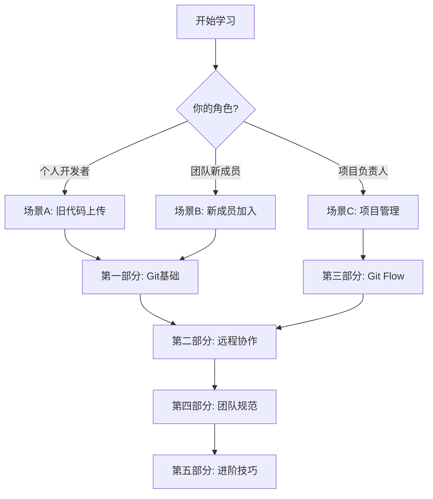

# 基于Gitea的代码版本管理与多人协作

> 完整的Git协作教程：从基础到实战，从单人到团队

---

## 📚 目录导航

### 🚀 快速开始
- [场景A：旧代码上传](#场景a旧代码上传) - 个人项目接入Gitea
- [场景B：新成员加入](#场景b刚加入项目) - 团队协作入门
- [场景C：项目管理](#场景c项目管理者) - 分支治理与发布

### 📖 详细教程
- [第一部分：Git版本管理基础](docs/01-第一部分.md) - 游戏化的Git学习
- [第二部分：远程仓库与Gitea](docs/02-第二部分.md) - 联机模式
- [第三部分：Git Flow多人协作](docs/03-第三部分.md) - 团队副本
- [第四部分：团队规范](docs/04-第四部分.md) - 游戏公会准则
- [第五部分：进阶技巧](docs/05-第五部分.md) - 大师秘籍

### 📋 参考资料
- [附录：命令速查表](docs/06-附录.md#_附录a：命令速查表)
- [附录：术语表](docs/06-附录.md#_附录b：术语表)
- [附录：参考资源](docs/06-附录.md#_附录c：参考资源)

### 🎯 快速定位
按需求快速找到解决方案：
- 🏠 **个人开发者** → [场景A](#场景a旧代码上传)
- 👥 **团队新成员** → [场景B](#场景b刚加入项目)  
- 🛡️ **项目管理者** → [场景C](#场景c项目管理者)
- 🔧 **遇到问题** → [常见问题处理](docs/05-第五部分.md#_52-常见问题处理：排除故障的技巧)
- 📝 **规范要求** → [团队规范](docs/04-第四部分.md)

---

## 🚀 快速开始

### 场景A：旧代码上传

**适用对象**：个人项目、已有源码要接入Gitea  
**目标**：初始化仓库 → 连接远程 → 提交 → 打标签 → 发布二进制

1. **初始化 & 首次提交**
   ```bash
   git init                # 初始化本地Git仓库
   git status              # 查看当前文件状态
   ```
   
   **编辑.gitignore文件**（用你喜欢的编辑器）：
   ```
   # 常见忽略内容
   node_modules/
   dist/
   build/
   *.log
   .DS_Store
   ```
   
   ```bash
   git add .gitignore       # 先添加.gitignore
   git commit -m "chore: 添加.gitignore"
   git add .                # 添加所有文件
   git commit -m "初始化"   # 提交项目源码
   ```

2. **连接远程（以Gitea为例）**
   ```bash
   git remote add origin git@your-gitea:team/repo.git
   git branch -M main
   git push -u origin main
   ```

3. **发布版本**
   ```bash
   git tag -a v1.0.0 -m "正式发布"
   git push origin v1.0.0
   ```
   - 在Gitea "Releases"中创建发布

---

### 场景B：刚加入项目

**适用对象**：新成员、协作者  
**目标**：拉取代码 → 创建分支 → 开发 → 提交 → 提PR

1. **获取代码**
   ```bash
   git clone git@your-gitea:team/repo.git
   cd repo
   ```

2. **开发新功能**
   ```bash
   git checkout -b feature/your-feature
   # 修改代码...
   git add .
   git commit -m "feat: 实现新功能"
   git push -u origin feature/your-feature
   ```

3. **创建Pull Request**
   - 在Gitea页面创建PR
   - 等待代码审查
   - 处理反馈后合并

4. **清理分支**
   ```bash
   git branch -d feature/your-feature
   git push origin --delete feature/your-feature
   ```

---

### 场景C：项目管理者

**适用对象**：Tech Lead、仓库管理员  
**目标**：管理分支 → 审核代码 → 发布版本

1. **分支治理**
   - `main`：生产环境
   - `develop`：开发环境
   - `feature/*`：功能开发
   - `release/*`：版本发布
   - `hotfix/*`：紧急修复

2. **代码审核**
   - 在Gitea审查PR
   - 检查代码质量
   - 批准或请求修改

3. **发布流程**
   ```bash
   git checkout -b release/v1.0.0 develop
   # 更新版本号等
   git tag -a v1.0.0 -m "Release v1.0.0"
   git push origin release/v1.0.0 --tags
   ```

---

📎 **详细指南**：查看docs目录下的完整文档

---

## 📚 完整文档结构

### 🎮 学习路径建议


### 📂 文档目录
```
docs/
├── 📖 00-HOW-TO.md          # 快速上手（本文档开头内容）
├── 🎮 01-第一部分.md        # Git版本管理基础
├── 🌐 02-第二部分.md        # 远程仓库与Gitea
├── 👥 03-第三部分.md        # Git Flow多人协作
├── 📋 04-第四部分.md        # 团队协作规范
├── 🔧 05-第五部分.md        # 进阶技巧与问题解决
├── 📚 06-附录.md            # 命令速查表、术语表、参考资源
├── 🎯 07-结语.md            # 总结与展望
└── 🎨 assets/               # 图片和图表
```

### 🔗 快速跳转链接

#### 🚀 快速开始
- [📋 HOW TO 快速上手](docs/00-HOW-TO.md) - 3个场景快速上手
- [🏠 场景A：旧代码上传](docs/00-HOW-TO.md#_场景-a旧代码上传) - 个人项目接入
- [👥 场景B：新成员加入](docs/00-HOW-TO.md#_场景-b刚加入项目要开始开发) - 团队协作入门
- [🛡️ 场景C：项目管理](docs/00-HOW-TO.md#_场景-c项目管理者维护者) - 分支治理

#### 📖 系统学习
- [🎮 第一部分：Git版本管理基础](docs/01-第一部分.md)
  - [1.1 引言：游戏化Git概念](docs/01-第一部分.md#_11-引言：代码版本管理的游戏世界)
  - [1.2 准备工作：新手村设置](docs/01-第一部分.md#_12-准备工作：新手村设置)
  - [1.3 单人冒险：基础版本管理](docs/01-第一部分.md#_13-单人冒险：基础版本管理)

- [🌐 第二部分：远程仓库与Gitea](docs/02-第二部分.md)
  - [2.1 远程仓库概念：云端存档系统](docs/02-第二部分.md#_21-远程仓库概念：云端存档系统)
  - [2.2 Gitea平台操作指南](docs/02-第二部分.md#_22-gitea平台操作指南)
  - [2.3 本地与远程的连接](docs/02-第二部分.md#_23-本地与远程的连接)

- [👥 第三部分：Git Flow多人协作](docs/03-第三部分.md)
  - [3.1 Git Flow模型介绍](docs/03-第三部分.md#_31-git-flow模型介绍：多人副本的战斗策略)
  - [3.2 五大分支类型详解](docs/03-第三部分.md#_32-五大分支类型详解)
  - [3.3 Issue驱动开发流程](docs/03-第三部分.md#_33-issue驱动开发流程：任务系统)
  - [3.4 Pull Request完整流程](docs/03-第三部分.md#_34-pull-request完整流程：代码审查系统)
  - [3.5 冲突解决实战](docs/03-第三部分.md#_35-冲突解决实战：当两个玩家修改了同一个地方)
  - [3.6 完整协作场景演示](docs/03-第三部分.md#_36-完整协作场景演示)

- [📋 第四部分：团队协作规范](docs/04-第四部分.md)
  - [4.1 Commit Message规范](docs/04-第四部分.md#_41-commit-message规范：记录你的冒险日志)
  - [4.2 分支命名规范](docs/04-第四部分.md#_42-分支命名规范：给你的任务线起个好名字)
  - [4.3 PR描述规范](docs/04-第四部分.md#_43-pr描述规范：任务提交报告模板)
  - [4.4 代码审查清单](docs/04-第四部分.md#_44-代码审查清单：审查装备的标准)

- [🔧 第五部分：进阶技巧与问题解决](docs/05-第五部分.md)
  - [5.1 标签管理：版本里程碑](docs/05-第五部分.md#_51-标签管理：版本里程碑)
  - [5.2 常见问题处理](docs/05-第五部分.md#_52-常见问题处理：排除故障的技巧)
  - [5.3 进阶命令：大师级技能](docs/05-第五部分.md#_53-进阶命令：大师级技能)
  - [5.4 最佳实践总结：大师的箴言](docs/05-第五部分.md#_54-最佳实践总结：大师的箴言)

#### 📚 参考资料
- [📖 附录A：命令速查表](docs/06-附录.md#_附录a：命令速查表) - 常用Git命令一览
- [📝 附录B：术语表](docs/06-附录.md#_附录b：术语表) - Git术语解释
- [🔗 附录C：参考资源](docs/06-附录.md#_附录c：参考资源) - 学习资料和工具推荐

- [🎯 结语](docs/07-结语.md) - 总结与展望

---

### 🎯 常见需求快速定位

| 需求 | 解决方案 | 文档链接 |
|------|----------|----------|
| 🔤 **Git基础概念** | 游戏化理解 | [1.1 引言](docs/01-第一部分.md#_11-引言：代码版本管理的游戏世界) |
| 🛠️ **本地版本管理** | commit、分支、回退 | [1.3 单人冒险](docs/01-第一部分.md#_13-单人冒险：基础版本管理) |
| 🔐 **SSH配置** | 免密推送代码 | [2.2 Gitea操作指南](docs/02-第二部分.md#_22-gitea平台操作指南) |
| 🌿 **分支管理** | Git Flow工作流 | [3.2 五大分支类型](docs/03-第三部分.md#_32-五大分支类型详解) |
| 🔄 **代码协作** | Pull Request流程 | [3.4 PR完整流程](docs/03-第三部分.md#_34-pull-request完整流程：代码审查系统) |
| ⚠️ **解决冲突** | 冲突处理技巧 | [3.5 冲突解决实战](docs/03-第三部分.md#_35-冲突解决实战：当两个玩家修改了同一个地方) |
| 📝 **提交规范** | Conventional Commits | [4.1 Commit Message规范](docs/04-第四部分.md#_41-commit-message规范：记录你的冒险日志) |
| 🐛 **紧急修复** | Hotfix流程 | [3.2 hotfix分支](docs/03-第三部分.md#_32-五大分支类型详解) |
| 📦 **版本发布** | Release流程 | [3.2 release分支](docs/03-第三部分.md#_32-五大分支类型详解) |
| 🔧 **高级命令** | rebase、cherry-pick等 | [5.3 进阶命令](docs/05-第五部分.md#_53-进阶命令：大师级技能) |

---

### 💡 学习建议

**🎯 新手路径：**
1. 从[快速开始](#🚀-快速开始)选择你的场景
2. 阅读[第一部分基础概念](docs/01-第一部分.md)
3. 实践[第二部分远程操作](docs/02-第二部分.md)

**👥 团队协作路径：**
1. 掌握[Git Flow模型](docs/03-第三部分.md#_31-git-flow模型介绍：多人副本的战斗策略)
2. 学习[团队规范](docs/04-第四部分.md)
3. 实践[完整协作场景](docs/03-第三部分.md#_36-完整协作场景演示)

**🔧 进阶提升路径：**
1. 学习[进阶技巧](docs/05-第五部分.md)
2. 查看[命令速查表](docs/06-附录.md#_附录a：命令速查表)
3. 探索[参考资源](docs/06-附录.md#_附录c：参考资源)

---

<div align="center">

**🎮 开始你的Git冒险之旅！**

Happy Coding with Git! 🚀

</div>
