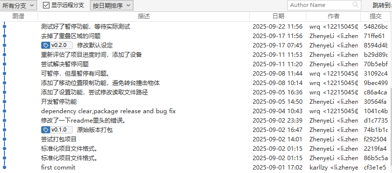

## 第一部分：Git版本管理基础

### 1.1 引言：代码版本管理的游戏世界

想象一下，你正在玩一款充满挑战的游戏。在游戏中，你需要：

- 不断闯关、打怪、解谜
- 在关键节点保存进度
- 需要时读取之前的存档重新尝试
- 查看自己的游戏历程

代码开发其实和玩游戏非常相似！让我们用游戏的概念来理解Git：

| 游戏概念       | Git概念          | 说明                             |
| -------------- | ---------------- | -------------------------------- |
| 🎮 存档库      | `.git` 文件夹  | 保存所有历史版本的地方           |
| 📜 存档记录    | `git log`      | 查看所有的保存点和历史           |
| 🗺️ 当前关卡  | 工作目录         | 你正在进行游戏的地方             |
| ⚔️ 打怪/闯关 | 修改文件         | 编写代码、修改文档               |
| 💾 通关存档    | `git commit`   | 完成一个阶段后保存进度           |
| 🏆 里程碑      | `git tag`      | 标记重要的游戏节点（如版本发布） |
| ⏮️ 读档      | `git checkout` | 回到之前的某个存档点             |


写代码的过程可以看作是修改当前关卡内的文件，完成指定功能（通关），然后存档的过程。

#### 为什么需要版本管理？

在没有版本管理的世界里，你可能遇到过这些问题：

1. **找不回之前的代码**：改了一通后发现之前的版本更好，但已经覆盖了
2. **文件命名混乱**：`代码_最终版.py`、`代码_最终版_真的最终版.py`、`代码_这次真的是最终版.py`
3. **多人协作困难**：你和同事同时修改同一个文件，不知道该保留谁的修改
4. **无法追溯历史**：不知道某段代码是谁写的、为什么写、什么时候写的

Git就是为了解决这些问题而生的！它就像是一个**智能的游戏存档系统**，让你可以：

- ✅ 随时保存代码的任意版本
- ✅ 轻松回到历史的任何时刻
- ✅ 清楚地看到每次修改的内容
- ✅ 多人同时工作互不干扰
- ✅ 安全地合并不同人的修改

### 1.2 准备工作：新手村设置

在开始冒险之前，我们需要完成一些准备工作。

#### 安装Git

**Windows系统：**

1. 访问Git官网：https://git-scm.com/download/win
2. 下载安装包并运行
3. 安装过程中保持默认设置即可（建议勾选"Git Bash Here"）
4. 安装完成后，右键点击任意文件夹，应该能看到"Git Bash Here"选项

**macOS系统：**

方法1：使用Homebrew（推荐）

```bash
brew install git
```

方法2：下载安装包

- 访问：https://git-scm.com/download/mac
- 下载并安装

**Linux系统：**

Ubuntu/Debian:

```bash
sudo apt update
sudo apt install git
```

CentOS/Fedora:

```bash
sudo yum install git
```

#### 验证安装

打开终端（Windows用户打开Git Bash），输入：

```bash
git --version
```

如果看到类似 `git version 2.40.0` 的输出，说明安装成功！

#### 全局配置：设置你的游戏ID

在Git的世界里，每次存档（commit）都需要记录是谁保存的。所以我们需要先设置你的身份信息：

```bash
# 设置你的用户名
git config --global user.name "你的名字"

# 设置你的邮箱
git config --global user.email "your.email@example.com"
```

**示例：**

```bash
git config --global user.name "张三"
git config --global user.email "zhangsan@example.com"
```

> 💡 **提示**：这里的邮箱建议使用你在Gitea上注册的邮箱，这样提交记录会和你的账号关联起来。

查看你的配置：

```bash
git config --global --list
```

#### 其他有用的配置

**设置默认分支名称为main：**

```bash
git config --global init.defaultBranch main
```

**设置默认编辑器（可选）：**

使用VS Code:

```bash
git config --global core.editor "code --wait"
```

使用Vim:

```bash
git config --global core.editor "vim"
```

使用Nano:

```bash
git config --global core.editor "nano"
```

**配置命令行显示颜色：**

```bash
git config --global color.ui auto
```

#### 图形化工具推荐（可选）

虽然我们主要讲解命令行操作，但图形化工具在某些场景下更直观：

- **SourceTree**：功能强大，适合新手（免费，但只适用于windows和mac，下图就是）
- **GitKraken**：界面美观，操作流畅（免费版可以打开公开仓库，付费才能支持私有仓库打开）
- **VS Code**：内置Git支持，如果你用VS Code写代码，无需额外安装
- **GitHub Desktop**：简单易用，虽然名字有GitHub但也支持Gitea


### 1.3 单人冒险：基础版本管理

现在，让我们开始第一次冒险！

#### 创建你的游戏世界：初始化仓库

假设你要开发一个计算器程序，首先创建项目文件夹：

```bash
# 创建项目文件夹
mkdir my-calculator
cd my-calculator

# 初始化Git仓库（创建存档系统）
git init
```

执行 `git init` 后，你会看到：

```
Initialized empty Git repository in /path/to/my-calculator/.git/
```

这时，一个隐藏的 `.git` 文件夹就被创建了。这就是你的**存档库**！

> ⚠️ **注意**：`.git` 文件夹非常重要，千万不要手动删除或修改它！这里保存着所有的历史记录。

查看 `.git` 文件夹（可选）：

```bash
# Windows Git Bash / Linux / macOS
ls -la
```

#### Git的三大区域：游戏的三个世界

在Git中，你的文件会处于三个不同的区域，理解这三个区域非常重要：

```
┌─────────────────────────────────────────────────────────────┐
│                    远程仓库（Remote）                          │
│                  （云端存档，第三部分讲解）                      │
└─────────────────────────────────────────────────────────────┘
                            ↕ git push/pull
┌─────────────────────────────────────────────────────────────┐
│                   版本库（Repository）                         │
│                      .git 文件夹                               │
│                   【已保存的存档】                              │
│                                                               │
│  存储：所有历史提交记录                                         │
└─────────────────────────────────────────────────────────────┘
                            ↑ git commit
┌─────────────────────────────────────────────────────────────┐
│                   暂存区（Staging Area）                       │
│                      Index / Stage                            │
│                 【准备存档的内容】                              │
│                                                               │
│  存储：准备提交的文件快照                                       │
└─────────────────────────────────────────────────────────────┘
                            ↑ git add
┌─────────────────────────────────────────────────────────────┐
│                   工作区（Working Directory）                  │
│                     项目文件夹                                 │
│                  【当前游戏关卡】                               │
│                                                               │
│  存储：你正在编辑的文件                                         │
└─────────────────────────────────────────────────────────────┘
```

**游戏化理解：**

1. **工作区（Working Directory）**：就像游戏中的**当前关卡**

   - 你看到的项目文件夹中的所有文件
   - 这是你"打怪"（编写代码）的地方
2. **暂存区（Staging Area）**：就像游戏的**保存菜单**

   - 你选择了要保存的内容，但还没有确认保存
   - 可以多次添加、修改暂存内容
3. **版本库（Repository）**：就像**已保存的存档**

   - 一旦提交（commit），就永久保存在这里
   - 可以随时读取这些存档

#### 基本操作流程：开始游戏

让我们通过一个完整的例子来体验Git的基本操作。

**第1步：创建文件（进入关卡）**

创建一个简单的计算器文件：

```bash
# 创建README文件
echo "# 我的计算器项目" > README.md

# 创建Python计算器文件
echo "def add(a, b):" > calculator.py
echo "    return a + b" >> calculator.py
```

或者用你喜欢的编辑器创建文件：

`README.md`:

```markdown
# 我的计算器项目

这是一个简单的计算器程序。
```

`calculator.py`:

```python
def add(a, b):
    return a + b

def subtract(a, b):
    return a - b
```

**第2步：查看状态（查看当前游戏状态）**

```bash
git status
```

输出类似：

```
On branch main

No commits yet

Untracked files:
  (use "git add <file>..." to include in what will be committed)
        README.md
        calculator.py

nothing added to commit but untracked files present (use "git add" to track)
```

解读：

- `Untracked files`：未跟踪的文件，Git还不知道这些文件
- 红色显示的文件：还没有被添加到暂存区

**第3步：添加到暂存区（选择要存档的内容）**

```bash
# 添加单个文件
git add README.md

# 或者添加所有文件
git add .
```

> 💡 **提示**：
>
> - `git add 文件名`：添加指定文件
> - `git add .`：添加当前目录所有文件
> - `git add *.py`：添加所有.py文件

再次查看状态：

```bash
git status
```

输出：

```
On branch main

No commits yet

Changes to be committed:
  (use "git rm --cached <file>..." to unstage)
        new file:   README.md
        new file:   calculator.py
```

解读：

- `Changes to be committed`：准备提交的更改
- 绿色显示：文件已在暂存区

**第4步：提交到版本库（正式存档）**

```bash
git commit -m "初始提交：创建项目和基本加减法功能"
```

输出：

```
[main (root-commit) a1b2c3d] 初始提交：创建项目和基本加减法功能
 2 files changed, 8 insertions(+)
 create mode 100644 README.md
 create mode 100644 calculator.py
```

> 💡 **提示**：`-m` 参数后面的内容是提交信息（commit message），应该简洁明了地描述这次修改做了什么。

**第5步：查看历史（查看存档记录）**

```bash
git log
```

输出：

```
commit a1b2c3d4e5f6g7h8i9j0k1l2m3n4o5p6q7r8s9t0 (HEAD -> main)
Author: 张三 <zhangsan@example.com>
Date:   Mon Nov 17 10:30:00 2025 +0800

    初始提交：创建项目和基本加减法功能
```

**更友好的查看方式：**

```bash
# 单行显示，更简洁
git log --oneline

# 图形化显示分支（后面会用到）
git log --oneline --graph --all

# 查看最近3条记录
git log -3
```

#### 实战示例：继续游戏，完成更多关卡

现在让我们继续开发，添加乘除法功能。

**关卡2：添加乘法和除法**

修改 `calculator.py`：

```python
def add(a, b):
    return a + b

def subtract(a, b):
    return a - b

def multiply(a, b):
    return a * b

def divide(a, b):
    if b == 0:
        return "错误：除数不能为0"
    return a / b
```

查看修改：

```bash
git status
```

输出：

```
On branch main
Changes not staged for commit:
  (use "git add <file>..." to update what will be committed)
  (use "git restore <file>..." to discard changes in working directory)
        modified:   calculator.py

no changes added to commit (use "git add" and/or "git commit -a")
```

查看具体修改了什么：

```bash
git diff
```

输出会显示文件的变化，`+` 表示新增的行，`-` 表示删除的行。

提交修改：

```bash
git add calculator.py
git commit -m "新增功能：添加乘法和除法"
```

**关卡3：添加测试用例**

创建 `test_calculator.py`：

```python
from calculator import add, subtract, multiply, divide

# 测试加法
assert add(2, 3) == 5
assert add(-1, 1) == 0

# 测试减法
assert subtract(5, 3) == 2
assert subtract(0, 5) == -5

# 测试乘法
assert multiply(3, 4) == 12
assert multiply(-2, 5) == -10

# 测试除法
assert divide(10, 2) == 5
assert divide(7, 2) == 3.5
assert divide(5, 0) == "错误：除数不能为0"

print("所有测试通过！")
```

提交：

```bash
git add test_calculator.py
git commit -m "新增测试：添加计算器功能的测试用例"
```

查看游戏历程：

```bash
git log --oneline
```

输出：

```
c3d4e5f (HEAD -> main) 新增测试：添加计算器功能的测试用例
b2c3d4e 新增功能：添加乘法和除法
a1b2c3d 初始提交：创建项目和基本加减法功能
```

🎉 恭喜！你已经完成了三个关卡，并保存了三个存档点！

#### 时光倒流：版本回退

有时候，你可能会发现最近的修改有问题，想要回到之前的某个版本。Git提供了多种"读档"的方式。

**查看历史版本：**

```bash
git log --oneline
```

假设输出：

```
c3d4e5f (HEAD -> main) 新增测试：添加计算器功能的测试用例
b2c3d4e 新增功能：添加乘法和除法
a1b2c3d 初始提交：创建项目和基本加减法功能
```

**方式1：git checkout（临时查看，不修改历史）**

就像在游戏中"读档查看"但不真正恢复：

```bash
# 回到指定版本查看（使用commit ID）
git checkout a1b2c3d

# 回到最新版本
git checkout main
```

> ⚠️ **注意**：这会让你进入"detached HEAD"状态，只是查看，不要在这个状态下修改文件。

**方式2：git reset（修改历史，慎用）**

这是真正的"读档"，会改变历史：

```bash
# 回退到上一个版本，保留工作区的修改
git reset --soft HEAD~1

# 回退到上一个版本，保留工作区和暂存区
git reset --mixed HEAD~1  # 默认模式

# 回退到上一个版本，丢弃所有修改（危险！）
git reset --hard HEAD~1
```

**特殊符号说明：**

- `HEAD`：当前版本
- `HEAD~1`：上一个版本
- `HEAD~2`：上上个版本
- 也可以直接使用commit ID：`git reset --hard a1b2c3d`

**三种模式对比：**

| 模式        | 版本库 | 暂存区 | 工作区 | 使用场景           |
| ----------- | ------ | ------ | ------ | ------------------ |
| `--soft`  | 回退   | 保留   | 保留   | 重新组织提交       |
| `--mixed` | 回退   | 清空   | 保留   | 取消暂存，保留修改 |
| `--hard`  | 回退   | 清空   | 清空   | 完全放弃最近的修改 |

**方式3：git revert（创建新提交来撤销，推荐）**

这是最安全的方式，不修改历史，而是创建一个新的提交来撤销之前的修改：

```bash
# 撤销指定的提交
git revert c3d4e5f

# 撤销最近的提交
git revert HEAD
```

Git会打开编辑器让你输入撤销说明，保存后就完成了。

**选择建议：**

- 🟢 **多人协作**：使用 `git revert`（不改变历史）
- 🟡 **本地调整**：使用 `git reset`（还没推送到远程）
- 🔴 **临时查看**：使用 `git checkout`（只是看看）

#### 实战练习：撤销操作

**场景1：撤销工作区的修改**

你修改了文件，但还没有 `git add`：

```bash
# 查看修改
git status

# 撤销对某个文件的修改
git restore calculator.py

# 或撤销所有修改
git restore .
```

**场景2：撤销暂存区的文件**

你已经 `git add` 了，但还没有 `git commit`：

```bash
# 取消暂存某个文件（文件修改仍保留在工作区）
git restore --staged calculator.py

# 取消所有暂存
git restore --staged .
```

**场景3：修改最后一次提交**

你刚刚提交，但发现漏了一个文件或提交信息写错了：

```bash
# 修改文件或添加遗漏的文件
echo "print('计算器v1.0')" >> calculator.py
git add calculator.py

# 追加到上一次提交，并修改提交信息
git commit --amend -m "新增功能：添加乘法和除法（含版本号）"
```

> 💡 **提示**：`--amend` 会替换最后一次提交，所以commit ID会改变。

#### .gitignore：不需要存档的文件

在游戏中，并不是所有东西都需要保存。比如：

- 游戏的临时缓存
- 系统自动生成的文件
- 个人的配置文件

在代码项目中也是一样，有些文件不需要版本控制：

- 编译生成的文件（如 `.pyc`、`.class`）
- 依赖包文件夹（如 `node_modules/`、`venv/`）
- 系统文件（如 `.DS_Store`、`Thumbs.db`）
- 配置文件（如包含密码的 `.env`）
- IDE配置（如 `.vscode/`、`.idea/`）

创建 `.gitignore` 文件来忽略这些文件：

```bash
# 创建 .gitignore
touch .gitignore
```

编辑 `.gitignore`：

```gitignore
# Python相关
__pycache__/
*.py[cod]
*$py.class
*.so
.Python
venv/
env/
.env

# 系统文件
.DS_Store
Thumbs.db
Desktop.ini

# IDE配置
.vscode/
.idea/
*.swp
*.swo

# 测试覆盖率报告
htmlcov/
.coverage
.pytest_cache/

# 日志文件
*.log

# 数据库文件
*.db
*.sqlite3
```

提交 `.gitignore`：

```bash
git add .gitignore
git commit -m "配置：添加.gitignore文件"
```

**通配符说明：**

- `*.log`：忽略所有 `.log` 文件
- `temp/`：忽略 `temp` 文件夹
- `!important.log`：例外，不忽略 `important.log`
- `doc/*.txt`：忽略 `doc` 目录下的 `.txt` 文件，但不包括子目录
- `doc/**/*.txt`：忽略 `doc` 目录及其所有子目录下的 `.txt` 文件

**查看忽略规则：**

```bash
# 查看某个文件是否被忽略
git check-ignore -v filename.log
```

#### 小结：单人冒险的核心技能

恭喜你完成了单人冒险模式！现在你已经掌握了：

✅ **基础操作**

- `git init`：创建仓库
- `git status`：查看状态
- `git add`：添加到暂存区
- `git commit`：提交到版本库
- `git log`：查看历史

✅ **版本回退**

- `git checkout`：临时查看历史版本
- `git reset`：回退版本（修改历史）
- `git revert`：撤销提交（创建新提交）

✅ **撤销操作**

- `git restore`：撤销工作区修改
- `git restore --staged`：取消暂存
- `git commit --amend`：修改最后一次提交

✅ **忽略文件**

- `.gitignore`：指定不需要版本控制的文件

**常用命令速查：**

```bash
# 初始化和配置
git init                          # 初始化仓库
git config --global user.name     # 设置用户名
git config --global user.email    # 设置邮箱

# 日常操作
git status                        # 查看状态
git add .                         # 添加所有文件
git commit -m "说明"              # 提交
git log --oneline                 # 查看历史

# 查看差异
git diff                          # 工作区 vs 暂存区
git diff --staged                 # 暂存区 vs 版本库
git diff HEAD                     # 工作区 vs 版本库

# 撤销操作
git restore 文件名                # 撤销工作区修改
git restore --staged 文件名       # 取消暂存
git reset --soft HEAD~1           # 撤销提交，保留修改
```

现在，你已经可以独立管理自己的项目了！这样的开发我们解决的问题主要是版本管理，于是就会得到下边这样的“我独自升级”版本提交图：


但是，真正的冒险才刚刚开始。在下一部分，我们将进入**联机模式**，学习如何将你的存档同步到云端，以及如何与其他玩家协作！

---
