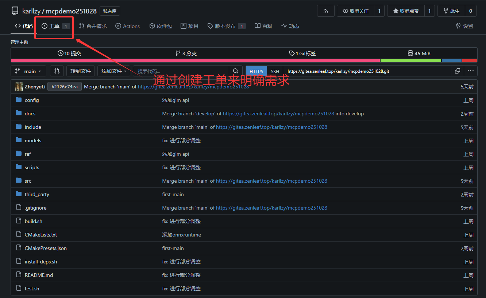

## 第三部分：团队副本 - Git Flow多人协作

### 3.1 Git Flow模型介绍：多人副本的战斗策略

在单人游戏中，你只需要一条主线往前推进就行。但在多人在线游戏（MMO）中，情况就复杂得多：

- 🏆 **主线剧情**（main分支）：已经通关的稳定版本，所有玩家都能体验
- 🎯 **测试服**（develop分支）：新内容的集结地，正在测试中
- ⚔️ **支线任务**（feature分支）：不同玩家在做不同的任务
- 🛡️ **紧急修复**（hotfix分支）：主线出现严重bug，需要立即修复

这就是**Git Flow模型**的核心思想。

#### 为什么需要分支管理策略？

想象一个场景：

- 开发者A正在开发登录功能（70%完成）
- 开发者B正在开发支付功能（50%完成）
- 突然，线上版本发现严重bug需要立即修复
- 同时，测试团队需要一个稳定的版本进行测试

如果所有人都在同一个分支上工作：
❌ 半成品功能会相互干扰
❌ 无法快速修复线上bug
❌ 测试版本不稳定
❌ 发布版本混乱

**Git Flow通过分支管理解决这些问题：**
✅ 各个功能独立开发，互不干扰
✅ 主分支永远保持稳定
✅ 可以随时紧急修复线上问题
✅ 发布流程规范化

#### Git Flow完整模型图解


### 3.2 五大分支类型详解

#### (1) main分支 - 主线剧情（永久分支）

**角色定位：**

- 🏆 生产环境的代码
- 📦 每个commit都是一个发布版本
- ✅ 永远保持稳定，可以随时部署

**特点：**

- **永久存在**，不会被删除
- **只接受合并**，不直接在上面开发
- 每次合并都应该打上版本标签（如v1.0.0）

**游戏类比：**
就像游戏的正式服务器，只有经过充分测试的内容才能上线，玩家玩的都是这个版本。

**操作命令：**

```bash
# 查看main分支的历史
git log main --oneline

# 查看main分支的标签
git tag -l

# 切换到main分支
git checkout main
```

**保护规则（在Gitea中设置）：**

- 🔒 禁止直接push
- 🔒 必须通过Pull Request合并
- 🔒 需要代码审查通过
- 🔒 必须通过CI/CD测试

#### (2) develop分支 - 开发服务器（永久分支）

**角色定位：**

- 🎯 开发环境的代码
- 🔄 集成所有开发完成的功能
- 📊 反映最新的开发进度

**特点：**

- **永久存在**，不会被删除
- **接受feature分支合并**
- 可能不稳定，但应该是可运行的

**游戏类比：**
就像游戏的测试服，新功能会先在这里集成，有问题可以继续修改，稳定后才会推到正式服。


**创建develop分支：**

```bash
# 从main创建develop分支
git checkout main
git checkout -b develop

# 推送到远程
git push -u origin develop
```

**日常操作：**

```bash
# 切换到develop
git checkout develop

# 拉取最新代码
git pull

# 查看develop的提交历史
git log develop --oneline
```

#### (3) feature分支 - 支线任务（临时分支）

**角色定位：**

- ⚔️ 开发具体功能
- 👤 通常一个人负责一个feature
- 🎯 完成后合并到develop，然后删除

**命名规范：**

```
feature/功能名称
feature/issue编号-功能名称
```

**示例：**

- `feature/user-login`
- `feature/payment-integration`
- `feature/issue-123-add-search`

游戏类比：

开很多个支线任务，然后再把支线任务里的奖励拿到之后再回到主线。（对应原神中的，先完成每日任务抽卡抽角色，再去做主线的魔神任务。）


**完整流程：**

**第1步：创建feature分支**

```bash
# 确保develop是最新的
git checkout develop
git pull

# 从develop创建新的feature分支
git checkout -b feature/user-login

# 推送到远程
git push -u origin feature/user-login
```

**第2步：在feature分支上开发**

```bash
# 开发功能...
# 编辑文件

# 提交代码
git add .
git commit -m "feat: 实现用户登录表单"

# 继续开发...
git add .
git commit -m "feat: 添加登录验证逻辑"

# 推送到远程
git push
```

**第3步：定期同步develop的更新**

如果develop分支有新的更新，需要定期合并，避免分支差异太大：

```bash
# 方法1：merge（保留完整历史）
git checkout feature/user-login
git merge develop

# 方法2：rebase（保持线性历史，推荐）
git checkout feature/user-login
git rebase develop
```

**第4步：功能完成，准备合并**

在Gitea上创建Pull Request（后面详细讲），或者直接合并：

```bash
# 切换到develop
git checkout develop
git pull

# 合并feature分支
git merge --no-ff feature/user-login

# 推送到远程
git push

# 删除本地feature分支
git branch -d feature/user-login

# 删除远程feature分支
git push origin --delete feature/user-login
```

> 💡 **提示**：`--no-ff` 参数表示"不使用快进合并"，会创建一个合并commit，保留分支历史。

**实战示例：开发一个搜索功能**

```bash
# 1. 创建分支
git checkout develop
git pull
git checkout -b feature/search-function

# 2. 第一次提交：创建搜索组件
# 编辑 search.py
git add search.py
git commit -m "feat: 创建搜索功能基础框架"

# 3. 第二次提交：实现搜索逻辑
# 编辑 search.py
git add search.py
git commit -m "feat: 实现基于关键词的搜索逻辑"

# 4. 第三次提交：添加测试
# 创建 test_search.py
git add test_search.py
git commit -m "test: 添加搜索功能的单元测试"

# 5. 推送到远程
git push -u origin feature/search-function

# 6. 在Gitea上创建PR（Pull Request）
# 请求合并到develop分支

# 7. PR合并后，删除分支
git checkout develop
git pull
git branch -d feature/search-function
git push origin --delete feature/search-function
```

#### (4) release分支 - 测试服（临时分支）

**角色定位：**

- 🎮 准备发布新版本
- 🔍 最后的测试和bug修复
- 📝 更新版本号和文档

**命名规范：**

```
release/版本号
```

**示例：**

- `release/1.0.0`
- `release/2.1.0`
- `release/v1.5.0-beta`

**什么时候创建release分支？**

当develop分支积累了足够的功能，准备发布新版本时：

- ✅ 所有计划的feature都已合并到develop
- ✅ develop分支相对稳定
- ✅ 准备好发布给用户

**完整流程：**

**第1步：从develop创建release分支**

```bash
# 切换到develop，确保最新
git checkout develop
git pull

# 创建release分支
git checkout -b release/1.0.0

# 推送到远程
git push -u origin release/1.0.0
```

**第2步：在release分支上进行最后的修改**

只做**版本相关的修改**，不添加新功能：

```bash
# 更新版本号
echo "VERSION = '1.0.0'" > version.py
git add version.py
git commit -m "chore: 更新版本号为1.0.0"

# 修复测试中发现的小bug
# 编辑文件...
git add .
git commit -m "fix: 修复登录页面的显示问题"

# 更新CHANGELOG
echo "## v1.0.0 (2025-11-17)" > CHANGELOG.md
echo "- 新增用户登录功能" >> CHANGELOG.md
echo "- 新增搜索功能" >> CHANGELOG.md
git add CHANGELOG.md
git commit -m "docs: 更新CHANGELOG for v1.0.0"
```

**第3步：完成测试，准备发布**

测试团队在release分支上进行完整测试，发现的bug在这个分支上修复。

**第4步：合并到main和develop**

```bash
# 合并到main（生产环境）
git checkout main
git pull
git merge --no-ff release/1.0.0
git tag -a v1.0.0 -m "Release version 1.0.0"
git push
git push --tags

# 合并到develop（同步bug修复）
git checkout develop
git pull
git merge --no-ff release/1.0.0
git push

# 删除release分支
git branch -d release/1.0.0
git push origin --delete release/1.0.0
```

**流程图：**


#### (5) hotfix分支 - 紧急修复（临时分支）

**角色定位：**

- 🚨 修复生产环境的紧急bug
- ⚡ 不等待develop的开发周期
- 🎯 修复后立即发布

**命名规范：**

```
hotfix/问题描述
hotfix/bug编号-问题描述
```

**示例：**

- `hotfix/login-crash`
- `hotfix/payment-error`
- `hotfix/issue-456-fix-security`

**什么时候使用hotfix？**

- 🔥 生产环境出现严重bug
- 🚨 安全漏洞需要立即修复
- ⏰ 不能等待正常的发布周期

**完整流程：**

**第1步：从main创建hotfix分支**

```bash
# 切换到main
git checkout main
git pull

# 创建hotfix分支
git checkout -b hotfix/login-crash

# 推送到远程
git push -u origin hotfix/login-crash
```

**第2步：修复bug**

```bash
# 修复bug
# 编辑相关文件...

git add .
git commit -m "fix: 修复登录时的崩溃问题"

# 测试修复
# 运行测试...

git push
```

**第3步：合并到main和develop**

```bash
# 合并到main
git checkout main
git pull
git merge --no-ff hotfix/login-crash

# 更新版本号（补丁版本）
git tag -a v1.0.1 -m "Hotfix: 修复登录崩溃"
git push
git push --tags

# 合并到develop
git checkout develop
git pull
git merge --no-ff hotfix/login-crash
git push

# 删除hotfix分支
git branch -d hotfix/login-crash
git push origin --delete hotfix/login-crash
```

**流程图：**


#### 分支类型对比表

| 分支类型          | 生命周期 | 从哪里分支 | 合并到哪里     | 命名规范          | 用途               |
| ----------------- | -------- | ---------- | -------------- | ----------------- | ------------------ |
| **main**    | 永久     | -          | -              | `main`          | 生产环境，正式发布 |
| **develop** | 永久     | main       | -              | `develop`       | 开发环境，功能集成 |
| **feature** | 临时     | develop    | develop        | `feature/xxx`   | 开发新功能         |
| **release** | 临时     | develop    | main & develop | `release/x.x.x` | 准备发布版本       |
| **hotfix**  | 临时     | main       | main & develop | `hotfix/xxx`    | 紧急修复bug        |

### 3.3 Issue驱动开发流程：任务系统

在游戏中，所有任务都从任务板开始。在代码协作中，所有工作都应该从Issue开始。

#### 什么是Issue？

**Issue**（议题）是Gitea的任务管理系统，可以用来：

- 📝 报告bug
- 💡 提出新功能建议
- 📋 记录待办事项
- 💬 讨论技术方案

**游戏类比：**
Issue就像任务板，每个Issue都是一个任务，你接受任务（分配给自己），完成任务（关闭Issue）。

#### 在Gitea创建工单(Issue)



**步骤详解：**

1. **进入项目仓库**

   - 打开项目页面
2. **点击"Issues"标签**

   - 在顶部导航栏找到"Issues"
3. **点击"新建Issue"按钮**
4. **填写Issue信息：**

   **标题**（必填）：简洁明了地描述问题

   ```
   好的例子：
   - 登录页面在移动端显示异常
   - 添加支付宝支付方式
   - 优化搜索性能

   不好的例子：
   - 有bug
   - 修改一下
   - 问题
   ```

   **描述**（详细信息）：

   ```markdown
   ## 问题描述
   用户在移动端访问登录页面时，表单显示不完整。

   ## 复现步骤
   1. 打开手机浏览器
   2. 访问登录页面
   3. 观察表单显示

   ## 预期行为
   表单应该完整显示并自适应屏幕宽度

   ## 实际行为
   表单右侧被截断

   ## 环境信息
   - 设备：iPhone 13
   - 浏览器：Safari 16
   - 系统版本：iOS 16

   ## 截图
   （可以拖拽图片到这里）
   ```

   **标签**（Labels）：分类Issue

   - `bug`：程序错误
   - `feature`：新功能
   - `enhancement`：功能改进
   - `documentation`：文档相关
   - `question`：疑问
   - `help wanted`：需要帮助
   - `priority:high`：高优先级

   **里程碑**（Milestone）：版本规划

   - `v1.0.0`：第一个正式版本
   - `v1.1.0`：下一个小版本
   - `Q1-2025`：第一季度目标

   **指派**（Assignees）：分配给谁

   - 指定负责人

   **到期日期**：设置截止时间
5. **点击"创建Issue"**

#### Issue组成要素示例

**Issue #123：添加用户注册功能**

```
标题：添加用户注册功能

标签：feature, priority:high
里程碑：v1.0.0
指派给：@zhangsan
到期时间：2025-11-30

描述：
## 需求背景
目前系统只有登录功能，需要添加用户注册功能。

## 功能要求
1. 注册表单包含：
   - 用户名（必填，3-20字符）
   - 邮箱（必填，需验证格式）
   - 密码（必填，至少8位）
   - 确认密码（必填，需匹配）

2. 验证逻辑：
   - 用户名不能重复
   - 邮箱不能重复
   - 密码强度检查

3. 成功后自动登录并跳转到首页

## 技术方案
- 前端：使用Vue.js实现表单
- 后端：添加 /api/register 接口
- 数据库：在users表中添加记录

## 验收标准
- [ ] 表单验证正确
- [ ] 重复检查生效
- [ ] 注册成功后自动登录
- [ ] 添加单元测试
- [ ] 更新API文档

评论区：
@lisi: 我建议添加邮箱验证功能
@zhangsan: 好的，邮箱验证放在v1.1版本
```

#### Issue与分支的关联

创建分支时，分支名包含Issue编号：

```bash
# Issue #123: 添加用户注册功能
git checkout develop
git checkout -b feature/issue-123-user-registration
git push -u origin feature/issue-123-user-registration
```

#### Issue编号在commit中的引用

在提交信息中引用Issue编号，Gitea会自动关联：

```bash
git commit -m "feat: 实现注册表单 #123"
git commit -m "feat: 添加注册API接口 (#123)"
git commit -m "test: 添加注册功能测试 (fixes #123)"
```

**特殊关键词可以自动关闭Issue：**

- `fixes #123`
- `closes #123`
- `resolves #123`

当包含这些关键词的commit被合并到main分支时，对应的Issue会自动关闭。

```bash
git commit -m "feat: 完成用户注册功能，fixes #123"
```

#### Issue工作流程

```
1. 创建Issue
   ↓
2. 讨论技术方案
   （在评论区）
   ↓
3. 分配给开发者
   ↓
4. 开发者创建feature分支
   （feature/issue-123-xxx）
   ↓
5. 开发过程中提交
   （commit message引用#123）
   ↓
6. 创建Pull Request
   （关联Issue）
   ↓
7. 代码审查
   ↓
8. 合并PR
   ↓
9. Issue自动关闭
   ✓ 任务完成
```

### 3.4 Pull Request完整流程：代码审查系统

**Pull Request（PR）**是Git协作的核心机制，就像向主线剧情提交你的支线任务成果。

#### PR的概念和作用

**什么是Pull Request？**

- 📤 请求将你的分支合并到目标分支
- 👀 让团队成员审查你的代码
- 💬 讨论和改进代码质量
- ✅ 通过后才能合并

**游戏类比：**
你完成了一个支线任务，现在要向游戏策划提交你的成果。策划会检查你的任务是否符合要求，有问题会让你修改，没问题就会接受并加入主线剧情。

#### 创建PR的完整步骤

**前置条件：**
你已经在feature分支上完成了开发，并推送到远程。

```bash
# 确保所有改动都已提交并推送
git add .
git commit -m "feat: 完成用户注册功能 #123"
git push
```

**在Gitea网页上创建PR：**

**第1步：进入Pull Requests页面**

- 进入项目仓库
- 点击顶部"Pull Requests"标签
- 点击"创建Pull Request"按钮

**第2步：选择分支**

```
源分支（要合并的）: feature/issue-123-user-registration
目标分支（合并到）: develop
```

**第3步：填写PR信息**

**标题**：简洁描述这个PR的内容

```
好的例子：
- feat: 添加用户注册功能 (#123)
- fix: 修复登录页面移动端显示问题 (#124)
- refactor: 重构用户认证模块 (#125)

不好的例子：
- 更新
- 修改了一些东西
- PR
```

**描述**（非常重要！）：使用模板

```markdown
## 相关Issue
Closes #123

## 改动说明
本PR实现了用户注册功能，包括：
- 前端注册表单及验证
- 后端注册API接口
- 用户信息的数据库存储
- 重复检查逻辑
- 单元测试

## 技术细节
- 使用bcrypt加密密码
- 使用正则表达式验证邮箱格式
- 添加了用户名和邮箱的唯一索引

## 测试情况
- [x] 单元测试通过（覆盖率85%）
- [x] 本地手动测试通过
- [x] 集成测试通过

## 截图/演示
（如果是UI改动，附上截图或GIF）

## 检查清单
- [x] 代码遵循项目规范
- [x] 添加了必要的注释
- [x] 更新了相关文档
- [x] 添加了测试用例
- [x] 所有测试通过
- [x] 没有新的警告

## 需要特别注意的地方
密码加密使用了bcrypt，性能相对较慢，但安全性更高。

## 后续工作
邮箱验证功能将在#124中实现。
```

**第4步：设置PR选项**

- **指派审查者**（Reviewers）：选择谁来审查代码
- **关联Issue**：在描述中使用 `Closes #123`
- **标签**：添加相关标签（如 `feature`）
- **里程碑**：关联到版本里程碑

**第5步：创建Pull Request**

点击"创建Pull Request"按钮。

#### 代码审查（Code Review）

创建PR后，审查者会进行代码审查。

**审查者的职责：**

✅ **功能检查**

- 功能是否符合需求
- 是否实现了Issue中的所有要求
- 边界情况是否处理

✅ **代码质量**

- 代码风格是否一致
- 命名是否规范
- 逻辑是否清晰
- 有无重复代码

✅ **安全性**

- 是否有安全漏洞
- 输入验证是否充分
- 是否有风险代码

✅ **性能**

- 是否有性能问题
- 算法复杂度是否合理
- 是否有不必要的查询

✅ **测试**

- 测试覆盖是否充分
- 测试用例是否合理

✅ **文档**

- 注释是否清晰
- API文档是否更新

**如何添加评论：**

1. **行级评论**

   - 在代码差异视图中，点击行号旁的 `+`
   - 输入评论
   - 可以选择"单条评论"或"开始审查"
2. **整体评论**

   - 在PR页面底部的评论框
   - 输入整体建议
3. **建议修改**

   ```markdown
   这里建议使用更清晰的变量名：
   ```python
   # 建议改为
   user_email = form.get('email')
   ```

**审查结果类型：**

- ✅ **批准（Approve）**：代码没问题，可以合并
- 💬 **评论（Comment）**：有建议但不阻止合并
- ❌ **请求修改（Request Changes）**：必须修改后才能合并

#### 处理审查意见

作为PR提交者，收到审查意见后：

**第1步：查看评论**

- 仔细阅读所有评论
- 理解审查者的关注点

**第2步：进行修改**

```bash
# 在同一个feature分支上修改
git checkout feature/issue-123-user-registration

# 根据反馈修改代码
# 编辑文件...

# 提交修改
git add .
git commit -m "refactor: 根据code review优化变量命名"

# 推送（会自动更新PR）
git push
```

> 💡 **提示**：推送后，PR会自动更新，审查者会收到通知。

**第3步：回复评论**

- 对每条评论进行回复
- 说明你如何处理了这个问题
- 可以使用"Resolve conversation"标记为已解决

**第4步：请求重新审查**

- 修改完成后，在PR中@审查者
- 或点击"Re-request review"

#### 合并PR的时机

PR可以合并的条件：

- ✅ 所有必需的审查者都已批准
- ✅ CI/CD测试全部通过
- ✅ 没有未解决的冲突
- ✅ 所有"Request Changes"都已处理

#### 合并策略选择

Gitea提供三种合并策略：

**1. Merge Commit（标准合并）**

```bash
# 相当于
git merge --no-ff feature-branch
```

**特点：**

- 保留完整的提交历史
- 创建一个merge commit
- 可以看到分支的完整演进

**历史图：**

```
main:     ●─────────────●
                       ╱
feature: ●───●───●────╯
```

**适用场景：**

- 想保留完整的开发历史
- 想看到功能是在哪个分支开发的

**2. Squash and Merge（压缩合并）**

```bash
# 相当于
git merge --squash feature-branch
```

**特点：**

- 将feature分支的所有commit压缩成一个
- 主分支历史更简洁
- 丢失分支内部的提交历史

**历史图：**

```
main: ●───────●
              │
        (包含所有改动)
```

**适用场景：**

- 功能分支有很多琐碎的commit
- 想保持主分支历史简洁
- 每个merge代表一个完整功能

**3. Rebase and Merge（变基合并）**

```bash
# 相当于
git rebase main feature-branch
git merge --ff-only feature-branch
```

**特点：**

- 保留所有commit，但整理成线性历史
- 没有merge commit
- 看起来像在主分支上直接开发

**历史图：**

```
main: ●───●───●───●
          │   │   │
     来自feature的commits
```

**适用场景：**

- 想要线性的历史
- commit都很有意义，不想压缩
- 团队习惯线性历史

**选择建议：**

| 场景             | 推荐策略         | 原因         |
| ---------------- | ---------------- | ------------ |
| 主要功能开发     | Merge Commit     | 保留完整历史 |
| 小bug修复        | Squash and Merge | 简化历史     |
| 完善的提交历史   | Rebase and Merge | 保持线性     |
| 多人协作的大功能 | Merge Commit     | 追溯历史     |

#### 在Gitea上合并PR

**步骤：**

1. **确认所有检查通过**

   - 审查已批准：✅
   - CI测试通过：✅
   - 没有冲突：✅
2. **选择合并策略**

   - 点击"Merge Pull Request"旁的下拉箭头
   - 选择合并方式
3. **填写合并信息**

   - 编辑merge commit的信息（如果需要）
4. **点击"Confirm Merge"**
5. **删除源分支**

   - 合并后会提示是否删除feature分支
   - 通常选择"Delete branch"

### 3.5 冲突解决实战：当两个玩家修改了同一个地方

#### 什么是冲突？

**冲突（Conflict）**发生在两个分支修改了同一文件的同一部分，Git无法自动合并。

**游戏类比：**
两个玩家同时接受了同一个任务，但采用了不同的解决方案。游戏策划需要你们商量一下，决定采用哪个方案，或者结合两者。

#### 冲突的产生场景

**场景1：两个分支修改了同一行**

```
main分支：
def calculate(a, b):
    return a + b + 10  # 开发者A添加了+10

feature分支：
def calculate(a, b):
    return a + b * 2   # 开发者B改成了*2
```

**场景2：一个分支修改，一个分支删除**

```
main分支：
保留文件但修改了内容

feature分支：
删除了文件
```

**场景3：两个分支都修改了邻近的代码**

有时候即使不是同一行，Git也可能产生冲突。

#### 冲突标记符号解读

当发生冲突时，Git会在文件中添加冲突标记：

```python
def calculate(a, b):
<<<<<<< HEAD
    return a + b + 10  # 当前分支(HEAD)的版本
=======
    return a + b * 2   # 要合并进来的版本
>>>>>>> feature/calculation
```

**标记说明：**

- `<<<<<<< HEAD`：当前分支的内容开始
- `=======`：分隔线
- `>>>>>>> feature/calculation`：要合并的分支内容结束

#### 手动解决冲突步骤

**场景：合并feature分支到develop时发生冲突**

```bash
# 尝试合并
git checkout develop
git merge feature/calculation
```

输出：

```
Auto-merging calculator.py
CONFLICT (content): Merge conflict in calculator.py
Automatic merge failed; fix conflicts and then commit the result.
```

**第1步：查看冲突文件**

```bash
git status
```

输出：

```
Unmerged paths:
  (use "git add <file>..." to mark resolution)
        both modified:   calculator.py
```

**第2步：打开冲突文件**

```python
# calculator.py
def add(a, b):
    return a + b

def calculate(a, b):
<<<<<<< HEAD
    return a + b + 10  # develop分支：添加10
=======
    return a + b * 2   # feature分支：乘以2
>>>>>>> feature/calculation

def multiply(a, b):
    return a * b
```

**第3步：手动编辑，保留正确的内容**

根据实际情况决定如何处理：

**选择1：保留develop的版本**

```python
def calculate(a, b):
    return a + b + 10
```

**选择2：保留feature的版本**

```python
def calculate(a, b):
    return a + b * 2
```

**选择3：结合两者**

```python
def calculate(a, b):
    # 既乘以2又加10
    return a * 2 + b * 2 + 10
```

**选择4：完全重写**

```python
def calculate(a, b, mode='add'):
    if mode == 'multiply':
        return a * b * 2
    else:
        return a + b + 10
```

**第4步：删除冲突标记**

确保删除所有的 `<<<<<<<`、`=======`、`>>>>>>>` 标记。

**第5步：标记为已解决**

```bash
git add calculator.py
```

**第6步：完成合并**

```bash
git commit -m "merge: 合并feature/calculation，采用组合方案"
```

> 💡 **提示**：如果有多个文件冲突，需要逐个解决。

**第7步：推送**

```bash
git push
```

#### 使用工具解决冲突

手动编辑对复杂冲突可能很困难，可以使用专门的工具。

**1. VS Code内置冲突解决**

VS Code会高亮显示冲突，并提供按钮：

- "Accept Current Change"：保留当前分支
- "Accept Incoming Change"：保留传入分支
- "Accept Both Changes"：保留双方
- "Compare Changes"：对比查看

**2. 命令行工具：git mergetool**

```bash
# 使用默认的合并工具
git mergetool

# 配置使用特定工具（如meld）
git config --global merge.tool meld
git mergetool
```

**3. 图形化工具**

- **Meld**：Linux/Windows的可视化diff和merge工具
- **P4Merge**：Perforce的免费merge工具
- **KDiff3**：跨平台的diff工具
- **SourceTree**：内置合并工具

#### Pull Request中的冲突解决

如果PR显示有冲突，无法自动合并：

**方法1：在本地解决（推荐）**

```bash
# 1. 确保feature分支是最新的
git checkout feature/your-feature
git pull

# 2. 拉取目标分支的最新代码
git fetch origin
git merge origin/develop
# 或使用 rebase
git rebase origin/develop

# 3. 解决冲突
# 编辑文件...
git add .
git commit -m "resolve: 解决与develop的合并冲突"
# 如果是rebase，使用：
git rebase --continue

# 4. 推送
git push
# 如果是rebase，可能需要强制推送
git push --force-with-lease
```

**方法2：使用Gitea网页解决（简单冲突）**

有些Gitea版本支持在网页上解决简单冲突：

1. 在PR页面点击"Resolve Conflicts"
2. 在网页编辑器中编辑
3. 标记为已解决
4. 提交

#### 预防冲突的最佳实践

✅ **频繁同步主分支**

```bash
# 每天开始工作前
git checkout feature/your-feature
git fetch origin
git merge origin/develop  # 或 git rebase origin/develop
```

✅ **小步提交，频繁推送**

- 不要积累太多改动
- 完成一个小功能就提交并推送

✅ **功能分工明确**

- 尽量不同的人改不同的文件
- 如果必须改同一文件，事先沟通

✅ **短生命周期的分支**

- 不要让feature分支存在太久
- 完成后尽快合并

✅ **沟通**

- 团队内及时沟通正在修改的代码
- 使用Issue和PR讨论技术方案

#### 冲突解决示例

**完整示例：**

```bash
# 场景：两个开发者同时修改了用户认证模块

# 开发者A：在develop分支修改
git checkout develop
# 修改 auth.py，添加了密码加密功能
git add auth.py
git commit -m "feat: 添加密码加密"
git push

# 开发者B：在feature分支修改（不知道A的修改）
git checkout feature/add-2fa
# 也修改了 auth.py，添加了双因素认证
git add auth.py
git commit -m "feat: 添加双因素认证"
git push

# 开发者B创建PR，发现有冲突
# 在本地解决冲突：

git checkout feature/add-2fa
git fetch origin
git merge origin/develop

# 输出：CONFLICT in auth.py

# 打开auth.py，看到：
"""
def authenticate(username, password):
<<<<<<< HEAD
    # 开发者B的代码：双因素认证
    if not verify_2fa(username):
        return False
=======
    # 开发者A的代码：密码加密
    password = encrypt_password(password)
>>>>>>> origin/develop
    # 原有代码
    return check_credentials(username, password)
"""

# 解决方案：结合两者
"""
def authenticate(username, password):
    # 先加密密码（开发者A的功能）
    password = encrypt_password(password)
    # 然后验证双因素认证（开发者B的功能）
    if not verify_2fa(username):
        return False
    # 最后检查凭据
    return check_credentials(username, password)
"""

# 标记为已解决
git add auth.py
git commit -m "merge: 整合密码加密和双因素认证功能"
git push

# PR现在可以合并了
```

### 3.6 完整协作场景演示

让我们通过完整的场景来演示Git Flow的实际应用。

#### 场景1：开发新功能（Feature流程）

**背景：**开发一个用户头像上传功能

**第1步：创建Issue**

在Gitea上创建Issue #200：

```
标题：添加用户头像上传功能
标签：feature, priority:medium
里程碑：v2.0.0
```

**第2步：创建Feature分支**

```bash
# 从develop创建分支
git checkout develop
git pull
git checkout -b feature/issue-200-avatar-upload

# 推送到远程
git push -u origin feature/issue-200-avatar-upload
```

**第3步：开发功能**

```bash
# 第一次提交：添加前端组件
# 创建 AvatarUpload.vue
git add src/components/AvatarUpload.vue
git commit -m "feat: 创建头像上传组件 #200"

# 第二次提交：添加后端API
# 创建 avatar_api.py
git add api/avatar_api.py
git commit -m "feat: 添加头像上传API接口 #200"

# 第三次提交：图片处理逻辑
git add utils/image_processor.py
git commit -m "feat: 实现图片裁剪和压缩功能 #200"

# 推送到远程
git push
```

**第4步：同步develop的更新**

在开发过程中，develop有了新的提交：

```bash
git fetch origin
git rebase origin/develop
# 或者
git merge origin/develop

git push
```

**第5步：创建Pull Request**

在Gitea上创建PR：

```
标题：feat: 添加用户头像上传功能 (#200)
源分支：feature/issue-200-avatar-upload
目标分支：develop

描述：
Closes #200

## 功能说明
实现了用户头像上传功能：
- 前端上传组件
- 支持图片裁剪
- 自动压缩到合适大小
- 后端存储和API

## 测试
- [x] 单元测试
- [x] 集成测试
- [x] 手动测试
```

**第6步：代码审查**

审查者提出意见：

```
💬 @reviewer: 建议添加文件大小限制
💬 @reviewer: 图片格式验证需要加强
```

**第7步：修改代码**

```bash
# 根据反馈修改
git add .
git commit -m "refactor: 添加文件大小和格式验证 #200"
git push
```

**第8步：合并PR**

审查通过，合并到develop：

- 选择"Squash and Merge"
- 删除feature分支

```bash
# 本地清理
git checkout develop
git pull
git branch -d feature/issue-200-avatar-upload
```

#### 场景2：准备发布版本（Release流程）

**背景：**develop分支积累了足够的功能，准备发布v2.0.0

**第1步：创建Release分支**

```bash
git checkout develop
git pull
git checkout -b release/2.0.0
git push -u origin release/2.0.0
```

**第2步：版本准备工作**

```bash
# 更新版本号
echo "VERSION = '2.0.0'" > version.py
git add version.py
git commit -m "chore: bump version to 2.0.0"

# 更新CHANGELOG
cat >> CHANGELOG.md << EOF
## v2.0.0 (2025-11-20)

### 新功能
- 用户头像上传功能 (#200)
- 密码找回功能 (#201)
- 邮件通知系统 (#202)

### 改进
- 优化首页加载速度 (#203)
- 改进移动端UI (#204)

### 修复
- 修复登录超时问题 (#205)
EOF

git add CHANGELOG.md
git commit -m "docs: update CHANGELOG for v2.0.0"

git push
```

**第3步：测试阶段**

测试团队在release/2.0.0分支上测试，发现bug：

```bash
# 修复测试中发现的bug
git add .
git commit -m "fix: 修复头像上传在IE浏览器的兼容问题"
git push
```

**第4步：准备发布**

测试通过，准备发布：

```bash
# 合并到main
git checkout main
git pull
git merge --no-ff release/2.0.0
git tag -a v2.0.0 -m "Release version 2.0.0"
git push
git push --tags

# 合并回develop（同步bug修复）
git checkout develop
git pull
git merge --no-ff release/2.0.0
git push

# 删除release分支
git branch -d release/2.0.0
git push origin --delete release/2.0.0
```

**第5步：部署**

```bash
# 在生产服务器上
git clone git@git.yourcompany.com:team/project.git
cd project
git checkout v2.0.0
# 部署应用...
```

#### 场景3：紧急修复线上Bug（Hotfix流程）

**背景：**生产环境（v2.0.0）发现严重bug，用户无法登录

**第1步：创建Issue**

在Gitea上创建Issue #210：

```
标题：【紧急】用户无法登录
标签：bug, priority:critical
```

**第2步：创建Hotfix分支**

```bash
# 从main创建hotfix分支
git checkout main
git pull
git checkout -b hotfix/issue-210-login-fix

git push -u origin hotfix/issue-210-login-fix
```

**第3步：快速修复**

```bash
# 定位并修复bug
# 编辑 auth.py
git add auth.py
git commit -m "fix: 修复登录验证逻辑错误 #210"

# 添加测试
git add test_auth.py
git commit -m "test: 添加登录验证的测试用例 #210"

git push
```

**第4步：测试验证**

```bash
# 运行测试
pytest test_auth.py

# 本地验证修复效果
```

**第5步：合并到main和develop**

```bash
# 合并到main
git checkout main
git pull
git merge --no-ff hotfix/issue-210-login-fix

# 打补丁版本标签
git tag -a v2.0.1 -m "Hotfix: 修复登录问题"
git push
git push --tags

# 合并到develop
git checkout develop
git pull
git merge --no-ff hotfix/issue-210-login-fix
git push

# 删除hotfix分支
git branch -d hotfix/issue-210-login-fix
git push origin --delete hotfix/issue-210-login-fix
```

**第6步：紧急部署**

```bash
# 在生产服务器上
cd project
git fetch --tags
git checkout v2.0.1
# 重启应用...
```

**第7步：通知**

- 关闭Issue #210
- 通知团队和用户问题已修复

#### 场景4：多人同时开发的协调

**背景：**三个开发者同时开发不同功能

**开发者A：开发搜索功能**

```bash
git checkout develop
git pull
git checkout -b feature/search
# 开发...
git push
# 创建PR...
```

**开发者B：开发评论功能**

```bash
git checkout develop
git pull
git checkout -b feature/comments
# 开发...
git push
# 创建PR...
```

**开发者C：优化数据库**

```bash
git checkout develop
git pull
git checkout -b feature/db-optimization
# 开发...
git push
# 创建PR...
```

**时间线：**

```
Day 1:
- 三人同时从develop创建各自的feature分支

Day 2:
- A的PR先被审查通过，合并到develop

Day 3:
- B需要同步develop的更新（包含A的改动）
  git checkout feature/comments
  git merge origin/develop
  
- C也同步develop的更新
  git checkout feature/db-optimization
  git merge origin/develop

Day 4:
- B的PR被合并到develop

Day 5:
- C再次同步，解决与B的改动的冲突
  git checkout feature/db-optimization
  git merge origin/develop
  # 解决冲突...
  
- C的PR被合并
```

**关键点：**

1. 每个人在独立的feature分支上工作
2. 定期同步develop的更新
3. PR按完成顺序逐个合并
4. 后合并的人负责解决冲突

#### 完整工作流程图

```
                    Gitea Issue面板
                         │
                         ↓
                   创建Issue #123
                         │
                         ↓
            ┌────────────┴────────────┐
            │                         │
     开发新功能                    修复Bug
            │                         │
            ↓                         ↓
    从develop创建              从main/develop创建
    feature分支                hotfix分支
            │                         │
            ↓                         ↓
      本地开发并提交              快速修复
            │                         │
            ↓                         ↓
    定期同步develop              测试修复效果
            │                         │
            ↓                         ↓
      推送到远程                  推送到远程
            │                         │
            ↓                         ↓
    创建Pull Request            直接合并或创建PR
            │                         │
            ↓                         ↓
      Code Review                合并到main
            │                         │
            ↓                         ↓
    处理审查意见                打hotfix标签
            │                         │
            ↓                         ↓
    审查通过                   合并到develop
            │                         │
            ↓                         ↓
   合并到develop                删除hotfix分支
            │                         │
            ↓                         ↓
    删除feature分支              部署到生产
            │                         │
            └────────────┬────────────┘
                         │
                         ↓
                  积累足够功能
                         │
                         ↓
               从develop创建release分支
                         │
                         ↓
              更新版本号、CHANGELOG
                         │
                         ↓
                    测试阶段
                         │
                         ↓
              修复测试中发现的bug
                         │
                         ↓
               合并到main和develop
                         │
                         ↓
                   打版本标签
                         │
                         ↓
                删除release分支
                         │
                         ↓
                  部署到生产环境
                         │
                         ↓
                   🎉 版本发布成功
```

#### 小结：团队副本核心技能

恭喜你掌握了Git Flow多人协作的全部技能！现在你已经学会了：

✅ **Git Flow五大分支**

- main：生产环境
- develop：开发环境
- feature：功能开发
- release：版本发布
- hotfix：紧急修复

✅ **Issue驱动开发**

- 创建和管理Issue
- 关联Issue和分支
- 在commit中引用Issue

✅ **Pull Request流程**

- 创建PR
- 代码审查
- 处理反馈
- 合并策略选择

✅ **冲突解决**

- 理解冲突产生原因
- 手动解决冲突
- 使用工具辅助
- 预防冲突的最佳实践

✅ **完整协作场景**

- Feature开发流程
- Release发布流程
- Hotfix紧急修复
- 多人协调开发

现在，你已经具备了在团队中高效协作的能力！但是，要成为Git大师，还需要掌握一些团队规范和进阶技巧。在下一部分，我们将学习**团队协作规范**，包括提交信息规范、分支命名规范、PR描述规范等。

---
