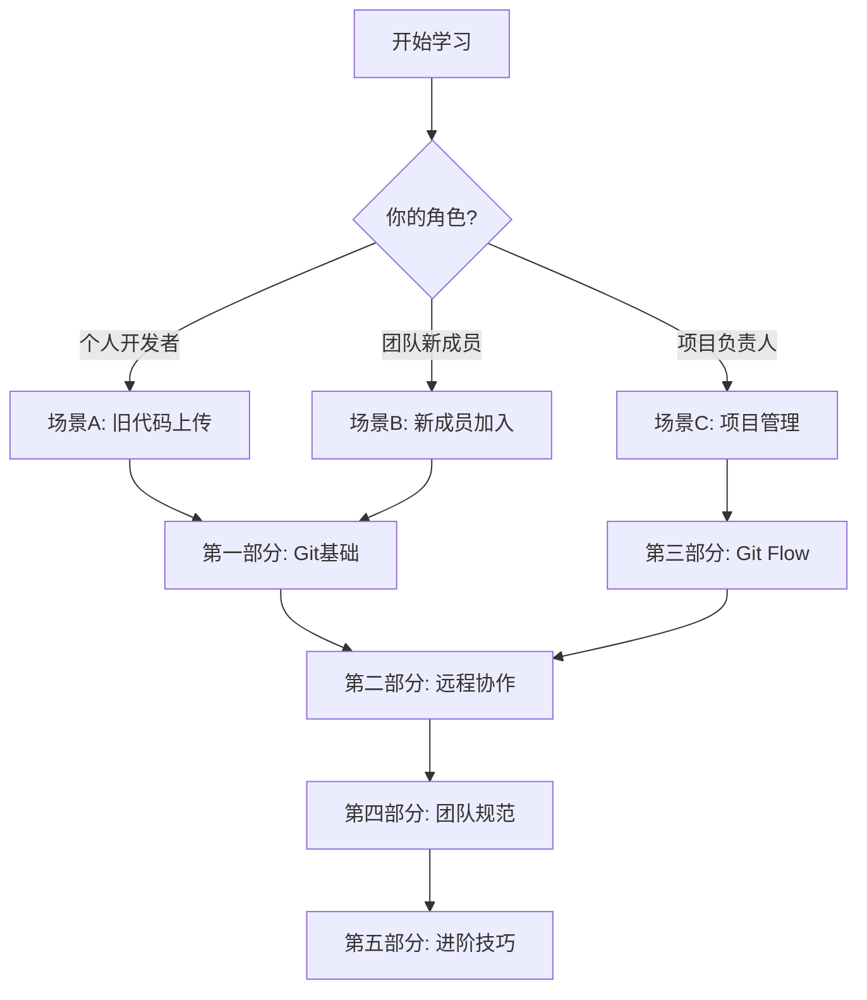

# 基于Git的代码版本管理与多人协作

> 欢迎来到代码版本管理的游戏世界！在这里，你将学会如何像玩游戏一样管理你的代码。
> *作者：Lzy & Zs & Wgy & Claude Sonnet4.5 | 最后更新：2025年11月*

---

## 📚 目录

### [HOW TO 快速上手](00-HOW-TO.md)
- [场景 A：已有代码要提交](00-HOW-TO.md#场景-a手上已有旧代码需要推送到远程)
- [场景 B：刚加入项目要开始开发](00-HOW-TO.md#场景-b刚加入项目要开始开发)
- [场景 C：项目管理者/维护者](00-HOW-TO.md#场景-c项目管理者维护者)

### [第一部分：Git版本管理基础](01-第一部分.md)
- 引言：代码版本管理的游戏世界
- 准备工作：新手村设置
- 单人冒险：基础版本管理

### [第二部分：联机模式 - 远程仓库与Gitea](02-第二部分.md)
- 远程仓库概念：云端存档系统
- Gitea平台操作指南
- 本地与远程的连接

### [第三部分：团队副本 - Git Flow多人协作](03-第三部分.md)
- Git Flow模型介绍：多人副本的战斗策略
- 五大分支类型详解
- Issue驱动开发流程：任务系统
- Pull Request完整流程：代码审查系统
- 冲突解决实战：当两个玩家修改了同一个地方
- 完整协作场景演示

### [第四部分：团队规范 - 游戏公会的行为准则](04-第四部分.md)
- Commit Message规范：记录你的冒险日志
- 分支命名规范：给你的任务线起个好名字
- PR描述规范：任务提交报告模板
- 代码审查清单：审查装备的标准

### [第五部分：进阶技巧与问题解决 - 成为Git大师的秘籍](05-第五部分.md)
- 标签管理：版本里程碑
- 常见问题处理：排除故障的技巧
- 进阶命令：大师级技能
- 最佳实践总结：大师的箴言

### [附录](06-附录.md)
- 附录A：命令速查表
- 附录B：术语表
- 附录C：参考资源

### [结语](07-结语.md)
- 你学到了什么
- 接下来该做什么
- 保持游戏精神
- 最后的建议

## 🎮 学习路径建议

---

💡 **提示**：点击上方目录中的章节标题即可开始阅读！
